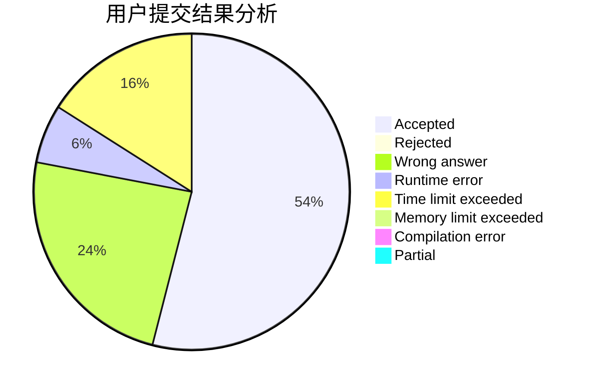
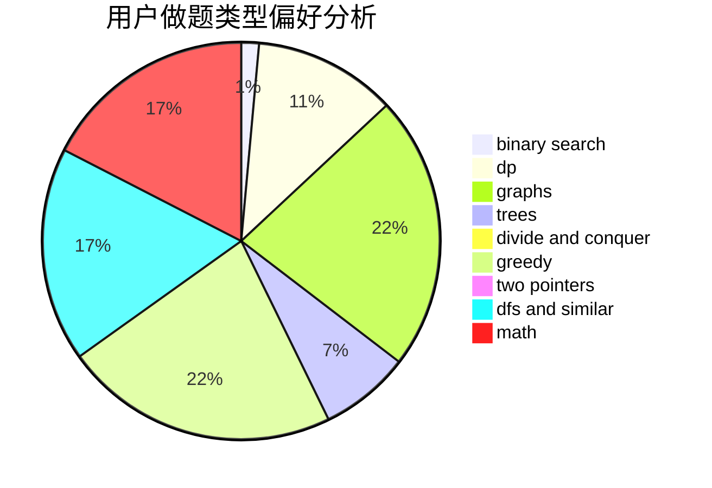

# LucasD

<!-- tabs:start -->

#### **用户提交结果分析**

#### **用户做题类型偏好分析**

<!-- tabs:end -->
# 推荐题目
[1257E](https://codeforces.com/contest/1257/problem/E)
[682D](https://codeforces.com/contest/682/problem/D)
[1102E](https://codeforces.com/contest/1102/problem/E)
[1249F](https://codeforces.com/contest/1249/problem/F)
[659A](https://codeforces.com/contest/659/problem/A)
[611D](https://codeforces.com/contest/611/problem/D)
[145A](https://codeforces.com/contest/145/problem/A)
[1305H](https://codeforces.com/contest/1305/problem/H)
[1151F](https://codeforces.com/contest/1151/problem/F)
[762C](https://codeforces.com/contest/762/problem/C)
