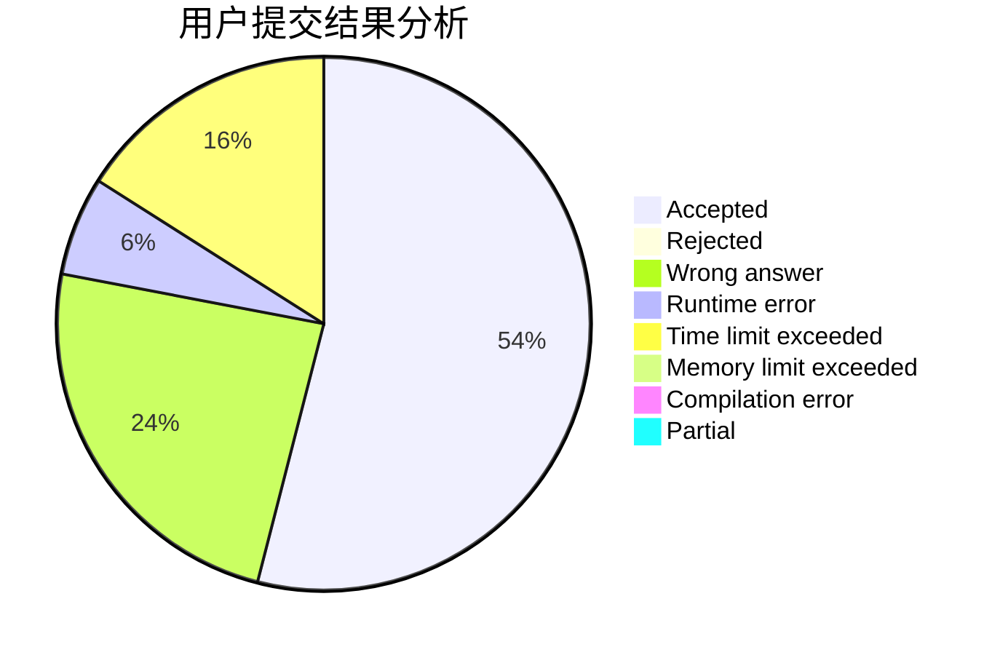
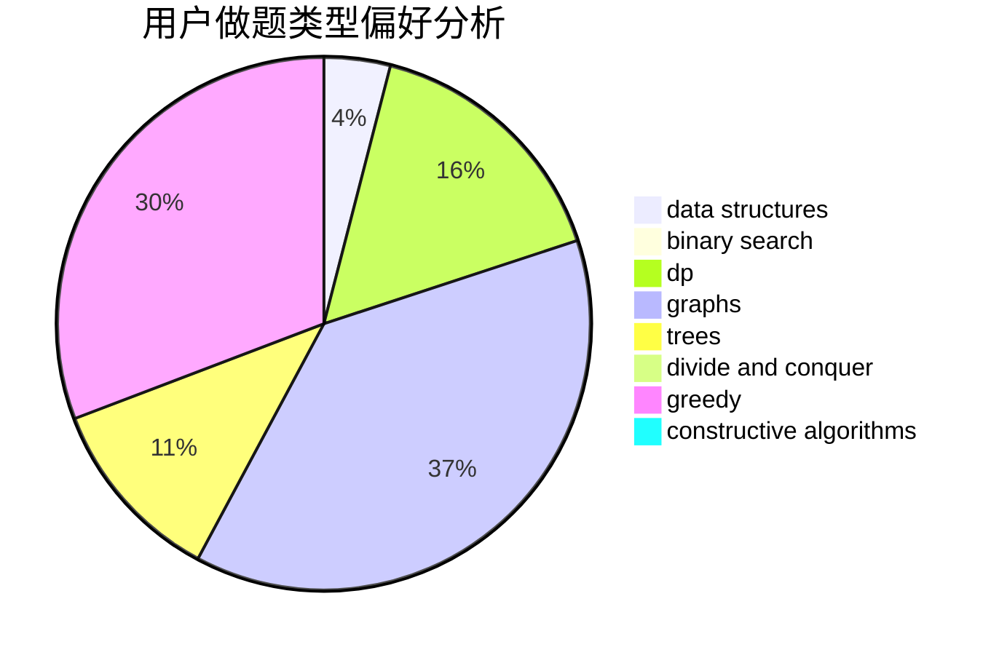
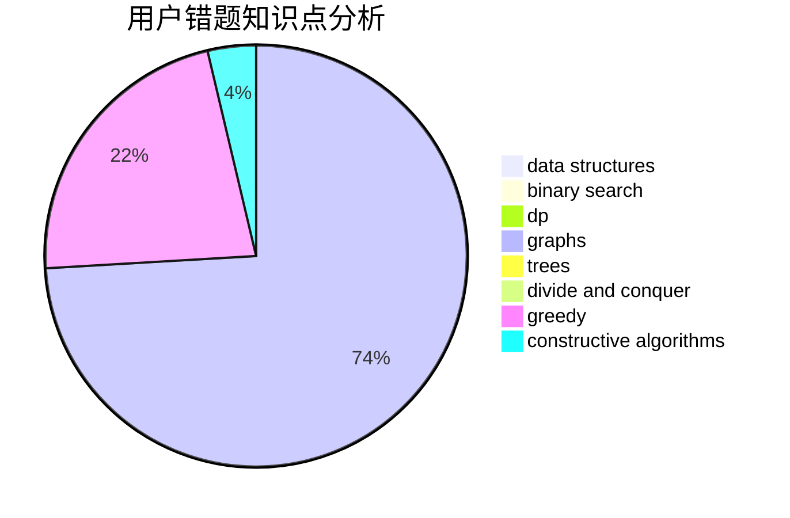

# LucasD

<!-- tabs:start -->

#### **用户提交结果分析**

#### **用户做题类型偏好分析**

#### **用户错题知识点分析**

<!-- tabs:end -->
# 推荐题目
[1257E](https://codeforces.com/contest/1257/problem/E)		data structures,
                        dp,
                        greedy		  
[682D](https://codeforces.com/contest/682/problem/D)		dp,
                        strings		  
[1102E](https://codeforces.com/contest/1102/problem/E)		combinatorics,
                        sortings		  
[1249F](https://codeforces.com/contest/1249/problem/F)		dp,
                        trees		  
[659A](https://codeforces.com/contest/659/problem/A)		implementation,
                        math		  
[611D](https://codeforces.com/contest/611/problem/D)		dp,
                        hashing,
                        strings		  
[145A](https://codeforces.com/contest/145/problem/A)		greedy,
                        implementation		  
[1305H](https://codeforces.com/contest/1305/problem/H)		binary search,
                        greedy		  
[1151F](https://codeforces.com/contest/1151/problem/F)		combinatorics,
                        dp,
                        matrices,
                        probabilities		  
[762C](https://codeforces.com/contest/762/problem/C)		binary search,
                        hashing,
                        strings,
                        two pointers		  
