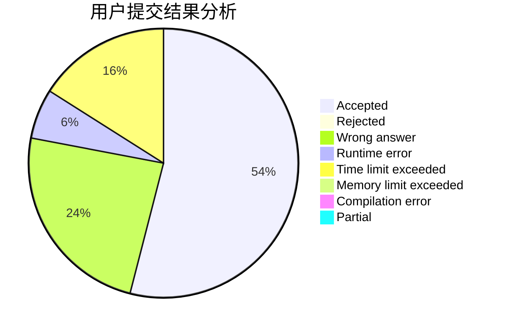
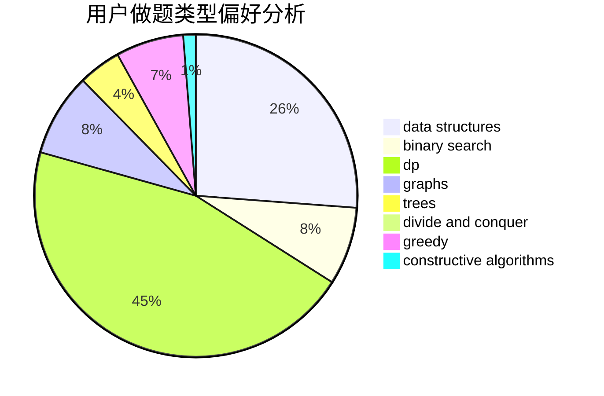
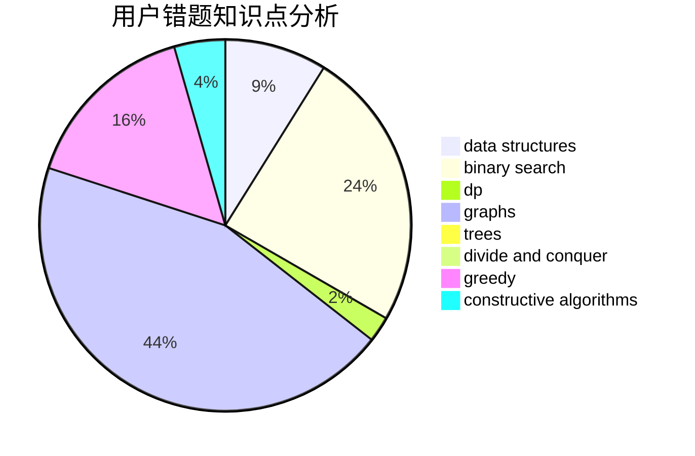

# LucasD
<!-- tabs:start -->
#### **用户提交结果分析**

#### **用户做题类型偏好分析**

#### **用户错题知识点分析**

<!-- tabs:end -->
# 推荐题目
[Find String in a Grid](http://codeforces.com/problemset/problem/1252/D)		data structures,
                        dp,
                        strings,
                        trees		  
[International Olympiad](http://codeforces.com/problemset/problem/662/D)		constructive algorithms,
                        greedy,
                        implementation,
                        math		  
[Array K-Coloring](http://codeforces.com/problemset/problem/1102/B)		greedy,
                        sortings		  
[Far Relative’s Birthday Cake](http://codeforces.com/problemset/problem/629/A)		brute force,
                        combinatorics,
                        constructive algorithms,
                        implementation		  
[The Monster and the Squirrel](http://codeforces.com/problemset/problem/592/B)		math		  
[Grammar Lessons](https://codeforces.com/contest/114/problem/C)		implementation,
                        strings		  
[Maxim and Array](http://codeforces.com/problemset/problem/721/D)		constructive algorithms,
                        data structures,
                        greedy,
                        math		  
[Equalizing Two Strings](http://codeforces.com/problemset/problem/1256/F)		constructive algorithms,
                        sortings,
                        strings		  
[Wojtek and Card Tricks](https://codeforces.com/contest/1229/problem/D)		math		  
[X-wing fighter](http://codeforces.com/problemset/problem/1116/D3)		nan		  
<!-- tabs:start -->
#### **data structures**
[Find String in a Grid](http://codeforces.com/problemset/problem/1252/D)		data structures,
                        dp,
                        strings,
                        trees		  
[International Olympiad](http://codeforces.com/problemset/problem/721/D)		constructive algorithms,
                        data structures,
                        greedy,
                        math		  
[Array K-Coloring](https://codeforces.com/contest/1261/problem/B1)		data structures,
                        greedy		  
[Far Relative’s Birthday Cake](http://codeforces.com/problemset/problem/258/E)		data structures,
                        dfs and similar,
                        trees		  
[The Monster and the Squirrel](http://codeforces.com/problemset/problem/1388/D)		data structures,
                        dfs and similar,
                        graphs,
                        greedy,
                        implementation,
                        trees		  
[Grammar Lessons](http://codeforces.com/problemset/problem/1495/F)		constructive algorithms,
                        data structures,
                        dp,
                        graphs,
                        trees		  
[Maxim and Array](http://codeforces.com/problemset/problem/1492/C)		binary search,
                        data structures,
                        dp,
                        greedy,
                        two pointers		  
[Equalizing Two Strings](http://codeforces.com/problemset/problem/1490/G)		binary search,
                        data structures,
                        math		  
[Wojtek and Card Tricks](http://codeforces.com/problemset/problem/1479/D)		binary search,
                        bitmasks,
                        brute force,
                        data structures,
                        probabilities,
                        trees		  
[X-wing fighter](http://codeforces.com/problemset/problem/1497/A)		brute force,
                        data structures,
                        greedy,
                        sortings		  
#### **binary search**
[Find String in a Grid](https://codeforces.com/contest/801/problem/C)		binary search,
                        math		  
[International Olympiad](http://codeforces.com/problemset/problem/1426/C)		binary search,
                        constructive algorithms,
                        math		  
[Array K-Coloring](http://codeforces.com/problemset/problem/1492/C)		binary search,
                        data structures,
                        dp,
                        greedy,
                        two pointers		  
[Far Relative’s Birthday Cake](http://codeforces.com/problemset/problem/1463/D)		binary search,
                        constructive algorithms,
                        greedy,
                        two pointers		  
[The Monster and the Squirrel](http://codeforces.com/problemset/problem/1490/G)		binary search,
                        data structures,
                        math		  
[Grammar Lessons](http://codeforces.com/problemset/problem/1479/D)		binary search,
                        bitmasks,
                        brute force,
                        data structures,
                        probabilities,
                        trees		  
[Maxim and Array](http://codeforces.com/problemset/problem/1436/E)		binary search,
                        data structures,
                        two pointers		  
[Equalizing Two Strings](http://codeforces.com/problemset/problem/1461/D)		binary search,
                        brute force,
                        data structures,
                        divide and conquer,
                        implementation,
                        sortings		  
[Wojtek and Card Tricks](http://codeforces.com/problemset/problem/1493/C)		binary search,
                        brute force,
                        constructive algorithms,
                        greedy,
                        strings		  
[X-wing fighter](http://codeforces.com/problemset/problem/1487/D)		binary search,
                        brute force,
                        math,
                        number theory		  
#### **dp**
[Find String in a Grid](http://codeforces.com/problemset/problem/1252/D)		data structures,
                        dp,
                        strings,
                        trees		  
[International Olympiad](http://codeforces.com/problemset/problem/1299/D)		bitmasks,
                        combinatorics,
                        dfs and similar,
                        dp,
                        graphs,
                        graphs,
                        math,
                        trees		  
[Array K-Coloring](http://codeforces.com/problemset/problem/1244/D)		brute force,
                        constructive algorithms,
                        dp,
                        graphs,
                        implementation,
                        trees		  
[Far Relative’s Birthday Cake](http://codeforces.com/problemset/problem/86/C)		dp,
                        string suffix structures,
                        trees		  
[The Monster and the Squirrel](https://codeforces.com/contest/418/problem/B)		bitmasks,
                        dp,
                        greedy,
                        sortings		  
[Grammar Lessons](http://codeforces.com/problemset/problem/1495/F)		constructive algorithms,
                        data structures,
                        dp,
                        graphs,
                        trees		  
[Maxim and Array](http://codeforces.com/problemset/problem/1492/C)		binary search,
                        data structures,
                        dp,
                        greedy,
                        two pointers		  
[Equalizing Two Strings](https://codeforces.com/contest/1457/problem/C)		brute force,
                        dp,
                        implementation		  
[Wojtek and Card Tricks](http://codeforces.com/problemset/problem/1491/C)		brute force,
                        data structures,
                        dp,
                        greedy,
                        implementation		  
[X-wing fighter](http://codeforces.com/problemset/problem/1437/C)		dp,
                        flows,
                        graph matchings,
                        greedy,
                        math,
                        sortings		  
#### **graph**
[Find String in a Grid](http://codeforces.com/problemset/problem/1147/A)		graphs		  
[International Olympiad](http://codeforces.com/problemset/problem/1299/D)		bitmasks,
                        combinatorics,
                        dfs and similar,
                        dp,
                        graphs,
                        graphs,
                        math,
                        trees		  
[Array K-Coloring](http://codeforces.com/problemset/problem/1344/B)		constructive algorithms,
                        dfs and similar,
                        dsu,
                        graphs		  
[Far Relative’s Birthday Cake](http://codeforces.com/problemset/problem/1244/D)		brute force,
                        constructive algorithms,
                        dp,
                        graphs,
                        implementation,
                        trees		  
[The Monster and the Squirrel](http://codeforces.com/problemset/problem/741/C)		constructive algorithms,
                        dfs and similar,
                        graphs		  
[Grammar Lessons](http://codeforces.com/problemset/problem/1388/D)		data structures,
                        dfs and similar,
                        graphs,
                        greedy,
                        implementation,
                        trees		  
[Maxim and Array](http://codeforces.com/problemset/problem/1495/F)		constructive algorithms,
                        data structures,
                        dp,
                        graphs,
                        trees		  
[Equalizing Two Strings](http://codeforces.com/problemset/problem/1487/C)		brute force,
                        constructive algorithms,
                        dfs and similar,
                        graphs,
                        greedy,
                        implementation,
                        math		  
[Wojtek and Card Tricks](http://codeforces.com/problemset/problem/1437/C)		dp,
                        flows,
                        graph matchings,
                        greedy,
                        math,
                        sortings		  
[X-wing fighter](http://codeforces.com/problemset/problem/1470/D)		constructive algorithms,
                        dfs and similar,
                        graph matchings,
                        graphs,
                        greedy		  
#### **trees**
[Find String in a Grid](http://codeforces.com/problemset/problem/1252/D)		data structures,
                        dp,
                        strings,
                        trees		  
[International Olympiad](http://codeforces.com/problemset/problem/1299/D)		bitmasks,
                        combinatorics,
                        dfs and similar,
                        dp,
                        graphs,
                        graphs,
                        math,
                        trees		  
[Array K-Coloring](http://codeforces.com/problemset/problem/1244/D)		brute force,
                        constructive algorithms,
                        dp,
                        graphs,
                        implementation,
                        trees		  
[Far Relative’s Birthday Cake](http://codeforces.com/problemset/problem/86/C)		dp,
                        string suffix structures,
                        trees		  
[The Monster and the Squirrel](http://codeforces.com/problemset/problem/258/E)		data structures,
                        dfs and similar,
                        trees		  
[Grammar Lessons](http://codeforces.com/problemset/problem/1388/D)		data structures,
                        dfs and similar,
                        graphs,
                        greedy,
                        implementation,
                        trees		  
[Maxim and Array](http://codeforces.com/problemset/problem/1495/F)		constructive algorithms,
                        data structures,
                        dp,
                        graphs,
                        trees		  
[Equalizing Two Strings](http://codeforces.com/problemset/problem/1479/D)		binary search,
                        bitmasks,
                        brute force,
                        data structures,
                        probabilities,
                        trees		  
[Wojtek and Card Tricks](http://codeforces.com/problemset/problem/1511/C)		brute force,
                        data structures,
                        implementation,
                        trees		  
[X-wing fighter](http://codeforces.com/problemset/problem/1499/F)		combinatorics,
                        dfs and similar,
                        dp,
                        trees		  
#### **divide and conquer**
[Find String in a Grid](http://codeforces.com/problemset/problem/1461/D)		binary search,
                        brute force,
                        data structures,
                        divide and conquer,
                        implementation,
                        sortings		  
[International Olympiad](http://codeforces.com/problemset/problem/1466/G)		combinatorics,
                        divide and conquer,
                        hashing,
                        math,
                        string suffix structures,
                        strings		  
[Array K-Coloring](http://codeforces.com/problemset/problem/1490/D)		dfs and similar,
                        divide and conquer,
                        implementation		  
[Far Relative’s Birthday Cake](https://codeforces.com/contest/1483/problem/C)		data structures,
                        divide and conquer,
                        dp		  
[The Monster and the Squirrel](http://codeforces.com/problemset/problem/1491/E)		brute force,
                        dfs and similar,
                        divide and conquer,
                        number theory,
                        trees		  
[Grammar Lessons](http://codeforces.com/problemset/problem/1303/G)		data structures,
                        divide and conquer,
                        geometry,
                        trees		  
[Maxim and Array](http://codeforces.com/problemset/problem/1494/D)		constructive algorithms,
                        data structures,
                        dfs and similar,
                        divide and conquer,
                        dsu,
                        greedy,
                        sortings,
                        trees		  
[Equalizing Two Strings](http://codeforces.com/problemset/problem/1482/E)		data structures,
                        divide and conquer,
                        dp		  
[Wojtek and Card Tricks](http://codeforces.com/problemset/problem/566/C)		dfs and similar,
                        divide and conquer,
                        trees		  
[X-wing fighter](http://codeforces.com/problemset/problem/1428/F)		binary search,
                        data structures,
                        divide and conquer,
                        dp,
                        two pointers		  
#### **greedy**
[Find String in a Grid](http://codeforces.com/problemset/problem/662/D)		constructive algorithms,
                        greedy,
                        implementation,
                        math		  
[International Olympiad](http://codeforces.com/problemset/problem/1102/B)		greedy,
                        sortings		  
[Array K-Coloring](http://codeforces.com/problemset/problem/721/D)		constructive algorithms,
                        data structures,
                        greedy,
                        math		  
[Far Relative’s Birthday Cake](https://codeforces.com/contest/1261/problem/B1)		data structures,
                        greedy		  
[The Monster and the Squirrel](http://codeforces.com/problemset/problem/1451/A)		greedy,
                        math		  
[Grammar Lessons](http://codeforces.com/problemset/problem/1091/B)		brute force,
                        constructive algorithms,
                        greedy,
                        implementation		  
[Maxim and Array](http://codeforces.com/problemset/problem/1388/D)		data structures,
                        dfs and similar,
                        graphs,
                        greedy,
                        implementation,
                        trees		  
[Equalizing Two Strings](https://codeforces.com/contest/418/problem/B)		bitmasks,
                        dp,
                        greedy,
                        sortings		  
[Wojtek and Card Tricks](http://codeforces.com/problemset/problem/1292/B)		brute force,
                        constructive algorithms,
                        geometry,
                        greedy,
                        implementation		  
[X-wing fighter](http://codeforces.com/problemset/problem/1492/C)		binary search,
                        data structures,
                        dp,
                        greedy,
                        two pointers		  
#### **constructive algorithms**
[Find String in a Grid](http://codeforces.com/problemset/problem/662/D)		constructive algorithms,
                        greedy,
                        implementation,
                        math		  
[International Olympiad](http://codeforces.com/problemset/problem/629/A)		brute force,
                        combinatorics,
                        constructive algorithms,
                        implementation		  
[Array K-Coloring](http://codeforces.com/problemset/problem/721/D)		constructive algorithms,
                        data structures,
                        greedy,
                        math		  
[Far Relative’s Birthday Cake](http://codeforces.com/problemset/problem/1256/F)		constructive algorithms,
                        sortings,
                        strings		  
[The Monster and the Squirrel](http://codeforces.com/problemset/problem/1344/B)		constructive algorithms,
                        dfs and similar,
                        dsu,
                        graphs		  
[Grammar Lessons](http://codeforces.com/problemset/problem/1244/D)		brute force,
                        constructive algorithms,
                        dp,
                        graphs,
                        implementation,
                        trees		  
[Maxim and Array](http://codeforces.com/problemset/problem/741/C)		constructive algorithms,
                        dfs and similar,
                        graphs		  
[Equalizing Two Strings](http://codeforces.com/problemset/problem/1091/B)		brute force,
                        constructive algorithms,
                        greedy,
                        implementation		  
[Wojtek and Card Tricks](http://codeforces.com/problemset/problem/1426/C)		binary search,
                        constructive algorithms,
                        math		  
[X-wing fighter](http://codeforces.com/problemset/problem/1495/F)		constructive algorithms,
                        data structures,
                        dp,
                        graphs,
                        trees		  
#### **sortings**
[Find String in a Grid](http://codeforces.com/problemset/problem/1102/B)		greedy,
                        sortings		  
[International Olympiad](http://codeforces.com/problemset/problem/1256/F)		constructive algorithms,
                        sortings,
                        strings		  
[Array K-Coloring](https://codeforces.com/contest/418/problem/B)		bitmasks,
                        dp,
                        greedy,
                        sortings		  
[Far Relative’s Birthday Cake](https://codeforces.com/contest/1496/problem/C)		geometry,
                        greedy,
                        math,
                        sortings		  
[The Monster and the Squirrel](http://codeforces.com/problemset/problem/1495/A)		geometry,
                        greedy,
                        math,
                        sortings		  
[Grammar Lessons](http://codeforces.com/problemset/problem/1497/A)		brute force,
                        data structures,
                        greedy,
                        sortings		  
[Maxim and Array](http://codeforces.com/problemset/problem/1427/A)		math,
                        sortings		  
[Equalizing Two Strings](http://codeforces.com/problemset/problem/1461/D)		binary search,
                        brute force,
                        data structures,
                        divide and conquer,
                        implementation,
                        sortings		  
[Wojtek and Card Tricks](http://codeforces.com/problemset/problem/1437/C)		dp,
                        flows,
                        graph matchings,
                        greedy,
                        math,
                        sortings		  
[X-wing fighter](http://codeforces.com/problemset/problem/1473/A)		greedy,
                        implementation,
                        math,
                        sortings		  
<!-- tabs:end -->
