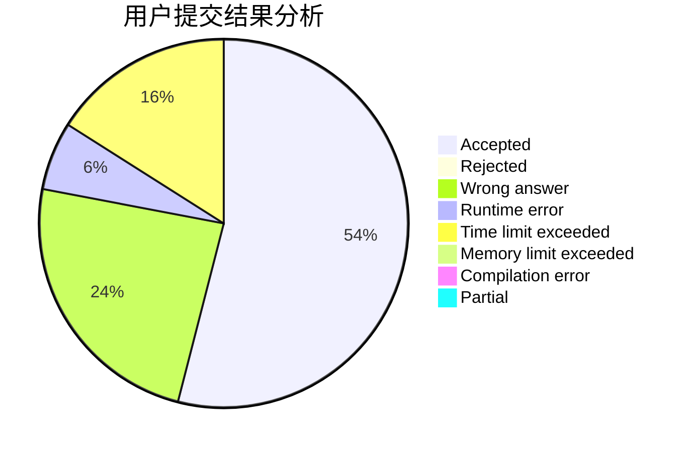
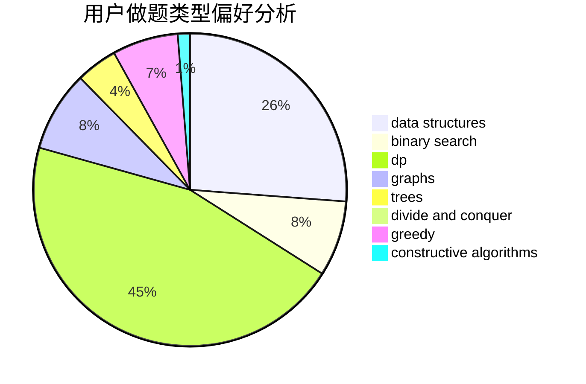
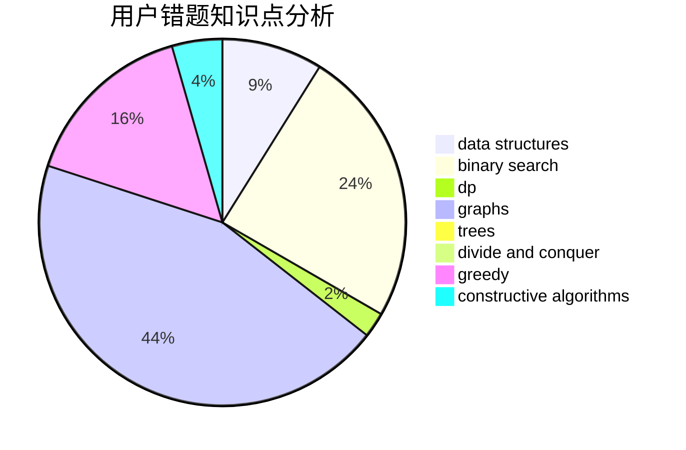

# LucasD

<!-- tabs:start -->

#### **用户提交结果分析**

#### **用户做题类型偏好分析**

#### **用户错题知识点分析**

<!-- tabs:end -->
# 推荐题目
[1252D](https://codeforces.com/contest/1252/problem/D)		data structures,
                        dp,
                        strings,
                        trees		  
[662D](https://codeforces.com/contest/662/problem/D)		constructive algorithms,
                        greedy,
                        implementation,
                        math		  
[1102B](https://codeforces.com/contest/1102/problem/B)		greedy,
                        sortings		  
[1244D](https://codeforces.com/contest/1244/problem/D)		brute force,
                        constructive algorithms,
                        dp,
                        graphs,
                        implementation,
                        trees		  
[629A](https://codeforces.com/contest/629/problem/A)		brute force,
                        combinatorics,
                        constructive algorithms,
                        implementation		  
[592B](https://codeforces.com/contest/592/problem/B)		math		  
[1451A](https://codeforces.com/contest/1451/problem/A)		greedy,
                        math		  
[1299D](https://codeforces.com/contest/1299/problem/D)		bitmasks,
                        combinatorics,
                        dfs and similar,
                        dp,
                        graphs,
                        graphs,
                        math,
                        trees		  
[114C](https://codeforces.com/contest/114/problem/C)		dsu,graphs,sortings,trees		  
[741C](https://codeforces.com/contest/741/problem/C)		constructive algorithms,
                        dfs and similar,
                        graphs		  
