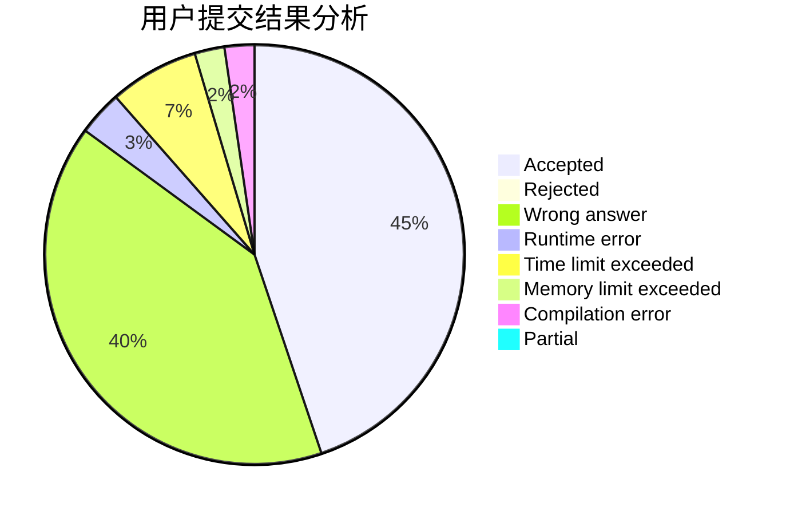
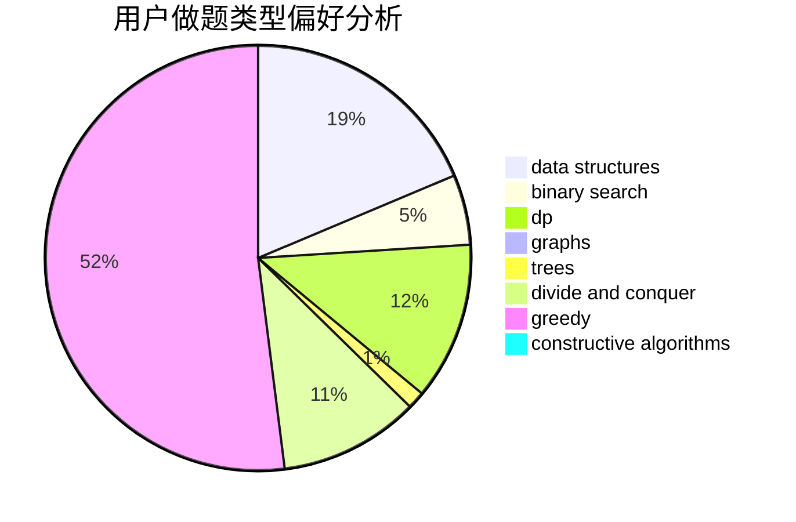
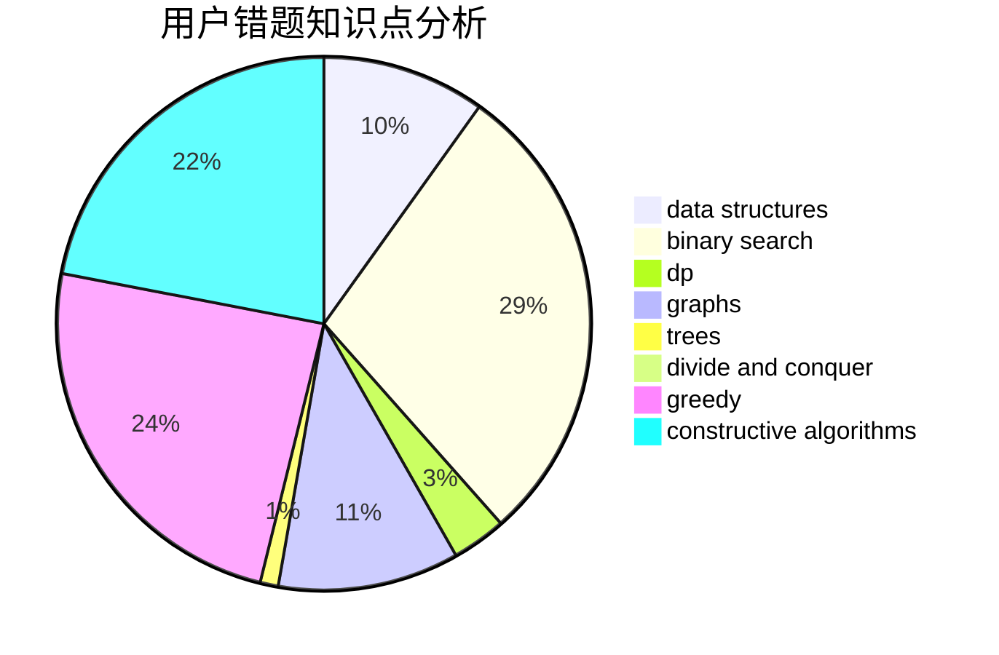

# Luckly

<!-- tabs:start -->

#### **用户提交结果分析**

#### **用户做题类型偏好分析**

#### **用户错题知识点分析**

<!-- tabs:end -->
# 推荐题目
[936A](https://codeforces.com/contest/936/problem/A)		binary search,
                        implementation,
                        math		  
[1216D](https://codeforces.com/contest/1216/problem/D)		math		  
[724G](https://codeforces.com/contest/724/problem/G)		bitmasks,
                        graphs,
                        math,
                        number theory,
                        trees		  
[947E](https://codeforces.com/contest/947/problem/E)		dsu,graphs,sortings,trees		  
[1100A](https://codeforces.com/contest/1100/problem/A)		implementation		  
[7E](https://codeforces.com/contest/7/problem/E)		dp,
                        expression parsing,
                        implementation		  
[698D](https://codeforces.com/contest/698/problem/D)		brute force,
                        geometry,
                        math		  
[1220E](https://codeforces.com/contest/1220/problem/E)		dfs and similar,
                        dp,
                        dsu,
                        graphs,
                        greedy,
                        trees		  
[1385G](https://codeforces.com/contest/1385/problem/G)		2-sat,
                        dfs and similar,
                        dsu,
                        graphs,
                        implementation		  
[1027G](https://codeforces.com/contest/1027/problem/G)		bitmasks,
                        math,
                        number theory		  
