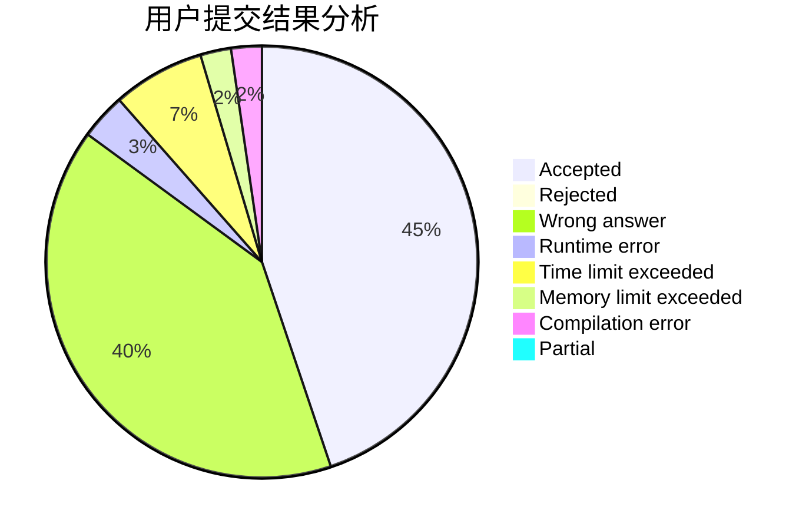
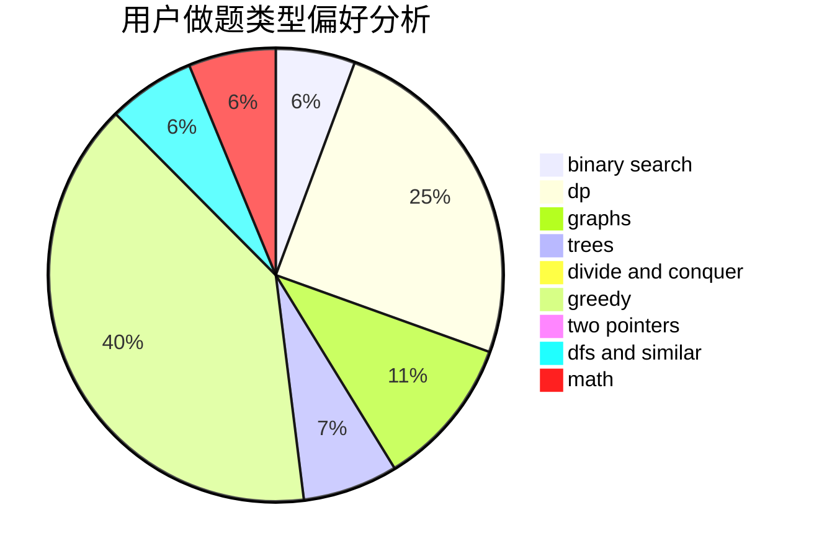

# Luckly

<!-- tabs:start -->

#### **用户提交结果分析**

#### **用户做题类型偏好分析**

<!-- tabs:end -->
# 推荐题目
[9581](https://codeforces.com/contest/958/problem/1)
[1223A](https://codeforces.com/contest/1223/problem/A)
[742D](https://codeforces.com/contest/742/problem/D)
[965A](https://codeforces.com/contest/965/problem/A)
[1100D](https://codeforces.com/contest/1100/problem/D)
[815A](https://codeforces.com/contest/815/problem/A)
[715B](https://codeforces.com/contest/715/problem/B)
[1228E](https://codeforces.com/contest/1228/problem/E)
[1396A](https://codeforces.com/contest/1396/problem/A)
[1028C](https://codeforces.com/contest/1028/problem/C)
