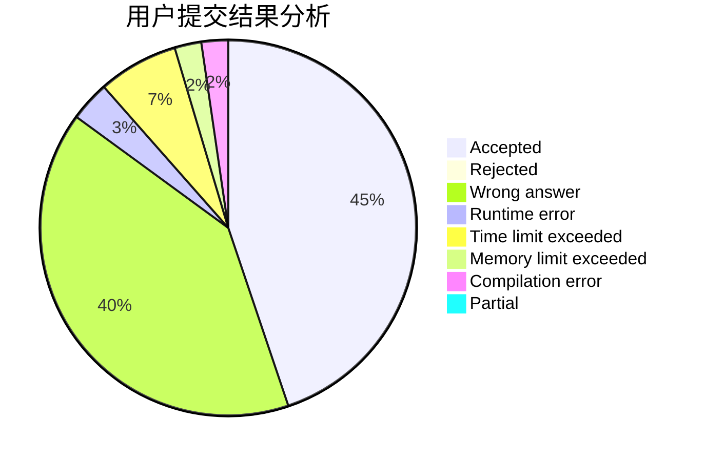
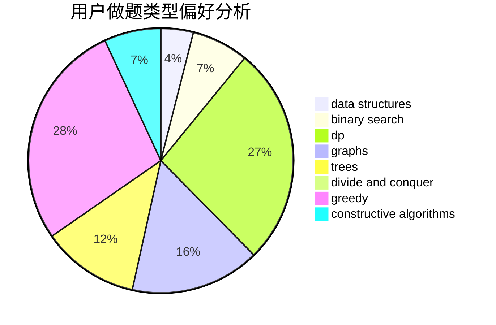
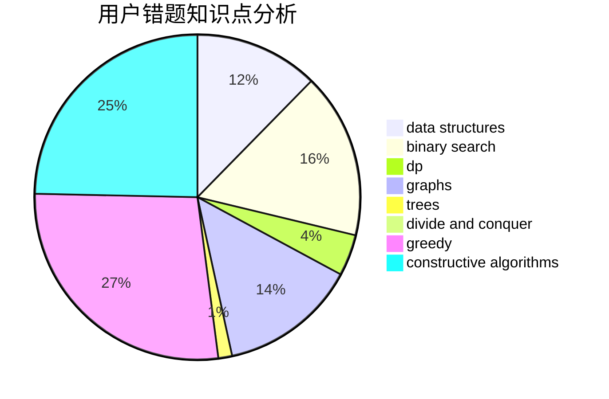

# Luckly

<!-- tabs:start -->

#### **用户提交结果分析**

#### **用户做题类型偏好分析**

#### **用户错题知识点分析**

<!-- tabs:end -->
# 推荐题目
[9581](https://codeforces.com/contest/958/problem/1)		dsu,graphs,sortings,trees		  
[1223A](https://codeforces.com/contest/1223/problem/A)		math		  
[742D](https://codeforces.com/contest/742/problem/D)		dsu,graphs,sortings,trees		  
[965A](https://codeforces.com/contest/965/problem/A)		math		  
[1100D](https://codeforces.com/contest/1100/problem/D)		constructive algorithms,
                        games,
                        interactive		  
[815A](https://codeforces.com/contest/815/problem/A)		brute force,
                        greedy,
                        implementation		  
[715B](https://codeforces.com/contest/715/problem/B)		binary search,
                        constructive algorithms,
                        graphs,
                        shortest paths		  
[1228E](https://codeforces.com/contest/1228/problem/E)		combinatorics,
                        dp,
                        math		  
[1396A](https://codeforces.com/contest/1396/problem/A)		constructive algorithms,
                        greedy,
                        number theory		  
[1028C](https://codeforces.com/contest/1028/problem/C)		geometry,
                        implementation,
                        sortings		  
