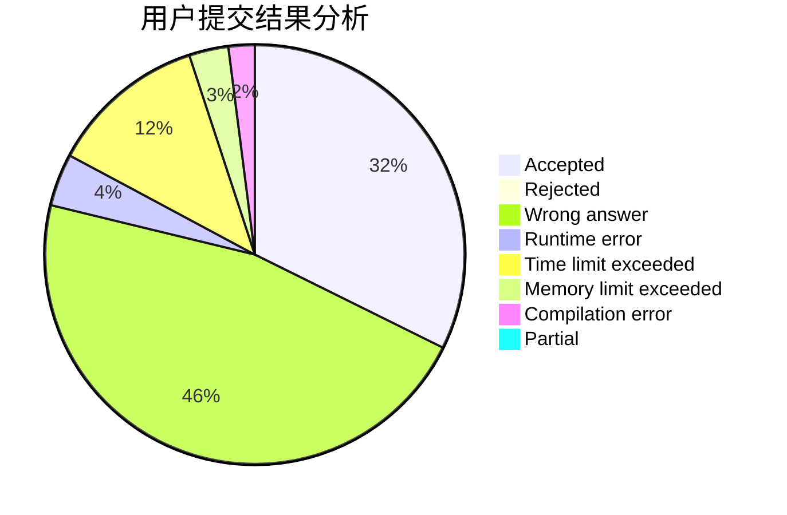
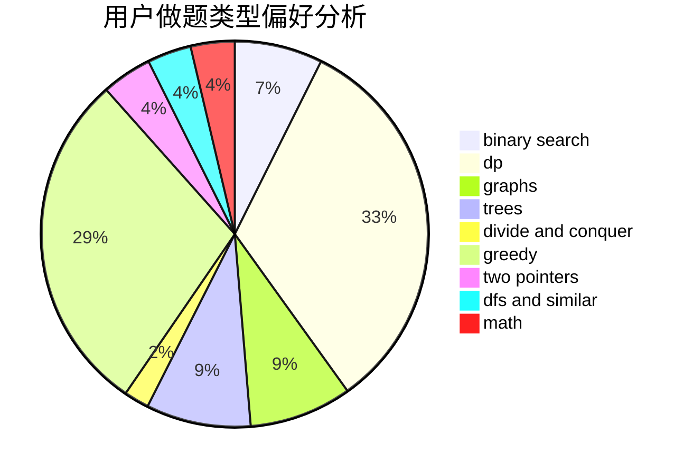

# Lucky_Glass

<!-- tabs:start -->

#### **用户提交结果分析**

#### **用户做题类型偏好分析**

<!-- tabs:end -->
# 推荐题目
[722D](https://codeforces.com/contest/722/problem/D)
[838F](https://codeforces.com/contest/838/problem/F)
[557B](https://codeforces.com/contest/557/problem/B)
[727E](https://codeforces.com/contest/727/problem/E)
[288E](https://codeforces.com/contest/288/problem/E)
[936E](https://codeforces.com/contest/936/problem/E)
[1188E](https://codeforces.com/contest/1188/problem/E)
[886F](https://codeforces.com/contest/886/problem/F)
[1200B](https://codeforces.com/contest/1200/problem/B)
[682E](https://codeforces.com/contest/682/problem/E)
