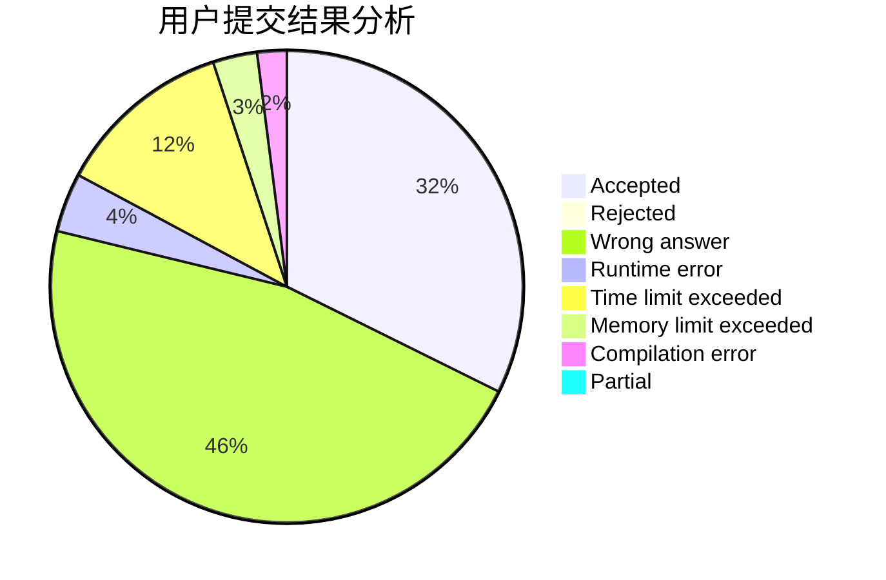
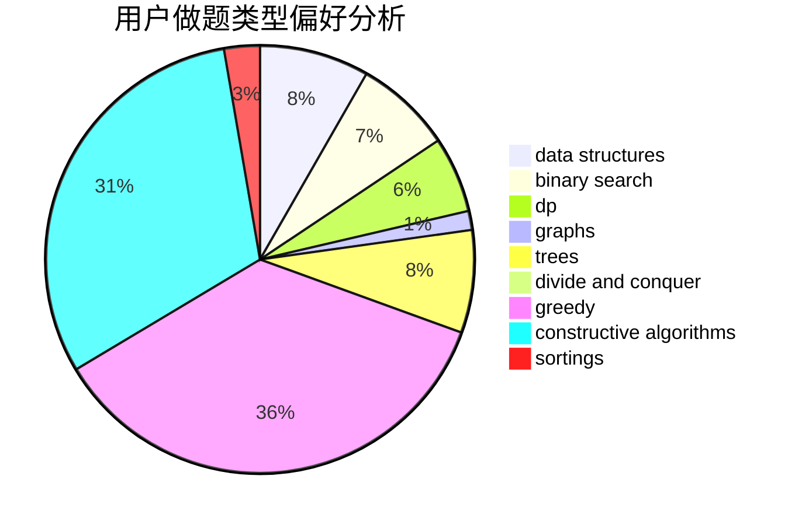
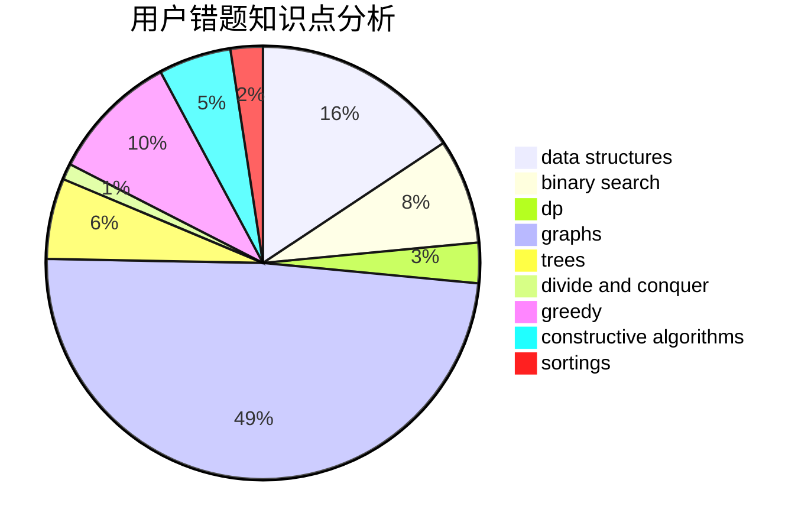

# Lucky_Glass
<!-- tabs:start -->
#### **用户提交结果分析**

#### **用户做题类型偏好分析**

#### **用户错题知识点分析**

<!-- tabs:end -->
# 推荐题目
[818G](http://codeforces.com/problemset/problem/818/G)		flows,
                        graphs		  
[703C](http://codeforces.com/problemset/problem/703/C)		geometry,
                        implementation		  
[1184E3](http://codeforces.com/problemset/problem/1184/E3)		data structures,
                        dsu,
                        graphs,
                        trees		  
[272E](http://codeforces.com/problemset/problem/272/E)		combinatorics,
                        constructive algorithms,
                        graphs		  
[667E](https://codeforces.com/contest/667/problem/E)		brute force,
                        geometry		  
[534F](http://codeforces.com/problemset/problem/534/F)		bitmasks,
                        dp,
                        hashing,
                        meet-in-the-middle		  
[472A](http://codeforces.com/problemset/problem/472/A)		math,
                        number theory		  
[1055A](http://codeforces.com/problemset/problem/1055/A)		graphs		  
[922A](http://codeforces.com/problemset/problem/922/A)		implementation		  
[44A](http://codeforces.com/problemset/problem/44/A)		implementation		  
<!-- tabs:start -->
#### **data structures**
[1184E3](http://codeforces.com/problemset/problem/1184/E3)		data structures,
                        dsu,
                        graphs,
                        trees		  
[637B](http://codeforces.com/problemset/problem/637/B)		*special problem,
                        binary search,
                        constructive algorithms,
                        data structures,
                        sortings		  
[916D](http://codeforces.com/problemset/problem/916/D)		data structures,
                        interactive,
                        trees		  
[343D](http://codeforces.com/problemset/problem/343/D)		data structures,
                        dfs and similar,
                        graphs,
                        trees		  
[487B](http://codeforces.com/problemset/problem/487/B)		binary search,
                        data structures,
                        dp,
                        two pointers		  
[866D](https://codeforces.com/contest/866/problem/D)		constructive algorithms,
                        data structures,
                        greedy		  
[860B](https://codeforces.com/contest/860/problem/B)		data structures,
                        implementation,
                        sortings		  
[708C](http://codeforces.com/problemset/problem/708/C)		data structures,
                        dfs and similar,
                        dp,
                        graphs,
                        greedy,
                        trees		  
[1207G](http://codeforces.com/problemset/problem/1207/G)		data structures,
                        dfs and similar,
                        hashing,
                        string suffix structures,
                        strings,
                        trees		  
[1492C](http://codeforces.com/problemset/problem/1492/C)		binary search,
                        data structures,
                        dp,
                        greedy,
                        two pointers		  
#### **binary search**
[637B](http://codeforces.com/problemset/problem/637/B)		*special problem,
                        binary search,
                        constructive algorithms,
                        data structures,
                        sortings		  
[487B](http://codeforces.com/problemset/problem/487/B)		binary search,
                        data structures,
                        dp,
                        two pointers		  
[1247E](https://codeforces.com/contest/1247/problem/E)		binary search,
                        dp		  
[1372F](http://codeforces.com/problemset/problem/1372/F)		binary search,
                        divide and conquer,
                        interactive		  
[1462E1](http://codeforces.com/problemset/problem/1462/E1)		binary search,
                        combinatorics,
                        math,
                        sortings,
                        two pointers		  
[1443C](http://codeforces.com/problemset/problem/1443/C)		binary search,
                        greedy,
                        sortings		  
[1492C](http://codeforces.com/problemset/problem/1492/C)		binary search,
                        data structures,
                        dp,
                        greedy,
                        two pointers		  
[1463D](http://codeforces.com/problemset/problem/1463/D)		binary search,
                        constructive algorithms,
                        greedy,
                        two pointers		  
[1490G](http://codeforces.com/problemset/problem/1490/G)		binary search,
                        data structures,
                        math		  
[1479D](http://codeforces.com/problemset/problem/1479/D)		binary search,
                        bitmasks,
                        brute force,
                        data structures,
                        probabilities,
                        trees		  
#### **dp**
[534F](http://codeforces.com/problemset/problem/534/F)		bitmasks,
                        dp,
                        hashing,
                        meet-in-the-middle		  
[662E](http://codeforces.com/problemset/problem/662/E)		brute force,
                        dp,
                        greedy		  
[1096G](http://codeforces.com/problemset/problem/1096/G)		divide and conquer,
                        dp,
                        fft		  
[870C](http://codeforces.com/problemset/problem/870/C)		dp,
                        greedy,
                        math,
                        number theory		  
[487B](http://codeforces.com/problemset/problem/487/B)		binary search,
                        data structures,
                        dp,
                        two pointers		  
[446A](http://codeforces.com/problemset/problem/446/A)		dp,
                        implementation,
                        two pointers		  
[1247E](https://codeforces.com/contest/1247/problem/E)		binary search,
                        dp		  
[893E](http://codeforces.com/problemset/problem/893/E)		combinatorics,
                        dp,
                        math,
                        number theory		  
[375E](http://codeforces.com/problemset/problem/375/E)		dp,
                        implementation,
                        math		  
[708C](http://codeforces.com/problemset/problem/708/C)		data structures,
                        dfs and similar,
                        dp,
                        graphs,
                        greedy,
                        trees		  
#### **graph**
[818G](http://codeforces.com/problemset/problem/818/G)		flows,
                        graphs		  
[1184E3](http://codeforces.com/problemset/problem/1184/E3)		data structures,
                        dsu,
                        graphs,
                        trees		  
[272E](http://codeforces.com/problemset/problem/272/E)		combinatorics,
                        constructive algorithms,
                        graphs		  
[1055A](http://codeforces.com/problemset/problem/1055/A)		graphs		  
[871C](https://codeforces.com/contest/871/problem/C)		dfs and similar,
                        dsu,
                        graphs,
                        trees		  
[870E](http://codeforces.com/problemset/problem/870/E)		dfs and similar,
                        dsu,
                        graphs,
                        trees		  
[343D](http://codeforces.com/problemset/problem/343/D)		data structures,
                        dfs and similar,
                        graphs,
                        trees		  
[1242B](http://codeforces.com/problemset/problem/1242/B)		dfs and similar,
                        dsu,
                        graphs,
                        sortings		  
[708C](http://codeforces.com/problemset/problem/708/C)		data structures,
                        dfs and similar,
                        dp,
                        graphs,
                        greedy,
                        trees		  
[160D](http://codeforces.com/problemset/problem/160/D)		dfs and similar,
                        dsu,
                        graphs,
                        sortings		  
#### **trees**
[1184E3](http://codeforces.com/problemset/problem/1184/E3)		data structures,
                        dsu,
                        graphs,
                        trees		  
[871C](https://codeforces.com/contest/871/problem/C)		dfs and similar,
                        dsu,
                        graphs,
                        trees		  
[916D](http://codeforces.com/problemset/problem/916/D)		data structures,
                        interactive,
                        trees		  
[870E](http://codeforces.com/problemset/problem/870/E)		dfs and similar,
                        dsu,
                        graphs,
                        trees		  
[343D](http://codeforces.com/problemset/problem/343/D)		data structures,
                        dfs and similar,
                        graphs,
                        trees		  
[708C](http://codeforces.com/problemset/problem/708/C)		data structures,
                        dfs and similar,
                        dp,
                        graphs,
                        greedy,
                        trees		  
[1246D](https://codeforces.com/contest/1246/problem/D)		constructive algorithms,
                        greedy,
                        trees		  
[1207G](http://codeforces.com/problemset/problem/1207/G)		data structures,
                        dfs and similar,
                        hashing,
                        string suffix structures,
                        strings,
                        trees		  
[1110G](http://codeforces.com/problemset/problem/1110/G)		constructive algorithms,
                        games,
                        trees		  
[1479D](http://codeforces.com/problemset/problem/1479/D)		binary search,
                        bitmasks,
                        brute force,
                        data structures,
                        probabilities,
                        trees		  
#### **divide and conquer**
[1096G](http://codeforces.com/problemset/problem/1096/G)		divide and conquer,
                        dp,
                        fft		  
[1372F](http://codeforces.com/problemset/problem/1372/F)		binary search,
                        divide and conquer,
                        interactive		  
[1461D](http://codeforces.com/problemset/problem/1461/D)		binary search,
                        brute force,
                        data structures,
                        divide and conquer,
                        implementation,
                        sortings		  
[1466G](http://codeforces.com/problemset/problem/1466/G)		combinatorics,
                        divide and conquer,
                        hashing,
                        math,
                        string suffix structures,
                        strings		  
[1490D](http://codeforces.com/problemset/problem/1490/D)		dfs and similar,
                        divide and conquer,
                        implementation		  
[1483C](https://codeforces.com/contest/1483/problem/C)		data structures,
                        divide and conquer,
                        dp		  
[1491E](http://codeforces.com/problemset/problem/1491/E)		brute force,
                        dfs and similar,
                        divide and conquer,
                        number theory,
                        trees		  
[1303G](http://codeforces.com/problemset/problem/1303/G)		data structures,
                        divide and conquer,
                        geometry,
                        trees		  
[1494D](http://codeforces.com/problemset/problem/1494/D)		constructive algorithms,
                        data structures,
                        dfs and similar,
                        divide and conquer,
                        dsu,
                        greedy,
                        sortings,
                        trees		  
[1482E](http://codeforces.com/problemset/problem/1482/E)		data structures,
                        divide and conquer,
                        dp		  
#### **greedy**
[23A](http://codeforces.com/problemset/problem/23/A)		brute force,
                        greedy		  
[662E](http://codeforces.com/problemset/problem/662/E)		brute force,
                        dp,
                        greedy		  
[574A](http://codeforces.com/problemset/problem/574/A)		greedy,
                        implementation		  
[870C](http://codeforces.com/problemset/problem/870/C)		dp,
                        greedy,
                        math,
                        number theory		  
[1163A](http://codeforces.com/problemset/problem/1163/A)		greedy,
                        math		  
[464A](http://codeforces.com/problemset/problem/464/A)		greedy,
                        strings		  
[866D](https://codeforces.com/contest/866/problem/D)		constructive algorithms,
                        data structures,
                        greedy		  
[708C](http://codeforces.com/problemset/problem/708/C)		data structures,
                        dfs and similar,
                        dp,
                        graphs,
                        greedy,
                        trees		  
[1246D](https://codeforces.com/contest/1246/problem/D)		constructive algorithms,
                        greedy,
                        trees		  
[1443C](http://codeforces.com/problemset/problem/1443/C)		binary search,
                        greedy,
                        sortings		  
#### **constructive algorithms**
[272E](http://codeforces.com/problemset/problem/272/E)		combinatorics,
                        constructive algorithms,
                        graphs		  
[1196F](http://codeforces.com/problemset/problem/1196/F)		brute force,
                        constructive algorithms,
                        shortest paths,
                        sortings		  
[637B](http://codeforces.com/problemset/problem/637/B)		*special problem,
                        binary search,
                        constructive algorithms,
                        data structures,
                        sortings		  
[866D](https://codeforces.com/contest/866/problem/D)		constructive algorithms,
                        data structures,
                        greedy		  
[1246D](https://codeforces.com/contest/1246/problem/D)		constructive algorithms,
                        greedy,
                        trees		  
[1455C](http://codeforces.com/problemset/problem/1455/C)		constructive algorithms,
                        games,
                        math		  
[1091B](http://codeforces.com/problemset/problem/1091/B)		brute force,
                        constructive algorithms,
                        greedy,
                        implementation		  
[1495C](http://codeforces.com/problemset/problem/1495/C)		constructive algorithms,
                        graphs		  
[1110C](http://codeforces.com/problemset/problem/1110/C)		constructive algorithms,
                        math,
                        number theory		  
[1421D](http://codeforces.com/problemset/problem/1421/D)		brute force,
                        constructive algorithms,
                        greedy,
                        implementation,
                        math,
                        shortest paths		  
#### **sortings**
[1196F](http://codeforces.com/problemset/problem/1196/F)		brute force,
                        constructive algorithms,
                        shortest paths,
                        sortings		  
[637B](http://codeforces.com/problemset/problem/637/B)		*special problem,
                        binary search,
                        constructive algorithms,
                        data structures,
                        sortings		  
[860B](https://codeforces.com/contest/860/problem/B)		data structures,
                        implementation,
                        sortings		  
[1242B](http://codeforces.com/problemset/problem/1242/B)		dfs and similar,
                        dsu,
                        graphs,
                        sortings		  
[160D](http://codeforces.com/problemset/problem/160/D)		dfs and similar,
                        dsu,
                        graphs,
                        sortings		  
[1462E1](http://codeforces.com/problemset/problem/1462/E1)		binary search,
                        combinatorics,
                        math,
                        sortings,
                        two pointers		  
[1443C](http://codeforces.com/problemset/problem/1443/C)		binary search,
                        greedy,
                        sortings		  
[1110E](http://codeforces.com/problemset/problem/1110/E)		constructive algorithms,
                        math,
                        sortings		  
[1496C](https://codeforces.com/contest/1496/problem/C)		geometry,
                        greedy,
                        math,
                        sortings		  
[1495A](http://codeforces.com/problemset/problem/1495/A)		geometry,
                        greedy,
                        math,
                        sortings		  
<!-- tabs:end -->
