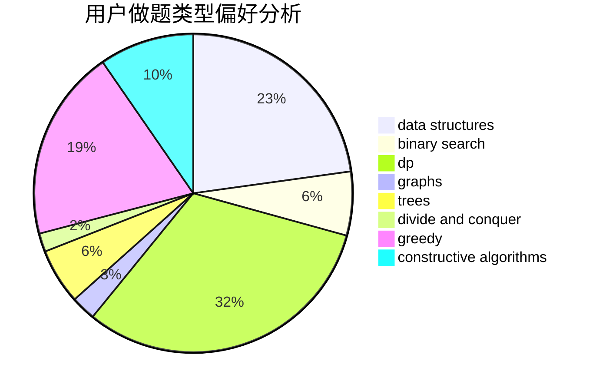

# Lucky_Glass

<!-- tabs:start -->

#### **用户提交结果分析**

#### **用户做题类型偏好分析**

#### **用户错题知识点分析**

<!-- tabs:end -->
# 推荐题目
[722D](https://codeforces.com/contest/722/problem/D)		binary search,
                        data structures,
                        dfs and similar,
                        greedy,
                        strings,
                        trees		  
[838F](https://codeforces.com/contest/838/problem/F)		nan		  
[557B](https://codeforces.com/contest/557/problem/B)		constructive algorithms,
                        implementation,
                        math,
                        sortings		  
[727E](https://codeforces.com/contest/727/problem/E)		data structures,
                        hashing,
                        string suffix structures,
                        strings		  
[288E](https://codeforces.com/contest/288/problem/E)		dp,
                        implementation,
                        math		  
[936E](https://codeforces.com/contest/936/problem/E)		data structures,
                        dfs and similar,
                        divide and conquer,
                        dsu,
                        shortest paths,
                        trees		  
[1188E](https://codeforces.com/contest/1188/problem/E)		combinatorics		  
[886F](https://codeforces.com/contest/886/problem/F)		geometry		  
[1200B](https://codeforces.com/contest/1200/problem/B)		dp,
                        greedy		  
[682E](https://codeforces.com/contest/682/problem/E)		geometry,
                        two pointers		  
