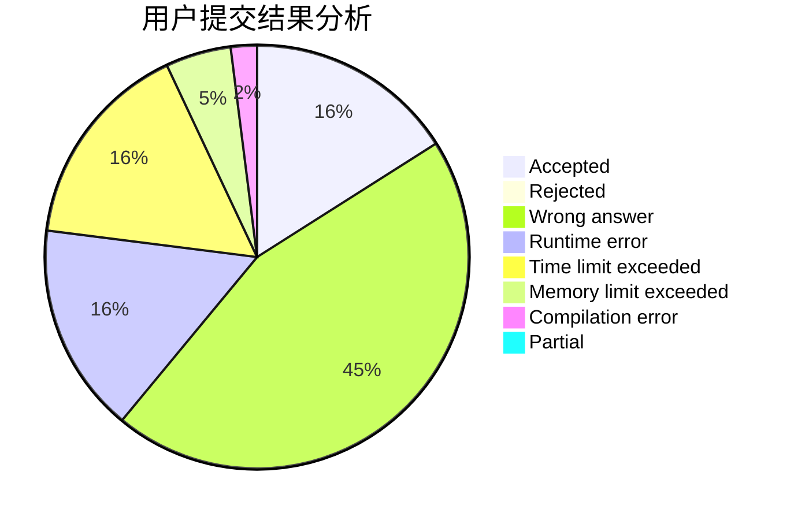
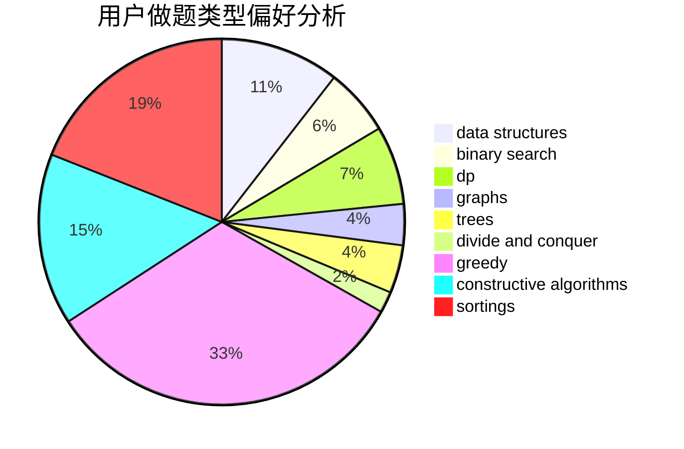

# 755352046
<!-- tabs:start -->
#### **用户提交结果分析**

#### **用户做题类型偏好分析**

#### **用户错题知识点分析**

<!-- tabs:end -->
# 推荐题目
[1355E](http://codeforces.com/problemset/problem/1355/E)		binary search,
                        greedy,
                        math,
                        sortings,
                        ternary search		  
[1415C](http://codeforces.com/problemset/problem/1415/C)		brute force,
                        dp,
                        implementation		  
[1417B](http://codeforces.com/problemset/problem/1417/B)		greedy,
                        math,
                        sortings		  
[1411G](http://codeforces.com/problemset/problem/1411/G)		bitmasks,
                        games,
                        math,
                        matrices		  
[1413F](http://codeforces.com/problemset/problem/1413/F)		data structures,
                        trees		  
[1207C](http://codeforces.com/problemset/problem/1207/C)		dp,
                        greedy		  
[1413C](http://codeforces.com/problemset/problem/1413/C)		binary search,
                        brute force,
                        dp,
                        implementation,
                        sortings,
                        two pointers		  
[1335E2](http://codeforces.com/problemset/problem/1335/E2)		brute force,
                        data structures,
                        dp,
                        two pointers		  
[1388E](http://codeforces.com/problemset/problem/1388/E)		data structures,
                        geometry,
                        sortings		  
[1415E](http://codeforces.com/problemset/problem/1415/E)		constructive algorithms,
                        greedy,
                        math		  
<!-- tabs:start -->
#### **data structures**
[1413F](http://codeforces.com/problemset/problem/1413/F)		data structures,
                        trees		  
[1335E2](http://codeforces.com/problemset/problem/1335/E2)		brute force,
                        data structures,
                        dp,
                        two pointers		  
[1388E](http://codeforces.com/problemset/problem/1388/E)		data structures,
                        geometry,
                        sortings		  
[1417E](https://codeforces.com/contest/1417/problem/E)		bitmasks,
                        data structures,
                        divide and conquer,
                        dp,
                        greedy,
                        math,
                        sortings,
                        strings,
                        trees		  
[1418F](http://codeforces.com/problemset/problem/1418/F)		data structures,
                        math,
                        number theory,
                        two pointers		  
[1417F](https://codeforces.com/contest/1417/problem/F)		data structures,
                        dsu,
                        graphs,
                        implementation,
                        trees		  
[1418G](http://codeforces.com/problemset/problem/1418/G)		data structures,
                        divide and conquer,
                        hashing,
                        two pointers		  
[140C](http://codeforces.com/problemset/problem/140/C)		binary search,
                        data structures,
                        greedy		  
[1380E](http://codeforces.com/problemset/problem/1380/E)		data structures,
                        dsu,
                        implementation,
                        trees		  
[1371F](http://codeforces.com/problemset/problem/1371/F)		data structures,
                        divide and conquer,
                        implementation		  
#### **binary search**
[1355E](http://codeforces.com/problemset/problem/1355/E)		binary search,
                        greedy,
                        math,
                        sortings,
                        ternary search		  
[1413C](http://codeforces.com/problemset/problem/1413/C)		binary search,
                        brute force,
                        dp,
                        implementation,
                        sortings,
                        two pointers		  
[1249C2](http://codeforces.com/problemset/problem/1249/C2)		binary search,
                        greedy,
                        math,
                        meet-in-the-middle		  
[140C](http://codeforces.com/problemset/problem/140/C)		binary search,
                        data structures,
                        greedy		  
[1417C](https://codeforces.com/contest/1417/problem/C)		binary search,
                        data structures,
                        implementation,
                        two pointers		  
[1416A](http://codeforces.com/problemset/problem/1416/A)		binary search,
                        data structures,
                        implementation,
                        two pointers		  
[1416E](http://codeforces.com/problemset/problem/1416/E)		binary search,
                        data structures,
                        dp,
                        greedy		  
[1419D2](http://codeforces.com/problemset/problem/1419/D2)		binary search,
                        brute force,
                        constructive algorithms,
                        greedy,
                        sortings,
                        two pointers		  
[1418E](http://codeforces.com/problemset/problem/1418/E)		binary search,
                        combinatorics,
                        probabilities		  
[1419D1](http://codeforces.com/problemset/problem/1419/D1)		binary search,
                        constructive algorithms,
                        greedy,
                        sortings		  
#### **dp**
[1415C](http://codeforces.com/problemset/problem/1415/C)		brute force,
                        dp,
                        implementation		  
[1207C](http://codeforces.com/problemset/problem/1207/C)		dp,
                        greedy		  
[1413C](http://codeforces.com/problemset/problem/1413/C)		binary search,
                        brute force,
                        dp,
                        implementation,
                        sortings,
                        two pointers		  
[1335E2](http://codeforces.com/problemset/problem/1335/E2)		brute force,
                        data structures,
                        dp,
                        two pointers		  
[1415F](http://codeforces.com/problemset/problem/1415/F)		dp		  
[1417E](https://codeforces.com/contest/1417/problem/E)		bitmasks,
                        data structures,
                        divide and conquer,
                        dp,
                        greedy,
                        math,
                        sortings,
                        strings,
                        trees		  
[140E](http://codeforces.com/problemset/problem/140/E)		combinatorics,
                        dp		  
[1392G](http://codeforces.com/problemset/problem/1392/G)		bitmasks,
                        dfs and similar,
                        dp,
                        math,
                        shortest paths		  
[1416E](http://codeforces.com/problemset/problem/1416/E)		binary search,
                        data structures,
                        dp,
                        greedy		  
[1007E](http://codeforces.com/problemset/problem/1007/E)		dp		  
#### **graph**
[1416F](http://codeforces.com/problemset/problem/1416/F)		flows,
                        graph matchings,
                        greedy,
                        implementation		  
[1411C](http://codeforces.com/problemset/problem/1411/C)		dfs and similar,
                        dsu,
                        graphs		  
[1417F](https://codeforces.com/contest/1417/problem/F)		data structures,
                        dsu,
                        graphs,
                        implementation,
                        trees		  
[1209F](http://codeforces.com/problemset/problem/1209/F)		data structures,
                        dfs and similar,
                        graphs,
                        shortest paths,
                        strings,
                        trees		  
[1278D](http://codeforces.com/problemset/problem/1278/D)		data structures,
                        dsu,
                        graphs,
                        trees		  
[1416D](http://codeforces.com/problemset/problem/1416/D)		data structures,
                        dsu,
                        graphs,
                        implementation,
                        trees		  
[1418C](http://codeforces.com/problemset/problem/1418/C)		dp,
                        graphs,
                        greedy,
                        shortest paths		  
[1487C](http://codeforces.com/problemset/problem/1487/C)		brute force,
                        constructive algorithms,
                        dfs and similar,
                        graphs,
                        greedy,
                        implementation,
                        math		  
[1437C](http://codeforces.com/problemset/problem/1437/C)		dp,
                        flows,
                        graph matchings,
                        greedy,
                        math,
                        sortings		  
[1470D](http://codeforces.com/problemset/problem/1470/D)		constructive algorithms,
                        dfs and similar,
                        graph matchings,
                        graphs,
                        greedy		  
#### **trees**
[1413F](http://codeforces.com/problemset/problem/1413/F)		data structures,
                        trees		  
[1417E](https://codeforces.com/contest/1417/problem/E)		bitmasks,
                        data structures,
                        divide and conquer,
                        dp,
                        greedy,
                        math,
                        sortings,
                        strings,
                        trees		  
[1417F](https://codeforces.com/contest/1417/problem/F)		data structures,
                        dsu,
                        graphs,
                        implementation,
                        trees		  
[1380E](http://codeforces.com/problemset/problem/1380/E)		data structures,
                        dsu,
                        implementation,
                        trees		  
[1252F](http://codeforces.com/problemset/problem/1252/F)		hashing,
                        trees		  
[1387B2](http://codeforces.com/problemset/problem/1387/B2)		*special problem,
                        dfs and similar,
                        trees		  
[1209F](http://codeforces.com/problemset/problem/1209/F)		data structures,
                        dfs and similar,
                        graphs,
                        shortest paths,
                        strings,
                        trees		  
[1278D](http://codeforces.com/problemset/problem/1278/D)		data structures,
                        dsu,
                        graphs,
                        trees		  
[1416D](http://codeforces.com/problemset/problem/1416/D)		data structures,
                        dsu,
                        graphs,
                        implementation,
                        trees		  
[1416C](http://codeforces.com/problemset/problem/1416/C)		bitmasks,
                        data structures,
                        divide and conquer,
                        dp,
                        greedy,
                        math,
                        sortings,
                        strings,
                        trees		  
#### **divide and conquer**
[1417E](https://codeforces.com/contest/1417/problem/E)		bitmasks,
                        data structures,
                        divide and conquer,
                        dp,
                        greedy,
                        math,
                        sortings,
                        strings,
                        trees		  
[1418G](http://codeforces.com/problemset/problem/1418/G)		data structures,
                        divide and conquer,
                        hashing,
                        two pointers		  
[1371F](http://codeforces.com/problemset/problem/1371/F)		data structures,
                        divide and conquer,
                        implementation		  
[1416C](http://codeforces.com/problemset/problem/1416/C)		bitmasks,
                        data structures,
                        divide and conquer,
                        dp,
                        greedy,
                        math,
                        sortings,
                        strings,
                        trees		  
[1461D](http://codeforces.com/problemset/problem/1461/D)		binary search,
                        brute force,
                        data structures,
                        divide and conquer,
                        implementation,
                        sortings		  
[1466G](http://codeforces.com/problemset/problem/1466/G)		combinatorics,
                        divide and conquer,
                        hashing,
                        math,
                        string suffix structures,
                        strings		  
[1490D](http://codeforces.com/problemset/problem/1490/D)		dfs and similar,
                        divide and conquer,
                        implementation		  
[1483C](https://codeforces.com/contest/1483/problem/C)		data structures,
                        divide and conquer,
                        dp		  
[1491E](http://codeforces.com/problemset/problem/1491/E)		brute force,
                        dfs and similar,
                        divide and conquer,
                        number theory,
                        trees		  
[1303G](http://codeforces.com/problemset/problem/1303/G)		data structures,
                        divide and conquer,
                        geometry,
                        trees		  
#### **greedy**
[1355E](http://codeforces.com/problemset/problem/1355/E)		binary search,
                        greedy,
                        math,
                        sortings,
                        ternary search		  
[1417B](http://codeforces.com/problemset/problem/1417/B)		greedy,
                        math,
                        sortings		  
[1207C](http://codeforces.com/problemset/problem/1207/C)		dp,
                        greedy		  
[1415E](http://codeforces.com/problemset/problem/1415/E)		constructive algorithms,
                        greedy,
                        math		  
[103C](http://codeforces.com/problemset/problem/103/C)		constructive algorithms,
                        greedy		  
[140B](http://codeforces.com/problemset/problem/140/B)		brute force,
                        greedy,
                        implementation		  
[1249C2](http://codeforces.com/problemset/problem/1249/C2)		binary search,
                        greedy,
                        math,
                        meet-in-the-middle		  
[1411D](http://codeforces.com/problemset/problem/1411/D)		brute force,
                        greedy,
                        implementation,
                        strings		  
[1411F](http://codeforces.com/problemset/problem/1411/F)		greedy,
                        math		  
[1416F](http://codeforces.com/problemset/problem/1416/F)		flows,
                        graph matchings,
                        greedy,
                        implementation		  
#### **constructive algorithms**
[1415E](http://codeforces.com/problemset/problem/1415/E)		constructive algorithms,
                        greedy,
                        math		  
[103C](http://codeforces.com/problemset/problem/103/C)		constructive algorithms,
                        greedy		  
[1415D](http://codeforces.com/problemset/problem/1415/D)		bitmasks,
                        brute force,
                        constructive algorithms		  
[1419B](http://codeforces.com/problemset/problem/1419/B)		brute force,
                        constructive algorithms,
                        greedy,
                        implementation,
                        math		  
[1148E](http://codeforces.com/problemset/problem/1148/E)		constructive algorithms,
                        greedy,
                        math,
                        sortings,
                        two pointers		  
[1417D](https://codeforces.com/contest/1417/problem/D)		constructive algorithms,
                        greedy,
                        math		  
[1419D2](http://codeforces.com/problemset/problem/1419/D2)		binary search,
                        brute force,
                        constructive algorithms,
                        greedy,
                        sortings,
                        two pointers		  
[1148C](http://codeforces.com/problemset/problem/1148/C)		constructive algorithms,
                        sortings		  
[1416B](http://codeforces.com/problemset/problem/1416/B)		constructive algorithms,
                        greedy,
                        math		  
[1413A](http://codeforces.com/problemset/problem/1413/A)		constructive algorithms,
                        math		  
#### **sortings**
[1355E](http://codeforces.com/problemset/problem/1355/E)		binary search,
                        greedy,
                        math,
                        sortings,
                        ternary search		  
[1417B](http://codeforces.com/problemset/problem/1417/B)		greedy,
                        math,
                        sortings		  
[1413C](http://codeforces.com/problemset/problem/1413/C)		binary search,
                        brute force,
                        dp,
                        implementation,
                        sortings,
                        two pointers		  
[1388E](http://codeforces.com/problemset/problem/1388/E)		data structures,
                        geometry,
                        sortings		  
[1417E](https://codeforces.com/contest/1417/problem/E)		bitmasks,
                        data structures,
                        divide and conquer,
                        dp,
                        greedy,
                        math,
                        sortings,
                        strings,
                        trees		  
[1269B](http://codeforces.com/problemset/problem/1269/B)		brute force,
                        sortings		  
[1148E](http://codeforces.com/problemset/problem/1148/E)		constructive algorithms,
                        greedy,
                        math,
                        sortings,
                        two pointers		  
[1418B](http://codeforces.com/problemset/problem/1418/B)		greedy,
                        sortings		  
[1419D2](http://codeforces.com/problemset/problem/1419/D2)		binary search,
                        brute force,
                        constructive algorithms,
                        greedy,
                        sortings,
                        two pointers		  
[1148C](http://codeforces.com/problemset/problem/1148/C)		constructive algorithms,
                        sortings		  
<!-- tabs:end -->
