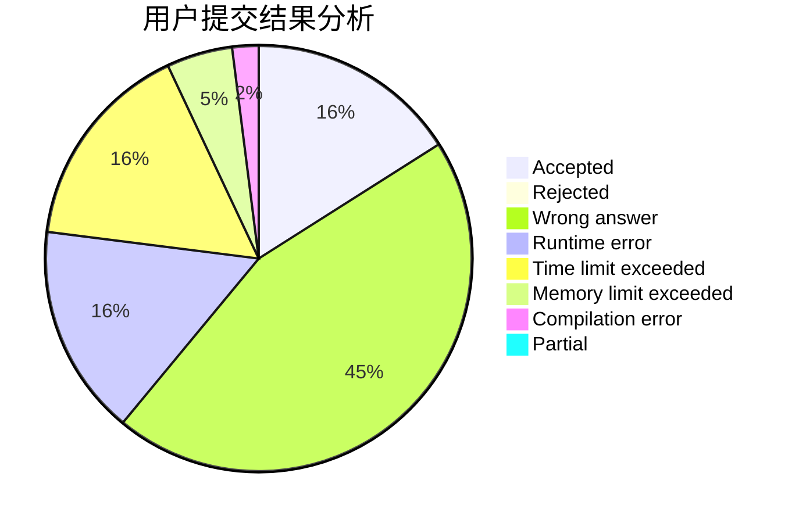
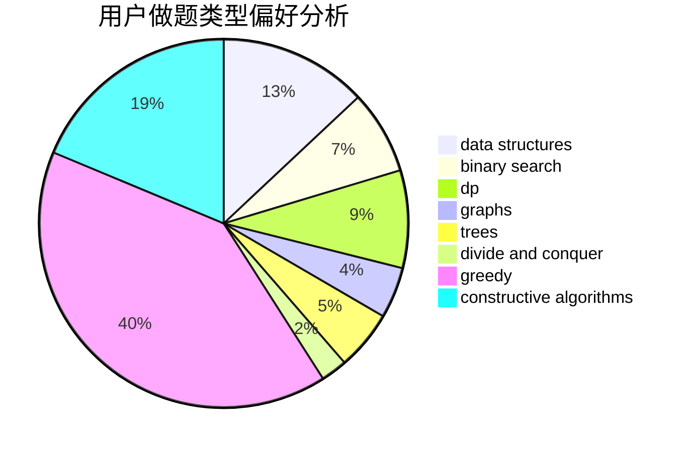

# 755352046

<!-- tabs:start -->

#### **用户提交结果分析**

#### **用户做题类型偏好分析**

#### **用户错题知识点分析**

<!-- tabs:end -->
# 推荐题目
[1419D1](https://codeforces.com/contest/1419D/problem/1)		binary search,
                        constructive algorithms,
                        greedy,
                        sortings		  
[140C](https://codeforces.com/contest/140/problem/C)		binary search,
                        data structures,
                        greedy		  
[1415F](https://codeforces.com/contest/1415/problem/F)		dp		  
[1416F](https://codeforces.com/contest/1416/problem/F)		flows,
                        graph matchings,
                        greedy,
                        implementation		  
[1413F](https://codeforces.com/contest/1413/problem/F)		data structures,
                        trees		  
[1417C](https://codeforces.com/contest/1417/problem/C)		dsu,graphs,sortings,trees		  
[103C](https://codeforces.com/contest/103/problem/C)		constructive algorithms,
                        greedy		  
[1355E](https://codeforces.com/contest/1355/problem/E)		binary search,
                        greedy,
                        math,
                        sortings,
                        ternary search		  
[1417B](https://codeforces.com/contest/1417/problem/B)		greedy,
                        math,
                        sortings		  
[1413C](https://codeforces.com/contest/1413/problem/C)		binary search,
                        brute force,
                        dp,
                        implementation,
                        sortings,
                        two pointers		  
