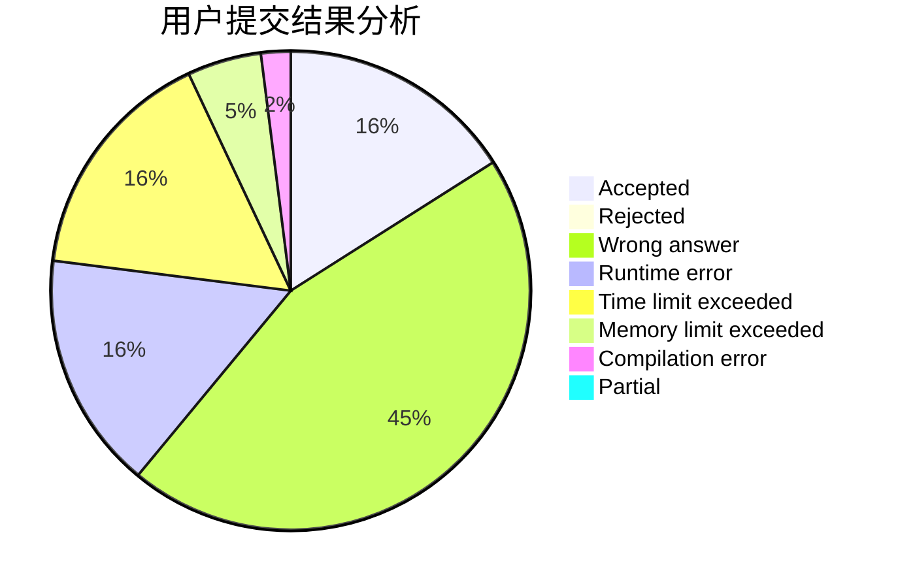
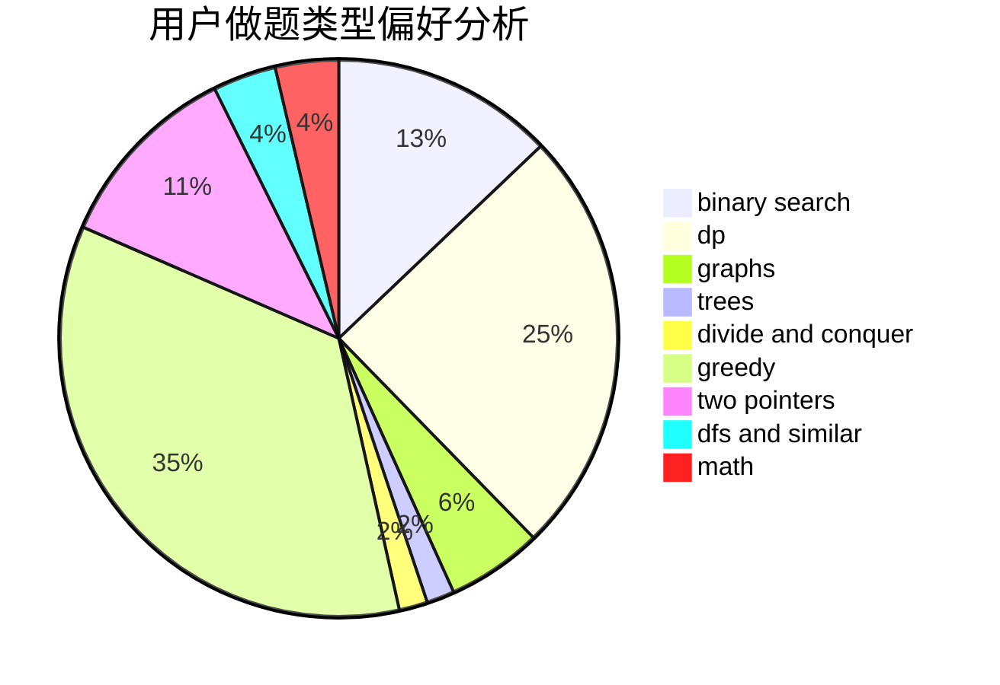

# 755352046

<!-- tabs:start -->

#### **用户提交结果分析**

#### **用户做题类型偏好分析**

<!-- tabs:end -->
# 推荐题目
[1427B](https://codeforces.com/contest/1427/problem/B)
[1420E](https://codeforces.com/contest/1420/problem/E)
[1423J](https://codeforces.com/contest/1423/problem/J)
[1424G](https://codeforces.com/contest/1424/problem/G)
[1423C](https://codeforces.com/contest/1423/problem/C)
[1424M](https://codeforces.com/contest/1424/problem/M)
[1040A](https://codeforces.com/contest/1040/problem/A)
[1362D](https://codeforces.com/contest/1362/problem/D)
[1424J](https://codeforces.com/contest/1424/problem/J)
[1422E](https://codeforces.com/contest/1422/problem/E)
