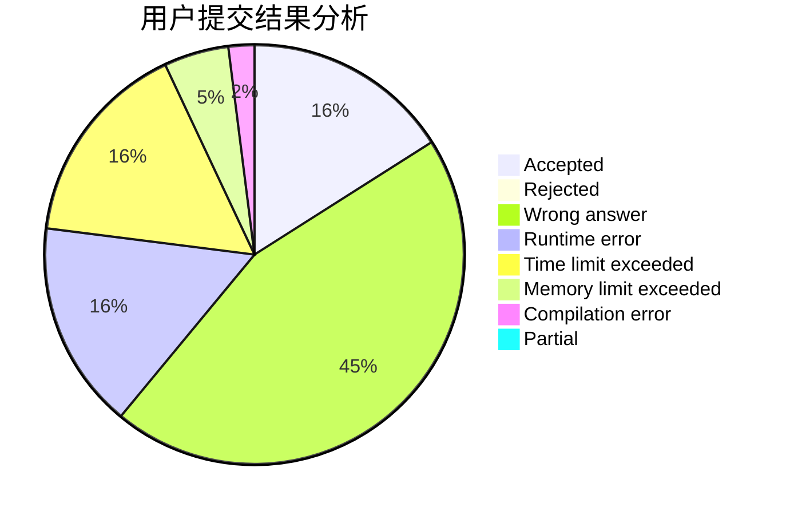
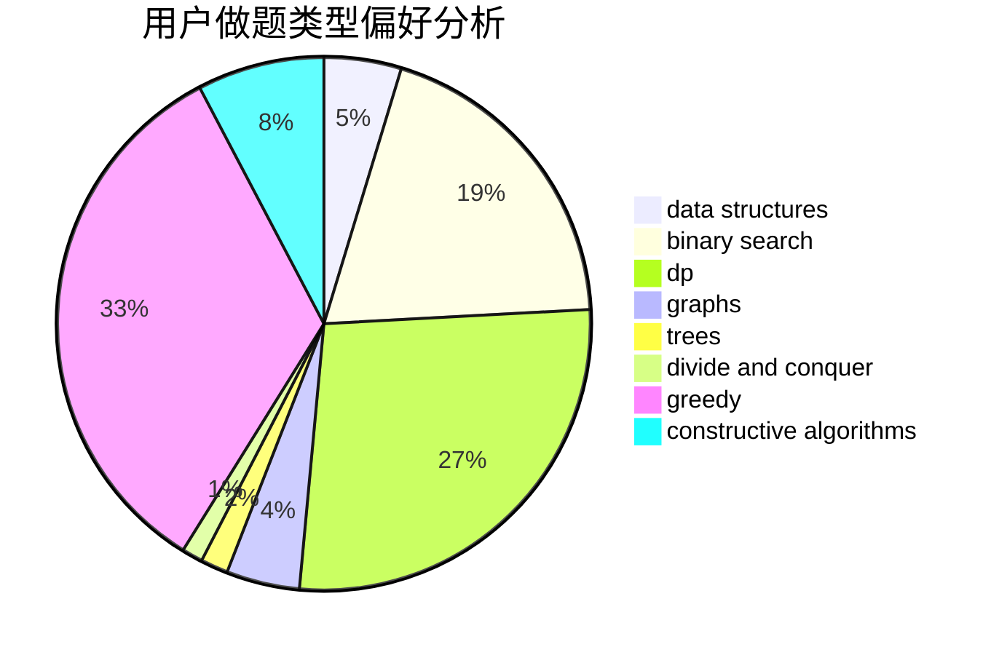

# 755352046

<!-- tabs:start -->

#### **用户提交结果分析**

#### **用户做题类型偏好分析**

#### **用户错题知识点分析**

<!-- tabs:end -->
# 推荐题目
[1427B](https://codeforces.com/contest/1427/problem/B)		greedy,
                        implementation,
                        sortings		  
[1420E](https://codeforces.com/contest/1420/problem/E)		dp,
                        greedy		  
[1423J](https://codeforces.com/contest/1423/problem/J)		bitmasks,
                        constructive algorithms,
                        dp,
                        math		  
[1424G](https://codeforces.com/contest/1424/problem/G)		data structures,
                        sortings		  
[1423C](https://codeforces.com/contest/1423/problem/C)		divide and conquer,
                        graphs,
                        trees		  
[1424M](https://codeforces.com/contest/1424/problem/M)		graphs,
                        sortings		  
[1040A](https://codeforces.com/contest/1040/problem/A)		greedy		  
[1362D](https://codeforces.com/contest/1362/problem/D)		dsu,graphs,sortings,trees		  
[1424J](https://codeforces.com/contest/1424/problem/J)		dsu,graphs,sortings,trees		  
[1422E](https://codeforces.com/contest/1422/problem/E)		dp,
                        greedy,
                        implementation,
                        strings		  
