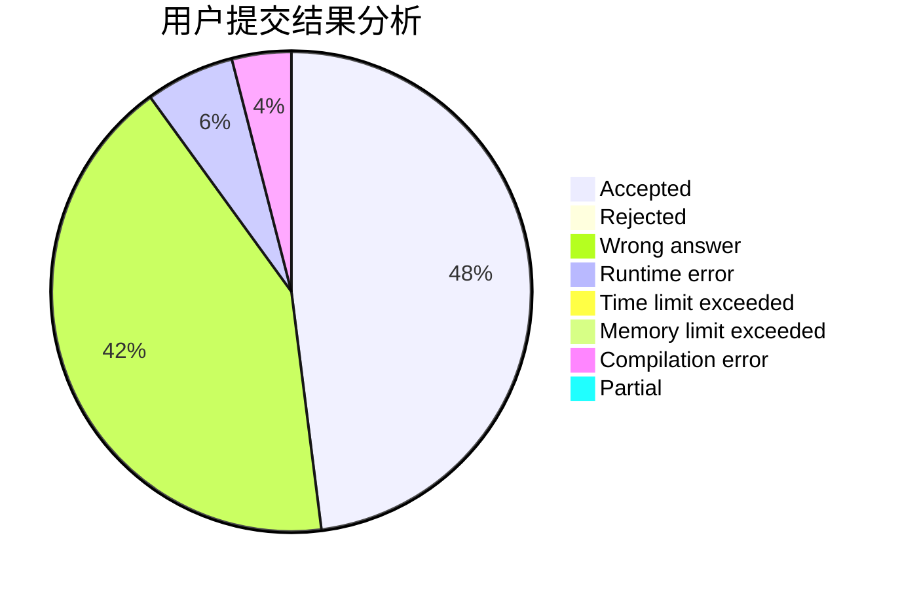
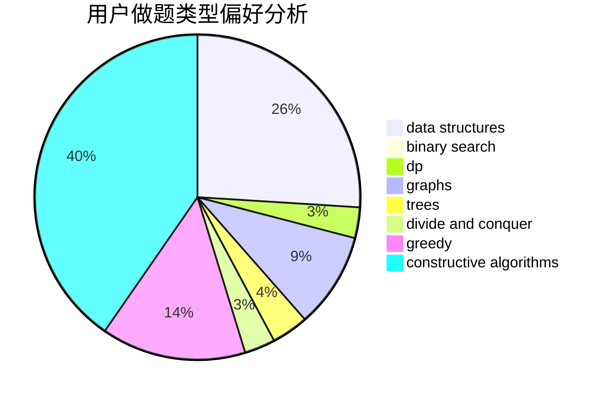
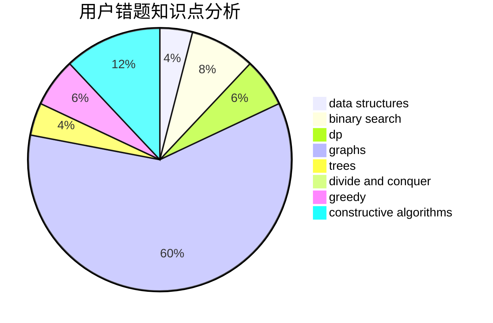

# Luisvacson

<!-- tabs:start -->

#### **用户提交结果分析**

#### **用户做题类型偏好分析**

#### **用户错题知识点分析**

<!-- tabs:end -->
# 推荐题目
[683A](https://codeforces.com/contest/683/problem/A)		*special problem,
                        geometry		  
[957B](https://codeforces.com/contest/957/problem/B)		dsu,graphs,sortings,trees		  
[618A](https://codeforces.com/contest/618/problem/A)		implementation		  
[1086D](https://codeforces.com/contest/1086/problem/D)		dsu,graphs,sortings,trees		  
[818D](https://codeforces.com/contest/818/problem/D)		data structures,
                        implementation		  
[1197C](https://codeforces.com/contest/1197/problem/C)		greedy,
                        sortings		  
[940E](https://codeforces.com/contest/940/problem/E)		data structures,
                        dp,
                        greedy,
                        math		  
[295E](https://codeforces.com/contest/295/problem/E)		data structures		  
[1320A](https://codeforces.com/contest/1320/problem/A)		data structures,
                        dp,
                        greedy,
                        math,
                        sortings		  
[712E](https://codeforces.com/contest/712/problem/E)		data structures,
                        math,
                        probabilities		  
