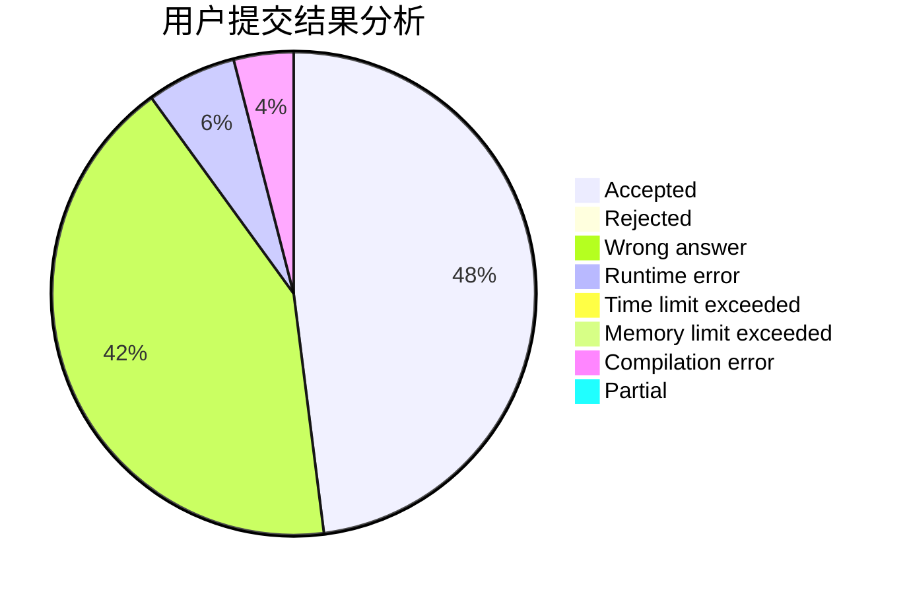
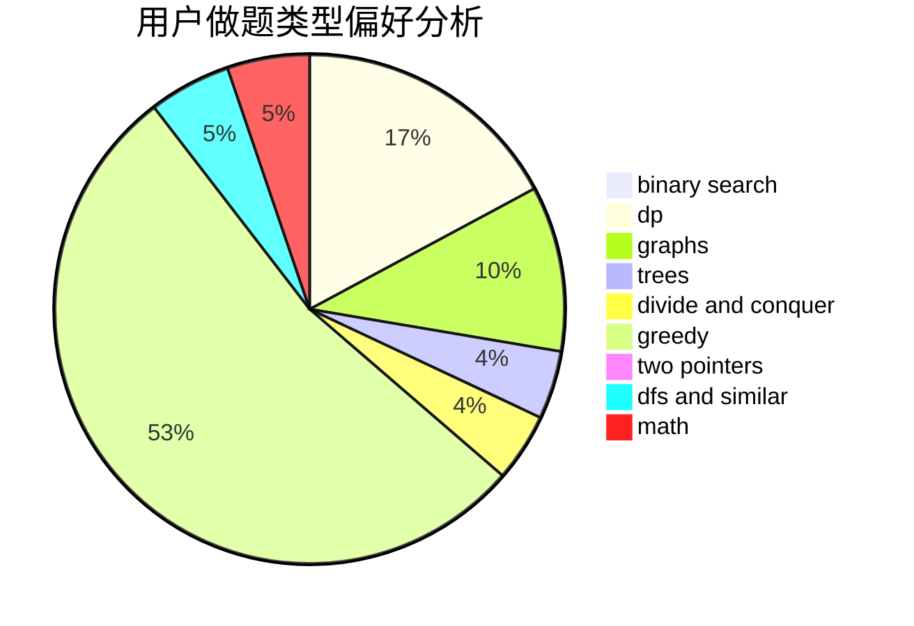

# Luisvacson

<!-- tabs:start -->

#### **用户提交结果分析**

#### **用户做题类型偏好分析**

<!-- tabs:end -->
# 推荐题目
[707B](https://codeforces.com/contest/707/problem/B)
[978E](https://codeforces.com/contest/978/problem/E)
[637B](https://codeforces.com/contest/637/problem/B)
[1087B](https://codeforces.com/contest/1087/problem/B)
[838C](https://codeforces.com/contest/838/problem/C)
[1200E](https://codeforces.com/contest/1200/problem/E)
[962B](https://codeforces.com/contest/962/problem/B)
[312C](https://codeforces.com/contest/312/problem/C)
[1327A](https://codeforces.com/contest/1327/problem/A)
[732A](https://codeforces.com/contest/732/problem/A)
