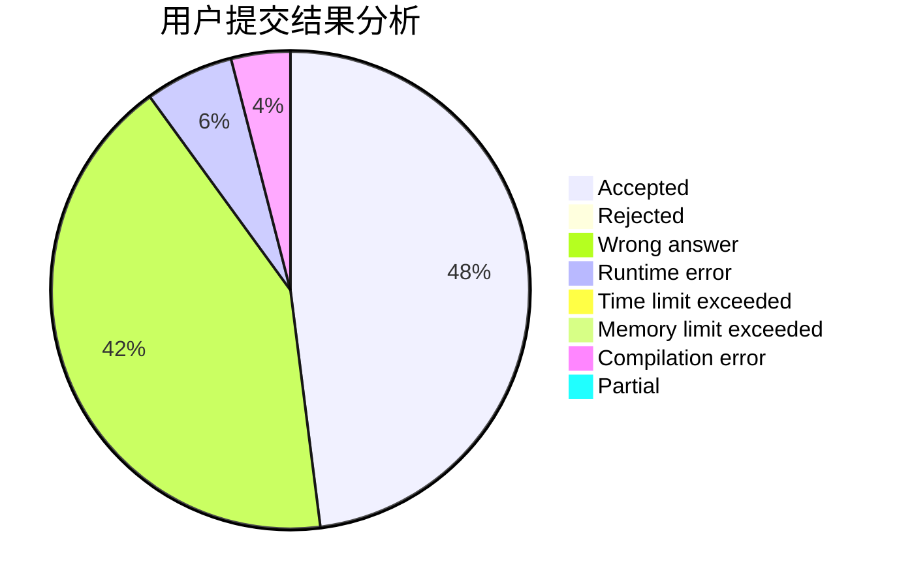
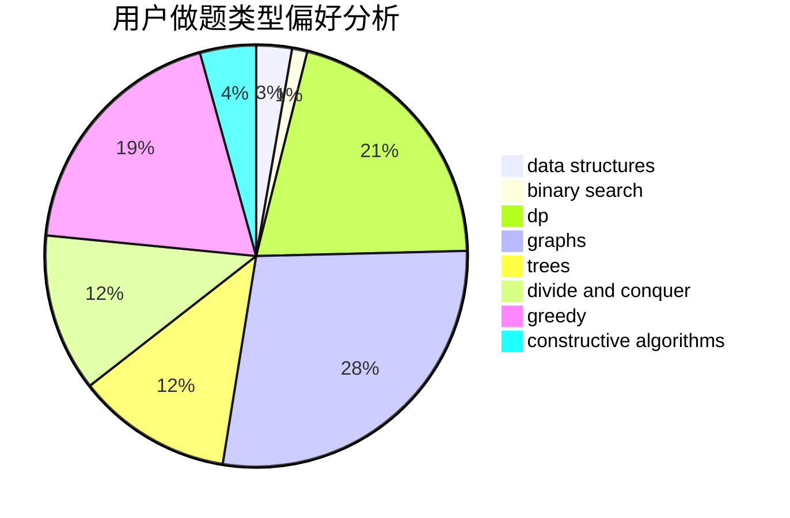
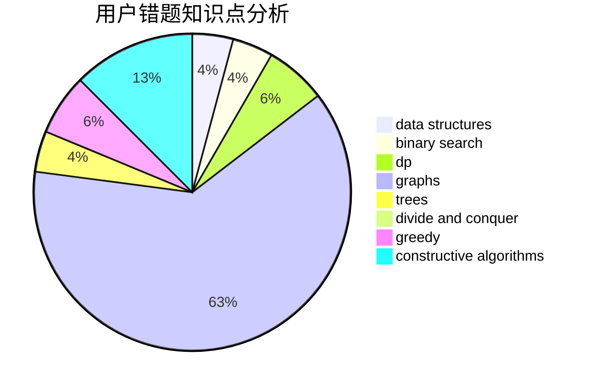

# Luisvacson

<!-- tabs:start -->

#### **用户提交结果分析**

#### **用户做题类型偏好分析**

#### **用户错题知识点分析**

<!-- tabs:end -->
# 推荐题目
[707B](https://codeforces.com/contest/707/problem/B)		graphs		  
[978E](https://codeforces.com/contest/978/problem/E)		combinatorics,
                        math		  
[637B](https://codeforces.com/contest/637/problem/B)		*special problem,
                        binary search,
                        constructive algorithms,
                        data structures,
                        sortings		  
[1087B](https://codeforces.com/contest/1087/problem/B)		dsu,graphs,sortings,trees		  
[838C](https://codeforces.com/contest/838/problem/C)		dp,
                        games		  
[1200E](https://codeforces.com/contest/1200/problem/E)		brute force,
                        hashing,
                        implementation,
                        string suffix structures,
                        strings		  
[962B](https://codeforces.com/contest/962/problem/B)		constructive algorithms,
                        greedy,
                        implementation		  
[312C](https://codeforces.com/contest/312/problem/C)		dsu,graphs,sortings,trees		  
[1327A](https://codeforces.com/contest/1327/problem/A)		math		  
[732A](https://codeforces.com/contest/732/problem/A)		brute force,
                        constructive algorithms,
                        implementation,
                        math		  
