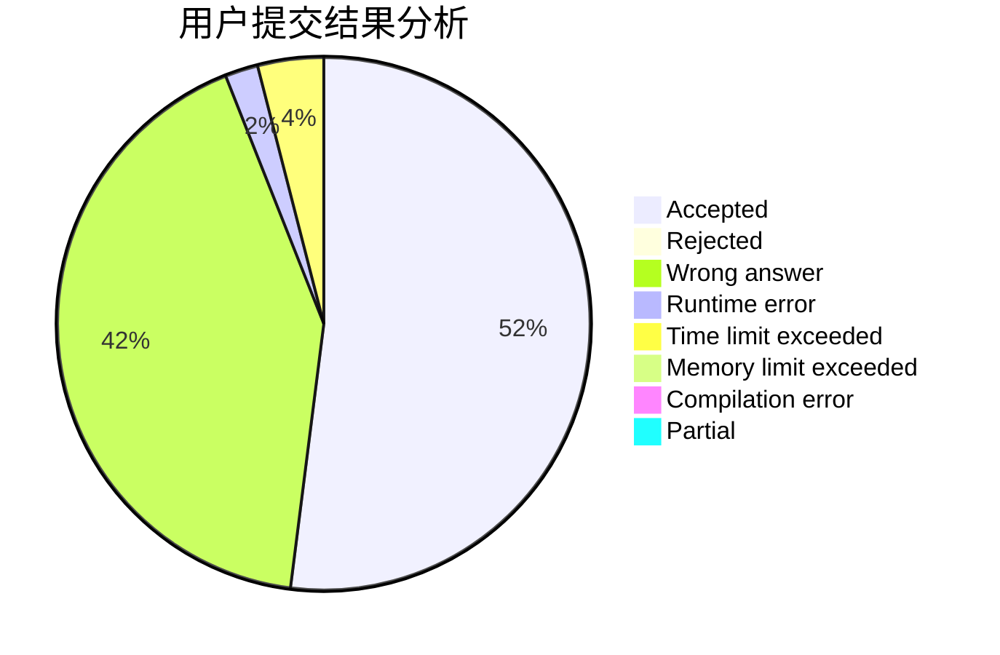
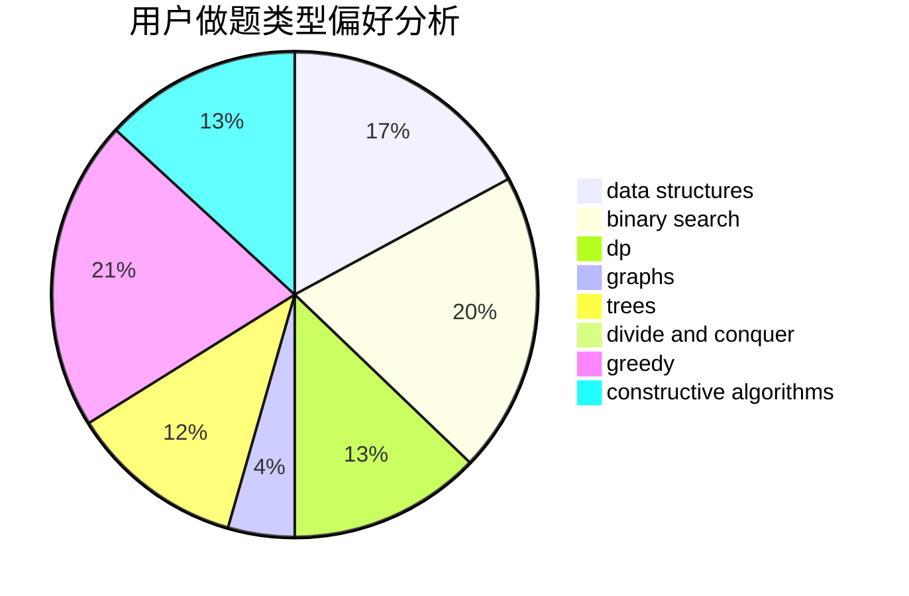

# LunarFlare

<!-- tabs:start -->

#### **用户提交结果分析**

#### **用户做题类型偏好分析**

#### **用户错题知识点分析**

<!-- tabs:end -->
# 推荐题目
[952E](https://codeforces.com/contest/952/problem/E)		nan		  
[1137B](https://codeforces.com/contest/1137/problem/B)		greedy,
                        hashing,
                        strings		  
[1265D](https://codeforces.com/contest/1265/problem/D)		dsu,graphs,sortings,trees		  
[86C](https://codeforces.com/contest/86/problem/C)		dp,
                        string suffix structures,
                        trees		  
[893F](https://codeforces.com/contest/893/problem/F)		data structures,
                        trees		  
[484A](https://codeforces.com/contest/484/problem/A)		bitmasks,
                        constructive algorithms		  
[1044D](https://codeforces.com/contest/1044/problem/D)		data structures,
                        dsu		  
[763E](https://codeforces.com/contest/763/problem/E)		data structures,
                        divide and conquer,
                        dsu		  
[1236B](https://codeforces.com/contest/1236/problem/B)		combinatorics,
                        math		  
[317A](https://codeforces.com/contest/317/problem/A)		brute force		  
