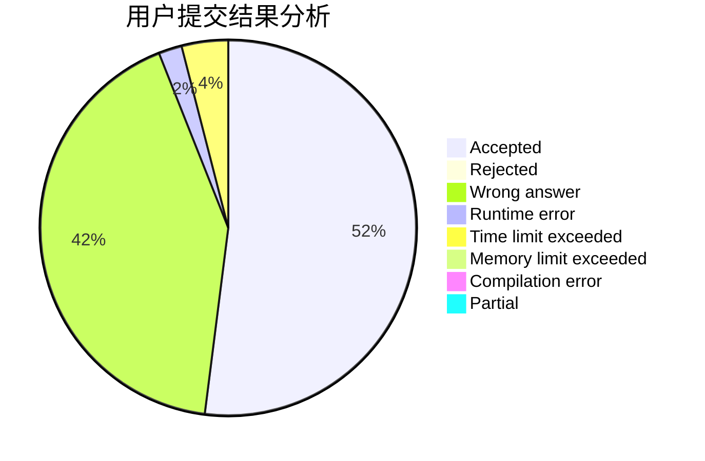
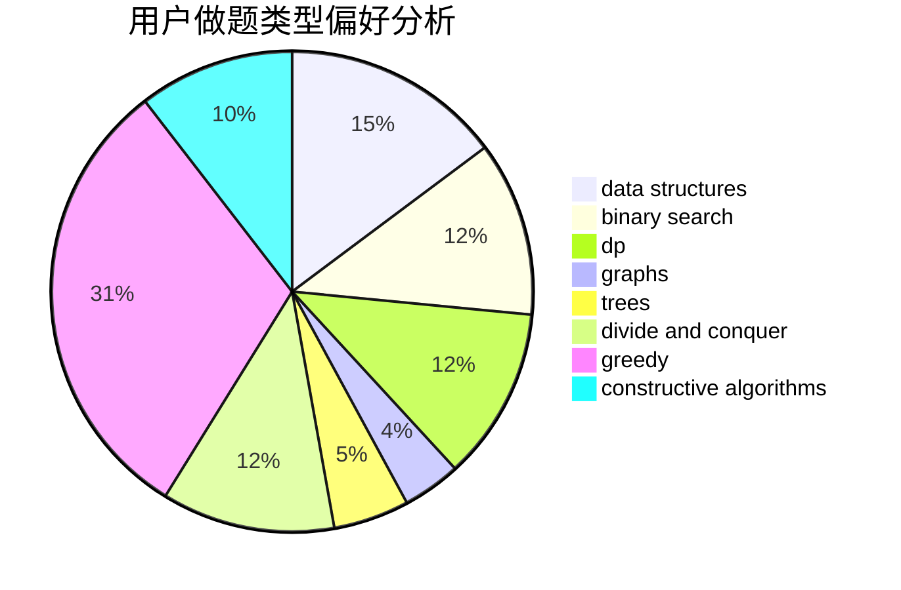

# LunarFlare

<!-- tabs:start -->

#### **用户提交结果分析**

#### **用户做题类型偏好分析**

#### **用户错题知识点分析**

<!-- tabs:end -->
# 推荐题目
[931F](https://codeforces.com/contest/931/problem/F)		dsu,graphs,sortings,trees		  
[1133A](https://codeforces.com/contest/1133/problem/A)		implementation		  
[125D](https://codeforces.com/contest/125/problem/D)		constructive algorithms,
                        greedy		  
[851B](https://codeforces.com/contest/851/problem/B)		geometry,
                        math		  
[873A](https://codeforces.com/contest/873/problem/A)		implementation		  
[464B](https://codeforces.com/contest/464/problem/B)		brute force,
                        geometry		  
[1043G](https://codeforces.com/contest/1043/problem/G)		data structures,
                        divide and conquer,
                        hashing,
                        string suffix structures,
                        strings		  
[743D](https://codeforces.com/contest/743/problem/D)		dfs and similar,
                        dp,
                        graphs,
                        trees		  
[1227D2](https://codeforces.com/contest/1227D/problem/2)		data structures,
                        greedy		  
[29B](https://codeforces.com/contest/29/problem/B)		implementation		  
