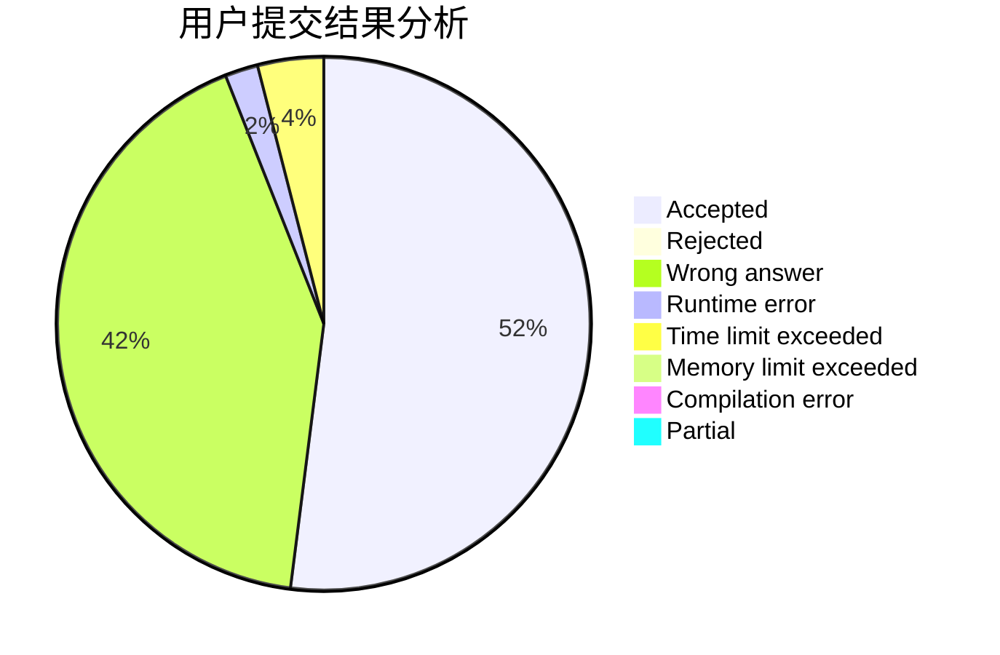
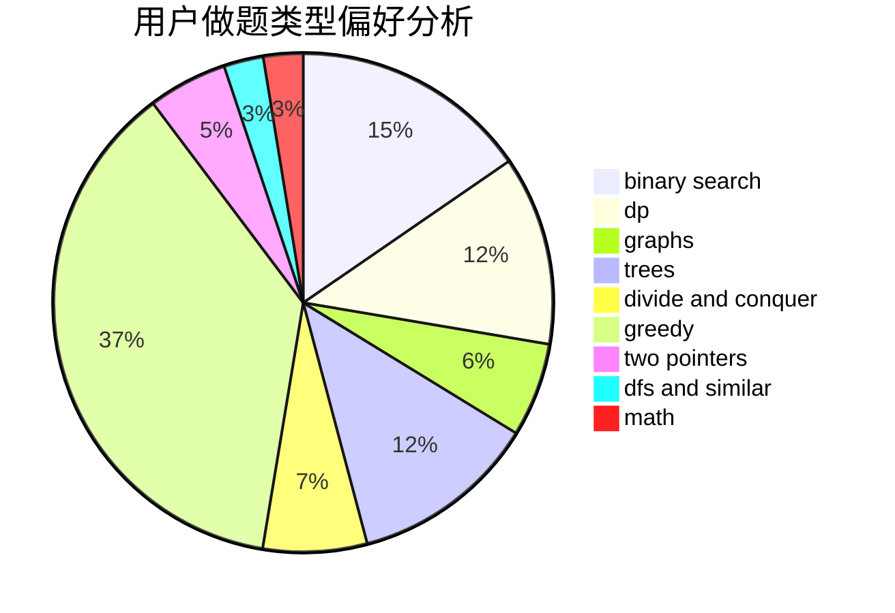

# LunarFlare

<!-- tabs:start -->

#### **用户提交结果分析**

#### **用户做题类型偏好分析**

<!-- tabs:end -->
# 推荐题目
[952E](https://codeforces.com/contest/952/problem/E)
[1137B](https://codeforces.com/contest/1137/problem/B)
[1265D](https://codeforces.com/contest/1265/problem/D)
[86C](https://codeforces.com/contest/86/problem/C)
[893F](https://codeforces.com/contest/893/problem/F)
[484A](https://codeforces.com/contest/484/problem/A)
[1044D](https://codeforces.com/contest/1044/problem/D)
[763E](https://codeforces.com/contest/763/problem/E)
[1236B](https://codeforces.com/contest/1236/problem/B)
[317A](https://codeforces.com/contest/317/problem/A)
