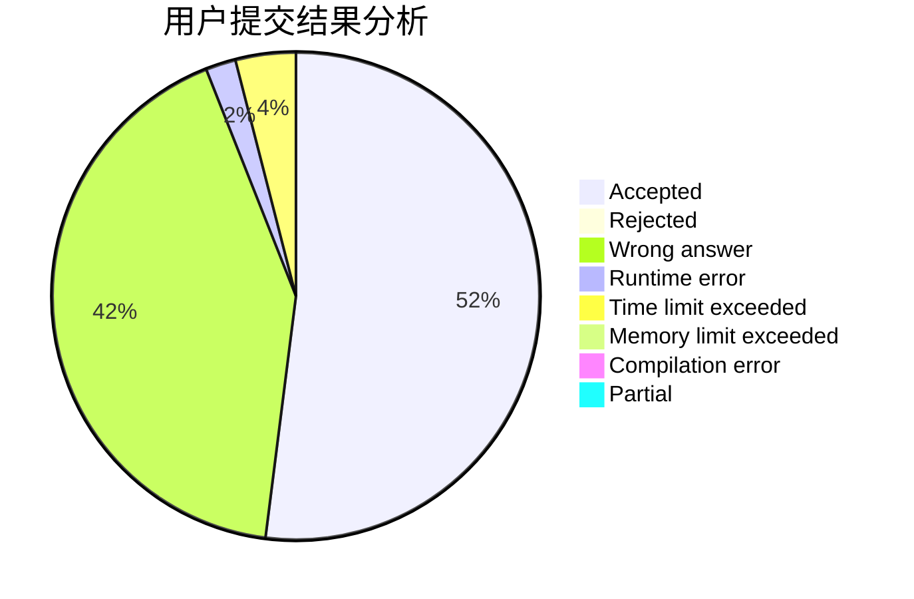
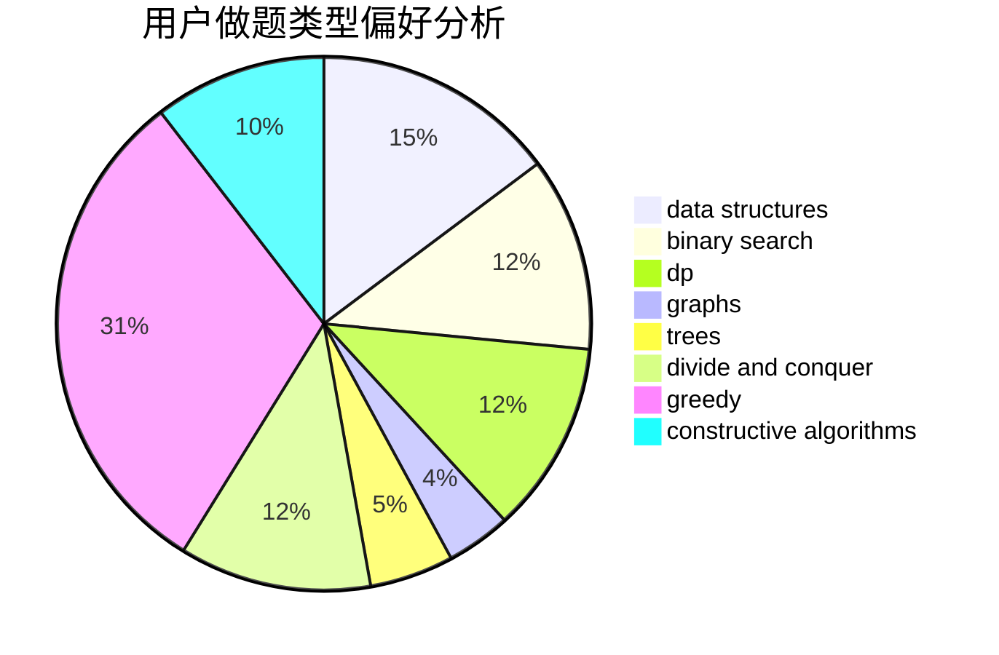

# LunarFlare
<!-- tabs:start -->
#### **用户提交结果分析**

#### **用户做题类型偏好分析**

#### **用户错题知识点分析**

<!-- tabs:end -->
# 推荐题目
[Teodor is not a liar!](https://codeforces.com/contest/931/problem/F)		data structures,
                        dp		  
[Speckled Band](http://codeforces.com/problemset/problem/1043/G)		data structures,
                        divide and conquer,
                        hashing,
                        string suffix structures,
                        strings		  
[Chores](http://codeforces.com/problemset/problem/873/A)		implementation		  
[Middle of the Contest](http://codeforces.com/problemset/problem/1133/A)		implementation		  
[Chloe and pleasant prizes](http://codeforces.com/problemset/problem/743/D)		dfs and similar,
                        dp,
                        graphs,
                        trees		  
[Two progressions](http://codeforces.com/problemset/problem/125/D)		constructive algorithms,
                        greedy		  
[New Roads](http://codeforces.com/problemset/problem/746/G)		constructive algorithms,
                        graphs,
                        trees		  
[Arpa and an exam about geometry](http://codeforces.com/problemset/problem/851/B)		geometry,
                        math		  
[Mike and Frog](http://codeforces.com/problemset/problem/547/A)		brute force,
                        greedy,
                        implementation,
                        math		  
[Lefthanders and Righthanders](http://codeforces.com/problemset/problem/234/A)		implementation		  
<!-- tabs:start -->
#### **data structures**
[Teodor is not a liar!](https://codeforces.com/contest/931/problem/F)		data structures,
                        dp		  
[Speckled Band](http://codeforces.com/problemset/problem/1043/G)		data structures,
                        divide and conquer,
                        hashing,
                        string suffix structures,
                        strings		  
[Chores](http://codeforces.com/problemset/problem/1385/F)		data structures,
                        greedy,
                        implementation,
                        trees		  
[Middle of the Contest](http://codeforces.com/problemset/problem/1227/D2)		data structures,
                        greedy		  
[Chloe and pleasant prizes](http://codeforces.com/problemset/problem/484/E)		binary search,
                        constructive algorithms,
                        data structures		  
[Two progressions](http://codeforces.com/problemset/problem/1108/E2)		data structures,
                        implementation		  
[New Roads](http://codeforces.com/problemset/problem/917/E)		data structures,
                        string suffix structures,
                        strings,
                        trees		  
[Arpa and an exam about geometry](http://codeforces.com/problemset/problem/637/B)		*special problem,
                        binary search,
                        constructive algorithms,
                        data structures,
                        sortings		  
[Mike and Frog](http://codeforces.com/problemset/problem/1436/E)		binary search,
                        data structures,
                        two pointers		  
[Lefthanders and Righthanders](http://codeforces.com/problemset/problem/1374/E1)		data structures,
                        greedy,
                        sortings		  
#### **binary search**
[Teodor is not a liar!](https://codeforces.com/contest/807/problem/C)		binary search,
                        math		  
[Speckled Band](http://codeforces.com/problemset/problem/484/E)		binary search,
                        constructive algorithms,
                        data structures		  
[Chores](http://codeforces.com/problemset/problem/1056/F)		binary search,
                        dp,
                        math		  
[Middle of the Contest](http://codeforces.com/problemset/problem/637/B)		*special problem,
                        binary search,
                        constructive algorithms,
                        data structures,
                        sortings		  
[Chloe and pleasant prizes](http://codeforces.com/problemset/problem/1055/E)		binary search,
                        dp		  
[Two progressions](http://codeforces.com/problemset/problem/1436/E)		binary search,
                        data structures,
                        two pointers		  
[New Roads](http://codeforces.com/problemset/problem/883/D)		binary search,
                        dp,
                        math		  
[Arpa and an exam about geometry](http://codeforces.com/problemset/problem/1237/D)		binary search,
                        data structures,
                        implementation		  
[Mike and Frog](https://codeforces.com/contest/957/problem/C)		binary search,
                        greedy,
                        two pointers		  
[Lefthanders and Righthanders](https://codeforces.com/contest/947/problem/B)		binary search,
                        data structures		  
#### **dp**
[Teodor is not a liar!](https://codeforces.com/contest/931/problem/F)		data structures,
                        dp		  
[Speckled Band](http://codeforces.com/problemset/problem/743/D)		dfs and similar,
                        dp,
                        graphs,
                        trees		  
[Chores](http://codeforces.com/problemset/problem/662/E)		brute force,
                        dp,
                        greedy		  
[Middle of the Contest](http://codeforces.com/problemset/problem/1056/F)		binary search,
                        dp,
                        math		  
[Chloe and pleasant prizes](http://codeforces.com/problemset/problem/1055/E)		binary search,
                        dp		  
[Two progressions](http://codeforces.com/problemset/problem/839/D)		combinatorics,
                        dp,
                        math,
                        number theory		  
[New Roads](https://codeforces.com/contest/434/problem/C)		dp		  
[Arpa and an exam about geometry](http://codeforces.com/problemset/problem/128/C)		combinatorics,
                        dp		  
[Mike and Frog](http://codeforces.com/problemset/problem/883/D)		binary search,
                        dp,
                        math		  
[Lefthanders and Righthanders](http://codeforces.com/problemset/problem/1133/E)		dp,
                        sortings,
                        two pointers		  
#### **graph**
[Teodor is not a liar!](http://codeforces.com/problemset/problem/743/D)		dfs and similar,
                        dp,
                        graphs,
                        trees		  
[Speckled Band](http://codeforces.com/problemset/problem/746/G)		constructive algorithms,
                        graphs,
                        trees		  
[Chores](http://codeforces.com/problemset/problem/557/D)		combinatorics,
                        dfs and similar,
                        graphs,
                        math		  
[Middle of the Contest](http://codeforces.com/problemset/problem/1476/C)		dp,
                        graphs,
                        greedy		  
[Chloe and pleasant prizes](http://codeforces.com/problemset/problem/1487/C)		brute force,
                        constructive algorithms,
                        dfs and similar,
                        graphs,
                        greedy,
                        implementation,
                        math		  
[Two progressions](http://codeforces.com/problemset/problem/1437/C)		dp,
                        flows,
                        graph matchings,
                        greedy,
                        math,
                        sortings		  
[New Roads](http://codeforces.com/problemset/problem/1470/D)		constructive algorithms,
                        dfs and similar,
                        graph matchings,
                        graphs,
                        greedy		  
[Arpa and an exam about geometry](http://codeforces.com/problemset/problem/1476/C)		dp,
                        graphs,
                        greedy		  
[Mike and Frog](http://codeforces.com/problemset/problem/1304/D)		constructive algorithms,
                        graphs,
                        greedy,
                        two pointers		  
[Lefthanders and Righthanders](http://codeforces.com/problemset/problem/1475/C)		combinatorics,
                        graphs,
                        math		  
#### **trees**
[Teodor is not a liar!](http://codeforces.com/problemset/problem/743/D)		dfs and similar,
                        dp,
                        graphs,
                        trees		  
[Speckled Band](http://codeforces.com/problemset/problem/746/G)		constructive algorithms,
                        graphs,
                        trees		  
[Chores](http://codeforces.com/problemset/problem/1385/F)		data structures,
                        greedy,
                        implementation,
                        trees		  
[Middle of the Contest](http://codeforces.com/problemset/problem/917/E)		data structures,
                        string suffix structures,
                        strings,
                        trees		  
[Chloe and pleasant prizes](http://codeforces.com/problemset/problem/1479/D)		binary search,
                        bitmasks,
                        brute force,
                        data structures,
                        probabilities,
                        trees		  
[Two progressions](http://codeforces.com/problemset/problem/1511/C)		brute force,
                        data structures,
                        implementation,
                        trees		  
[New Roads](http://codeforces.com/problemset/problem/1499/F)		combinatorics,
                        dfs and similar,
                        dp,
                        trees		  
[Arpa and an exam about geometry](http://codeforces.com/problemset/problem/1491/E)		brute force,
                        dfs and similar,
                        divide and conquer,
                        number theory,
                        trees		  
[Mike and Frog](http://codeforces.com/problemset/problem/1466/D)		data structures,
                        greedy,
                        sortings,
                        trees		  
[Lefthanders and Righthanders](http://codeforces.com/problemset/problem/1495/D)		combinatorics,
                        dfs and similar,
                        graphs,
                        math,
                        shortest paths,
                        trees		  
#### **divide and conquer**
[Teodor is not a liar!](http://codeforces.com/problemset/problem/1043/G)		data structures,
                        divide and conquer,
                        hashing,
                        string suffix structures,
                        strings		  
[Speckled Band](http://codeforces.com/problemset/problem/1000/F)		data structures,
                        divide and conquer		  
[Chores](http://codeforces.com/problemset/problem/1386/C)		*special problem,
                        bitmasks,
                        data structures,
                        divide and conquer,
                        dsu		  
[Middle of the Contest](http://codeforces.com/problemset/problem/1461/D)		binary search,
                        brute force,
                        data structures,
                        divide and conquer,
                        implementation,
                        sortings		  
[Chloe and pleasant prizes](http://codeforces.com/problemset/problem/1466/G)		combinatorics,
                        divide and conquer,
                        hashing,
                        math,
                        string suffix structures,
                        strings		  
[Two progressions](http://codeforces.com/problemset/problem/1490/D)		dfs and similar,
                        divide and conquer,
                        implementation		  
[New Roads](https://codeforces.com/contest/1483/problem/C)		data structures,
                        divide and conquer,
                        dp		  
[Arpa and an exam about geometry](http://codeforces.com/problemset/problem/1491/E)		brute force,
                        dfs and similar,
                        divide and conquer,
                        number theory,
                        trees		  
[Mike and Frog](http://codeforces.com/problemset/problem/1303/G)		data structures,
                        divide and conquer,
                        geometry,
                        trees		  
[Lefthanders and Righthanders](http://codeforces.com/problemset/problem/1494/D)		constructive algorithms,
                        data structures,
                        dfs and similar,
                        divide and conquer,
                        dsu,
                        greedy,
                        sortings,
                        trees		  
#### **greedy**
[Teodor is not a liar!](http://codeforces.com/problemset/problem/125/D)		constructive algorithms,
                        greedy		  
[Speckled Band](http://codeforces.com/problemset/problem/547/A)		brute force,
                        greedy,
                        implementation,
                        math		  
[Chores](http://codeforces.com/problemset/problem/1385/F)		data structures,
                        greedy,
                        implementation,
                        trees		  
[Middle of the Contest](http://codeforces.com/problemset/problem/1227/D2)		data structures,
                        greedy		  
[Chloe and pleasant prizes](http://codeforces.com/problemset/problem/662/E)		brute force,
                        dp,
                        greedy		  
[Two progressions](http://codeforces.com/problemset/problem/1374/E1)		data structures,
                        greedy,
                        sortings		  
[New Roads](https://codeforces.com/contest/957/problem/C)		binary search,
                        greedy,
                        two pointers		  
[Arpa and an exam about geometry](http://codeforces.com/problemset/problem/1477/B)		data structures,
                        greedy		  
[Mike and Frog](http://codeforces.com/problemset/problem/478/C)		greedy		  
[Lefthanders and Righthanders](http://codeforces.com/problemset/problem/1329/A)		constructive algorithms,
                        greedy,
                        implementation,
                        math		  
#### **constructive algorithms**
[Teodor is not a liar!](http://codeforces.com/problemset/problem/125/D)		constructive algorithms,
                        greedy		  
[Speckled Band](http://codeforces.com/problemset/problem/746/G)		constructive algorithms,
                        graphs,
                        trees		  
[Chores](https://codeforces.com/contest/1261/problem/E)		constructive algorithms		  
[Middle of the Contest](http://codeforces.com/problemset/problem/484/E)		binary search,
                        constructive algorithms,
                        data structures		  
[Chloe and pleasant prizes](http://codeforces.com/problemset/problem/637/B)		*special problem,
                        binary search,
                        constructive algorithms,
                        data structures,
                        sortings		  
[Two progressions](http://codeforces.com/problemset/problem/42/C)		brute force,
                        constructive algorithms		  
[New Roads](http://codeforces.com/problemset/problem/1352/B)		constructive algorithms,
                        math		  
[Arpa and an exam about geometry](http://codeforces.com/problemset/problem/1329/A)		constructive algorithms,
                        greedy,
                        implementation,
                        math		  
[Mike and Frog](http://codeforces.com/problemset/problem/1493/A)		constructive algorithms,
                        greedy		  
[Lefthanders and Righthanders](http://codeforces.com/problemset/problem/1463/D)		binary search,
                        constructive algorithms,
                        greedy,
                        two pointers		  
#### **sortings**
[Teodor is not a liar!](http://codeforces.com/problemset/problem/637/B)		*special problem,
                        binary search,
                        constructive algorithms,
                        data structures,
                        sortings		  
[Speckled Band](http://codeforces.com/problemset/problem/1374/E1)		data structures,
                        greedy,
                        sortings		  
[Chores](http://codeforces.com/problemset/problem/1133/E)		dp,
                        sortings,
                        two pointers		  
[Middle of the Contest](http://codeforces.com/problemset/problem/1194/E)		bitmasks,
                        brute force,
                        data structures,
                        geometry,
                        sortings		  
[Chloe and pleasant prizes](http://codeforces.com/problemset/problem/862/E)		binary search,
                        data structures,
                        sortings		  
[Two progressions](https://codeforces.com/contest/1496/problem/C)		geometry,
                        greedy,
                        math,
                        sortings		  
[New Roads](http://codeforces.com/problemset/problem/1495/A)		geometry,
                        greedy,
                        math,
                        sortings		  
[Arpa and an exam about geometry](http://codeforces.com/problemset/problem/1497/A)		brute force,
                        data structures,
                        greedy,
                        sortings		  
[Mike and Frog](http://codeforces.com/problemset/problem/1427/A)		math,
                        sortings		  
[Lefthanders and Righthanders](http://codeforces.com/problemset/problem/1461/D)		binary search,
                        brute force,
                        data structures,
                        divide and conquer,
                        implementation,
                        sortings		  
<!-- tabs:end -->
