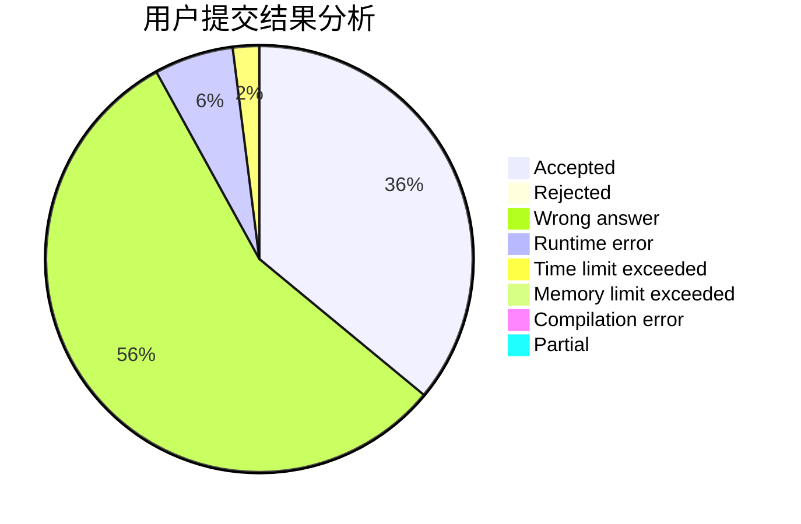
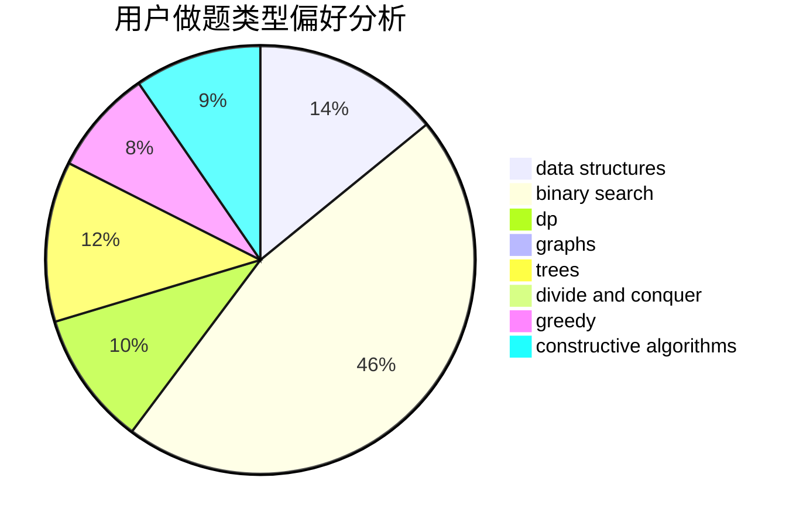
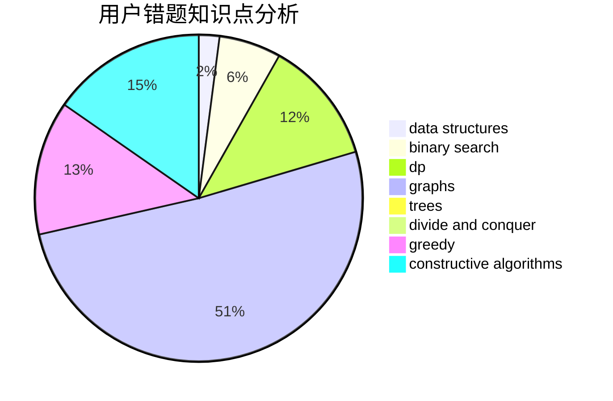

# LunateCirno

<!-- tabs:start -->

#### **用户提交结果分析**

#### **用户做题类型偏好分析**

#### **用户错题知识点分析**

<!-- tabs:end -->
# 推荐题目
[1445C](https://codeforces.com/contest/1445/problem/C)		dsu,graphs,sortings,trees		  
[441D](https://codeforces.com/contest/441/problem/D)		constructive algorithms,
                        dsu,
                        graphs,
                        implementation,
                        math,
                        string suffix structures		  
[290C](https://codeforces.com/contest/290/problem/C)		*special problem,
                        graph matchings,
                        implementation,
                        trees		  
[916D](https://codeforces.com/contest/916/problem/D)		data structures,
                        interactive,
                        trees		  
[1433E](https://codeforces.com/contest/1433/problem/E)		combinatorics,
                        math		  
[1000C](https://codeforces.com/contest/1000/problem/C)		data structures,
                        implementation,
                        sortings		  
[300C](https://codeforces.com/contest/300/problem/C)		brute force,
                        combinatorics		  
[659E](https://codeforces.com/contest/659/problem/E)		data structures,
                        dfs and similar,
                        dsu,
                        graphs,
                        greedy		  
[1424J](https://codeforces.com/contest/1424/problem/J)		dsu,graphs,sortings,trees		  
[814A](https://codeforces.com/contest/814/problem/A)		constructive algorithms,
                        greedy,
                        implementation,
                        sortings		  
