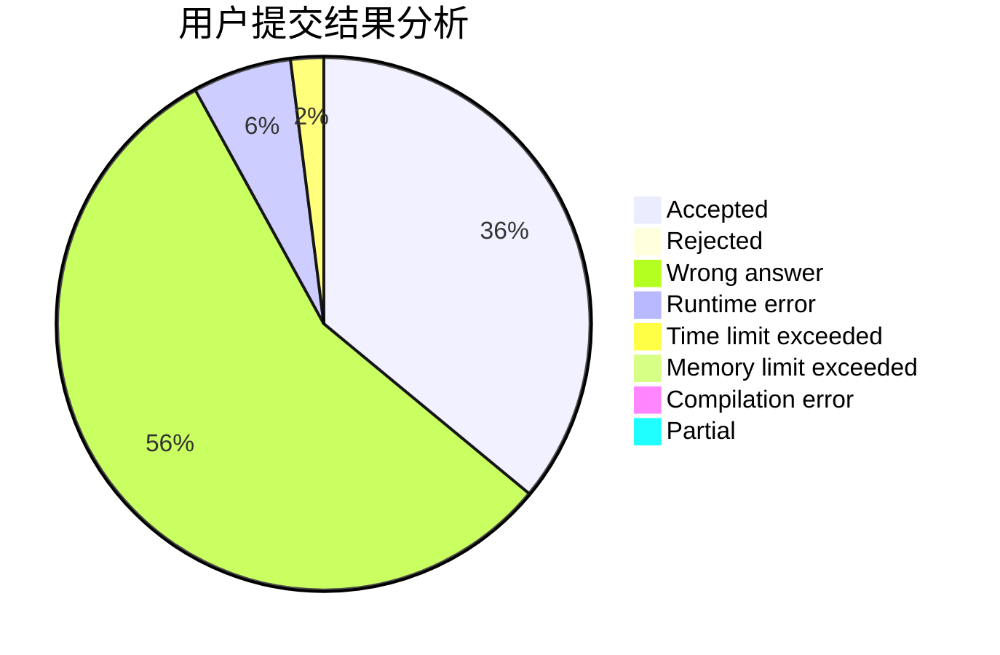
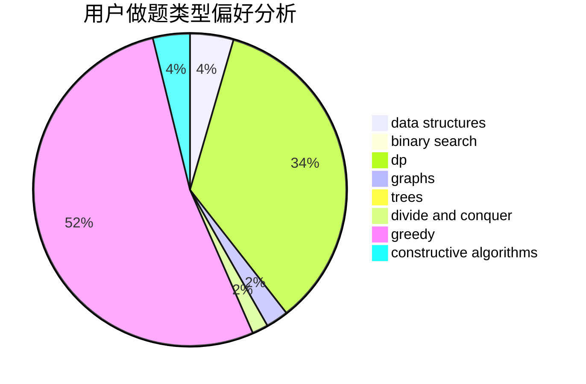
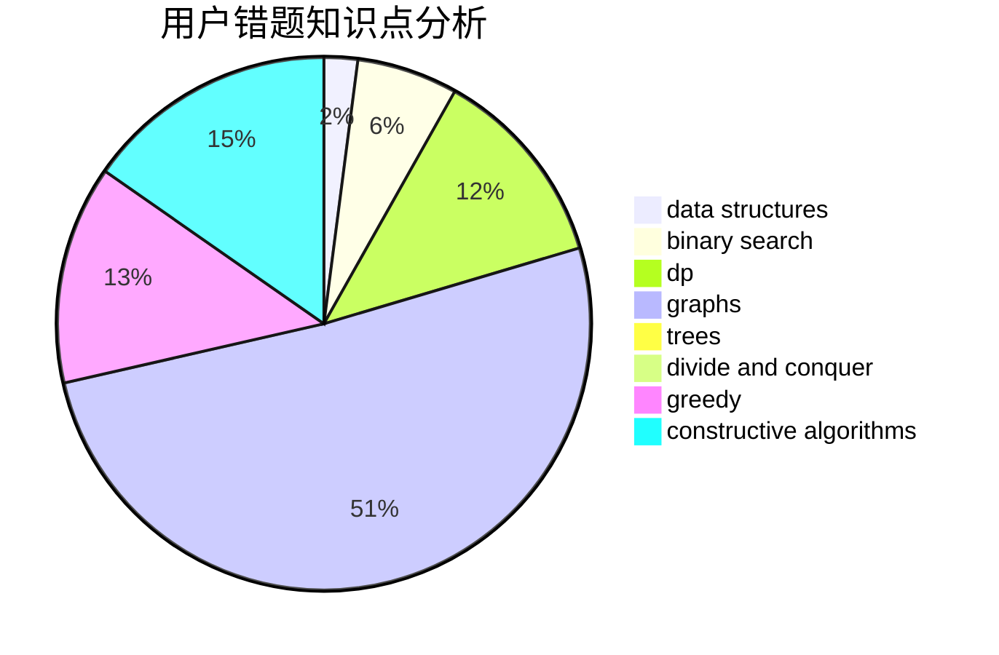

# LunateCirno

<!-- tabs:start -->

#### **用户提交结果分析**

#### **用户做题类型偏好分析**

#### **用户错题知识点分析**

<!-- tabs:end -->
# 推荐题目
[1435C](https://codeforces.com/contest/1435/problem/C)		dsu,graphs,sortings,trees		  
[416D](https://codeforces.com/contest/416/problem/D)		greedy,
                        implementation,
                        math		  
[276C](https://codeforces.com/contest/276/problem/C)		data structures,
                        greedy,
                        implementation,
                        sortings		  
[900A](https://codeforces.com/contest/900/problem/A)		geometry,
                        implementation		  
[1425B](https://codeforces.com/contest/1425/problem/B)		divide and conquer,
                        dp		  
[1000C](https://codeforces.com/contest/1000/problem/C)		data structures,
                        implementation,
                        sortings		  
[286B](https://codeforces.com/contest/286/problem/B)		implementation		  
[629E](https://codeforces.com/contest/629/problem/E)		combinatorics,
                        data structures,
                        dfs and similar,
                        dp,
                        probabilities,
                        trees		  
[1417B](https://codeforces.com/contest/1417/problem/B)		greedy,
                        math,
                        sortings		  
[79D](https://codeforces.com/contest/79/problem/D)		bitmasks,
                        dp,
                        shortest paths		  
