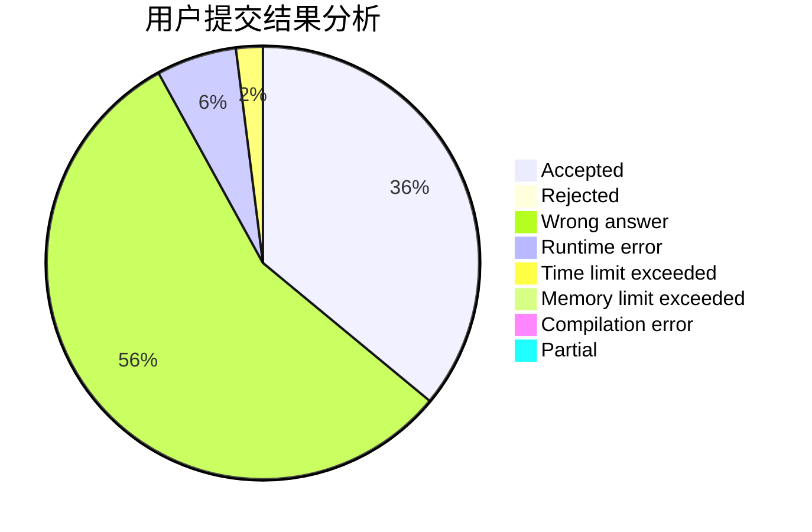
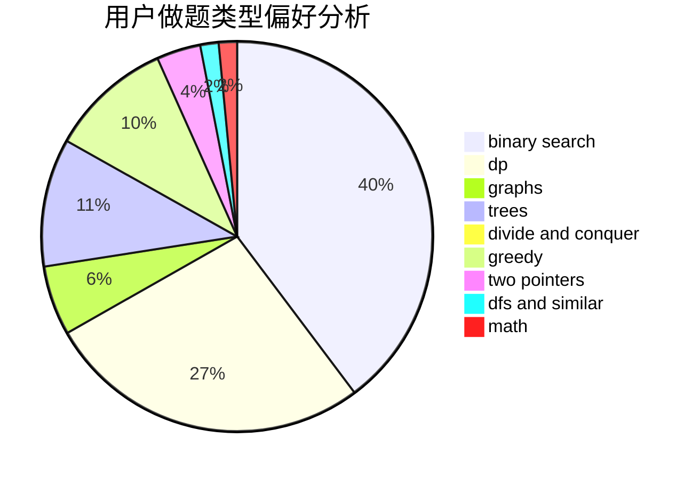

# LunateCirno

<!-- tabs:start -->

#### **用户提交结果分析**

#### **用户做题类型偏好分析**

<!-- tabs:end -->
# 推荐题目
[1445C](https://codeforces.com/contest/1445/problem/C)
[441D](https://codeforces.com/contest/441/problem/D)
[290C](https://codeforces.com/contest/290/problem/C)
[916D](https://codeforces.com/contest/916/problem/D)
[1433E](https://codeforces.com/contest/1433/problem/E)
[1000C](https://codeforces.com/contest/1000/problem/C)
[300C](https://codeforces.com/contest/300/problem/C)
[659E](https://codeforces.com/contest/659/problem/E)
[1424J](https://codeforces.com/contest/1424/problem/J)
[814A](https://codeforces.com/contest/814/problem/A)
