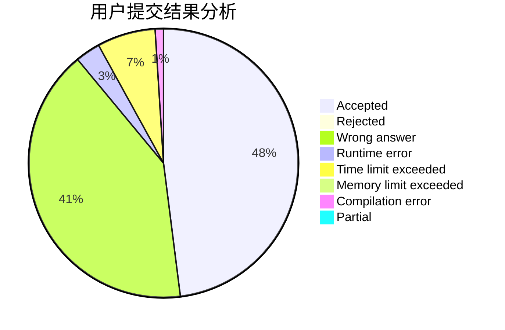
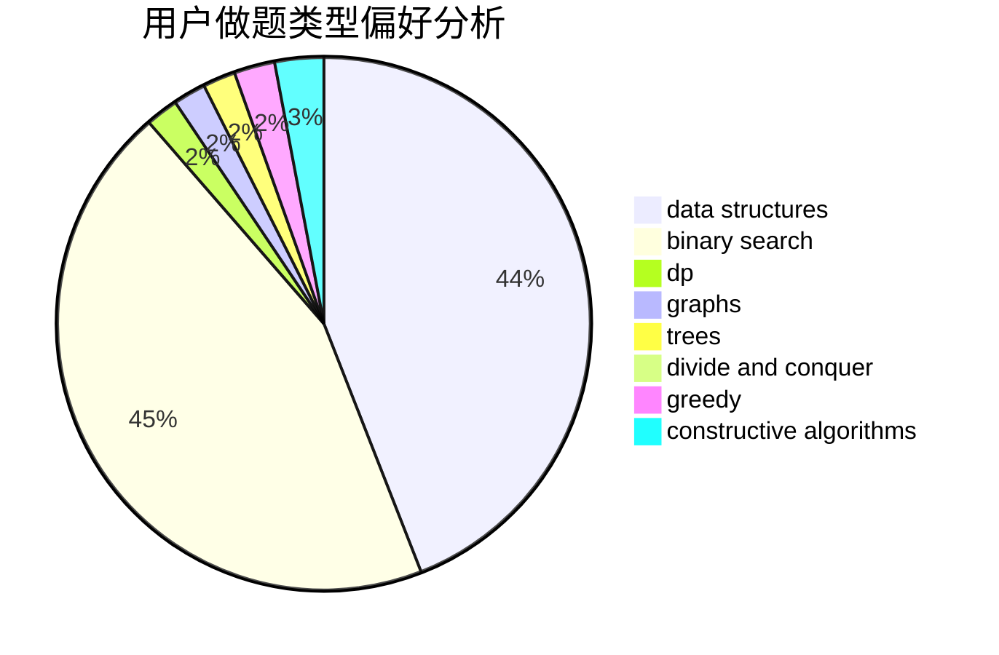
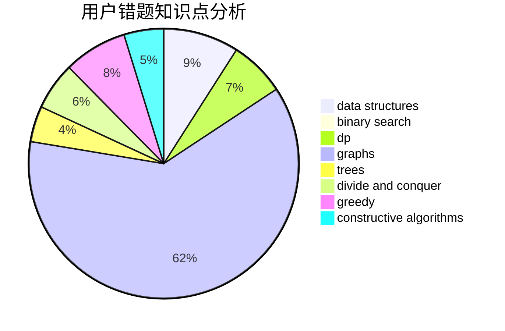

# Lusterdawn

<!-- tabs:start -->

#### **用户提交结果分析**

#### **用户做题类型偏好分析**

#### **用户错题知识点分析**

<!-- tabs:end -->
# 推荐题目
[274B](https://codeforces.com/contest/274/problem/B)		dfs and similar,
                        dp,
                        greedy,
                        trees		  
[666A](https://codeforces.com/contest/666/problem/A)		dp,
                        implementation,
                        strings		  
[1007E](https://codeforces.com/contest/1007/problem/E)		dp		  
[1019C](https://codeforces.com/contest/1019/problem/C)		constructive algorithms,
                        graphs		  
[1404E](https://codeforces.com/contest/1404/problem/E)		flows,
                        graph matchings,
                        graphs		  
[652A](https://codeforces.com/contest/652/problem/A)		implementation,
                        math		  
[1167A](https://codeforces.com/contest/1167/problem/A)		brute force,
                        greedy,
                        strings		  
[1373E](https://codeforces.com/contest/1373/problem/E)		brute force,
                        constructive algorithms,
                        dp,
                        greedy		  
[855B](https://codeforces.com/contest/855/problem/B)		brute force,
                        data structures,
                        dp		  
[1512E](https://codeforces.com/contest/1512/problem/E)		brute force,
                        greedy,
                        math		  
