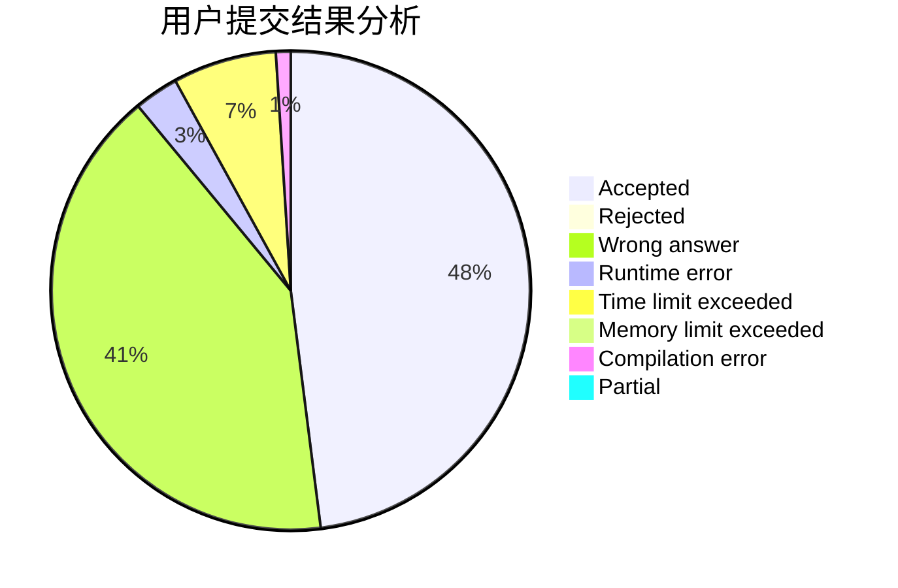
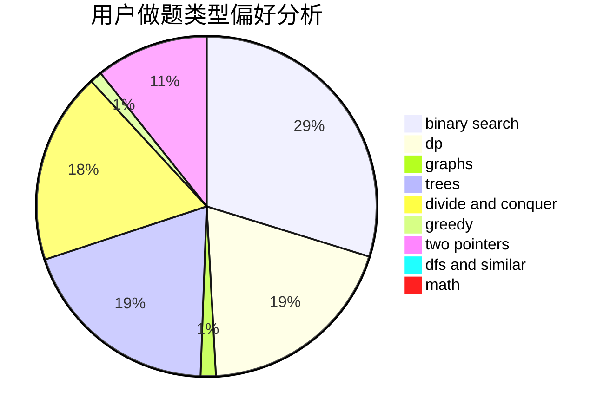

# Lusterdawn

<!-- tabs:start -->

#### **用户提交结果分析**

#### **用户做题类型偏好分析**

<!-- tabs:end -->
# 推荐题目
[28A](https://codeforces.com/contest/28/problem/A)
[687A](https://codeforces.com/contest/687/problem/A)
[1008C](https://codeforces.com/contest/1008/problem/C)
[101B](https://codeforces.com/contest/101/problem/B)
[1416A](https://codeforces.com/contest/1416/problem/A)
[675E](https://codeforces.com/contest/675/problem/E)
[1170E](https://codeforces.com/contest/1170/problem/E)
[1382A](https://codeforces.com/contest/1382/problem/A)
[873C](https://codeforces.com/contest/873/problem/C)
[171E](https://codeforces.com/contest/171/problem/E)
