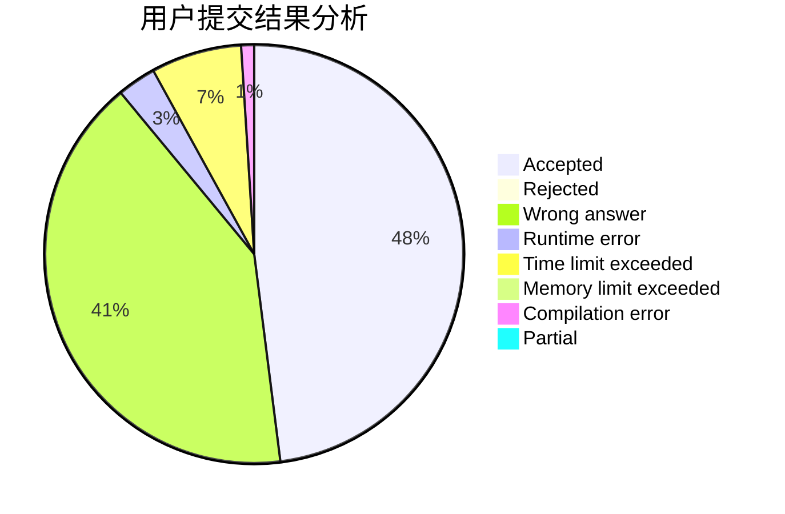
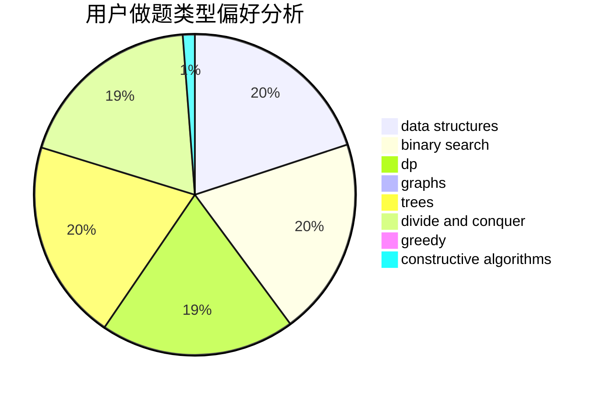
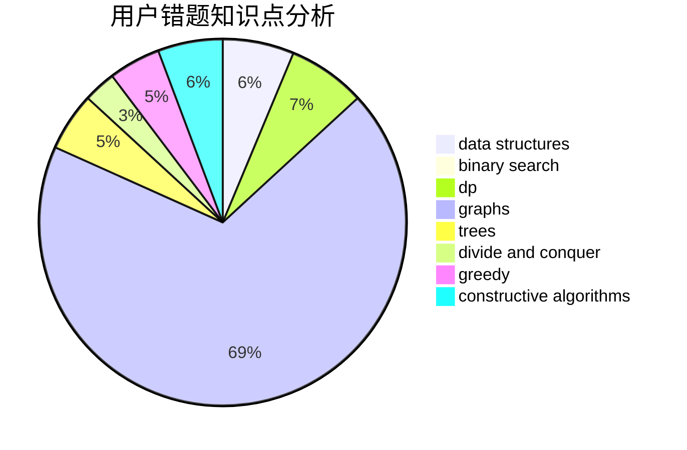

# Lusterdawn

<!-- tabs:start -->

#### **用户提交结果分析**

#### **用户做题类型偏好分析**

#### **用户错题知识点分析**

<!-- tabs:end -->
# 推荐题目
[28A](https://codeforces.com/contest/28/problem/A)		implementation		  
[687A](https://codeforces.com/contest/687/problem/A)		dfs and similar,
                        graphs		  
[1008C](https://codeforces.com/contest/1008/problem/C)		dsu,graphs,sortings,trees		  
[101B](https://codeforces.com/contest/101/problem/B)		binary search,
                        data structures,
                        dp		  
[1416A](https://codeforces.com/contest/1416/problem/A)		binary search,
                        data structures,
                        implementation,
                        two pointers		  
[675E](https://codeforces.com/contest/675/problem/E)		data structures,
                        dp,
                        greedy		  
[1170E](https://codeforces.com/contest/1170/problem/E)		*special problem,
                        binary search		  
[1382A](https://codeforces.com/contest/1382/problem/A)		brute force		  
[873C](https://codeforces.com/contest/873/problem/C)		greedy,
                        two pointers		  
[171E](https://codeforces.com/contest/171/problem/E)		*special problem		  
