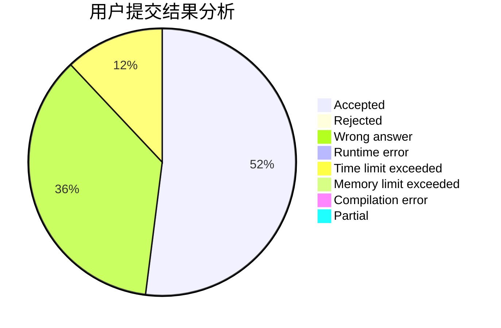
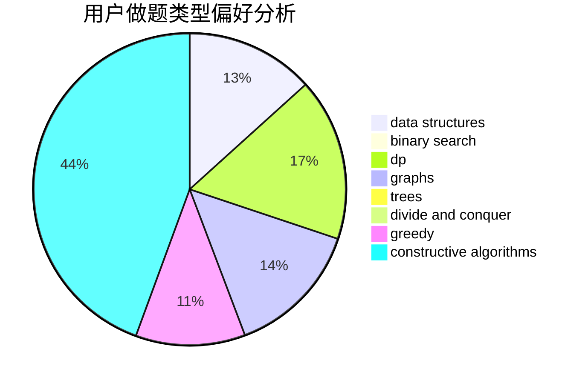

# Lv_x

<!-- tabs:start -->

#### **用户提交结果分析**

#### **用户做题类型偏好分析**

#### **用户错题知识点分析**

<!-- tabs:end -->
# 推荐题目
[816D](https://codeforces.com/contest/816/problem/D)		dsu,graphs,sortings,trees		  
[386C](https://codeforces.com/contest/386/problem/C)		dp,
                        strings,
                        two pointers		  
[875D](https://codeforces.com/contest/875/problem/D)		binary search,
                        bitmasks,
                        combinatorics,
                        data structures,
                        divide and conquer		  
[622F](https://codeforces.com/contest/622/problem/F)		math		  
[1020C](https://codeforces.com/contest/1020/problem/C)		dsu,graphs,sortings,trees		  
[197D](https://codeforces.com/contest/197/problem/D)		dsu,graphs,sortings,trees		  
[1139E](https://codeforces.com/contest/1139/problem/E)		flows,
                        graph matchings,
                        graphs		  
[1195A](https://codeforces.com/contest/1195/problem/A)		greedy,
                        math		  
[1290D](https://codeforces.com/contest/1290/problem/D)		constructive algorithms,
                        graphs,
                        interactive		  
[1251B](https://codeforces.com/contest/1251/problem/B)		greedy,
                        strings		  
