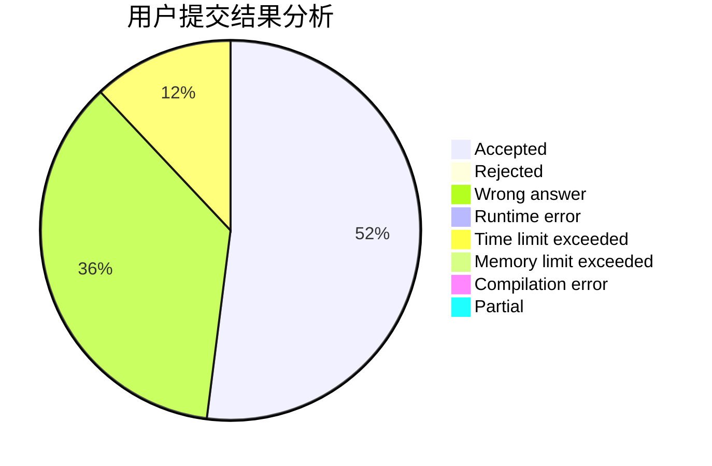
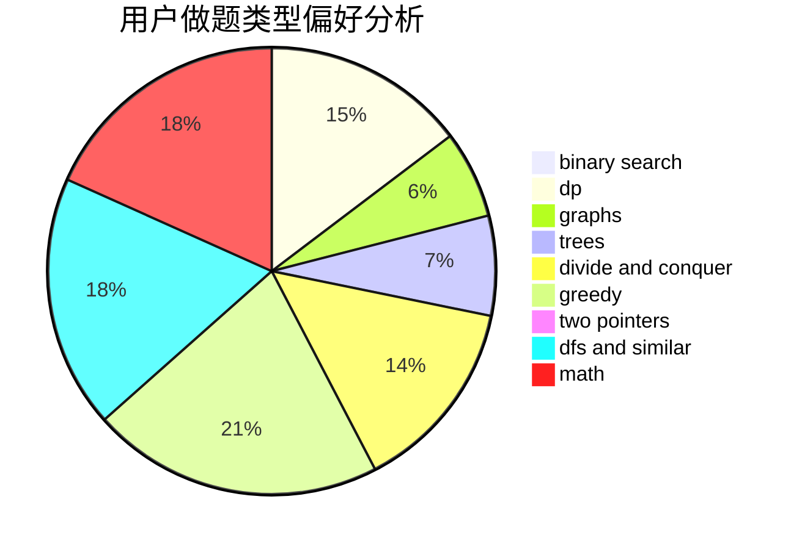

# Lv_x

<!-- tabs:start -->

#### **用户提交结果分析**

#### **用户做题类型偏好分析**

<!-- tabs:end -->
# 推荐题目
[835E](https://codeforces.com/contest/835/problem/E)
[416C](https://codeforces.com/contest/416/problem/C)
[895D](https://codeforces.com/contest/895/problem/D)
[650E](https://codeforces.com/contest/650/problem/E)
[1023A](https://codeforces.com/contest/1023/problem/A)
[219C](https://codeforces.com/contest/219/problem/C)
[11412](https://codeforces.com/contest/1141/problem/2)
[1199C](https://codeforces.com/contest/1199/problem/C)
[1297A](https://codeforces.com/contest/1297/problem/A)
[1256C](https://codeforces.com/contest/1256/problem/C)
