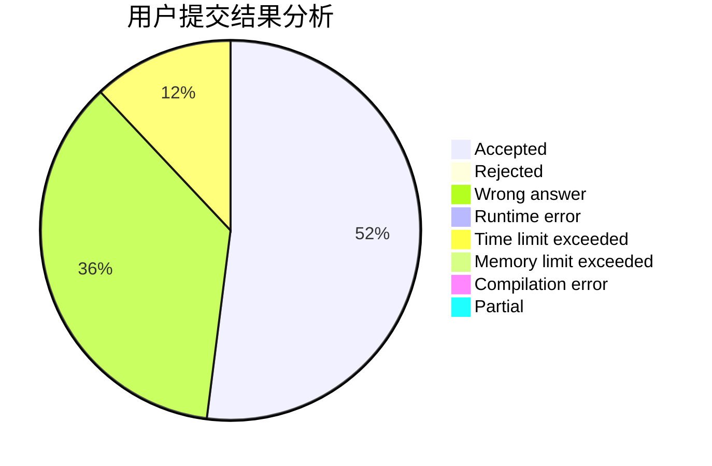
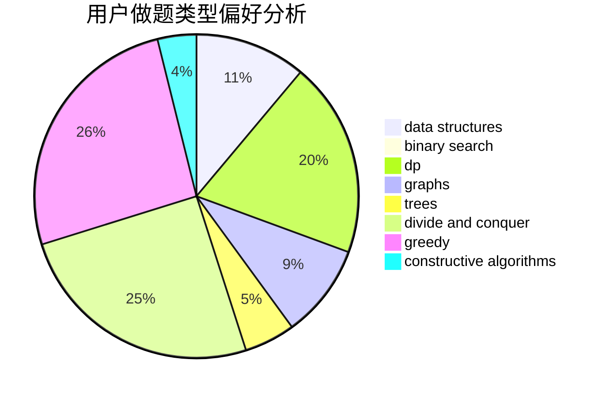

# Lv_x

<!-- tabs:start -->

#### **用户提交结果分析**

#### **用户做题类型偏好分析**

#### **用户错题知识点分析**

<!-- tabs:end -->
# 推荐题目
[835E](https://codeforces.com/contest/835/problem/E)		binary search,
                        constructive algorithms,
                        interactive		  
[416C](https://codeforces.com/contest/416/problem/C)		binary search,
                        dp,
                        greedy,
                        implementation		  
[895D](https://codeforces.com/contest/895/problem/D)		combinatorics,
                        math,
                        strings		  
[650E](https://codeforces.com/contest/650/problem/E)		data structures,
                        dfs and similar,
                        dsu,
                        greedy,
                        trees		  
[1023A](https://codeforces.com/contest/1023/problem/A)		brute force,
                        implementation,
                        strings		  
[219C](https://codeforces.com/contest/219/problem/C)		brute force,
                        dp,
                        greedy		  
[11412](https://codeforces.com/contest/1141/problem/2)		dsu,graphs,sortings,trees		  
[1199C](https://codeforces.com/contest/1199/problem/C)		dsu,graphs,sortings,trees		  
[1297A](https://codeforces.com/contest/1297/problem/A)		*special problem,
                        implementation		  
[1256C](https://codeforces.com/contest/1256/problem/C)		greedy		  
