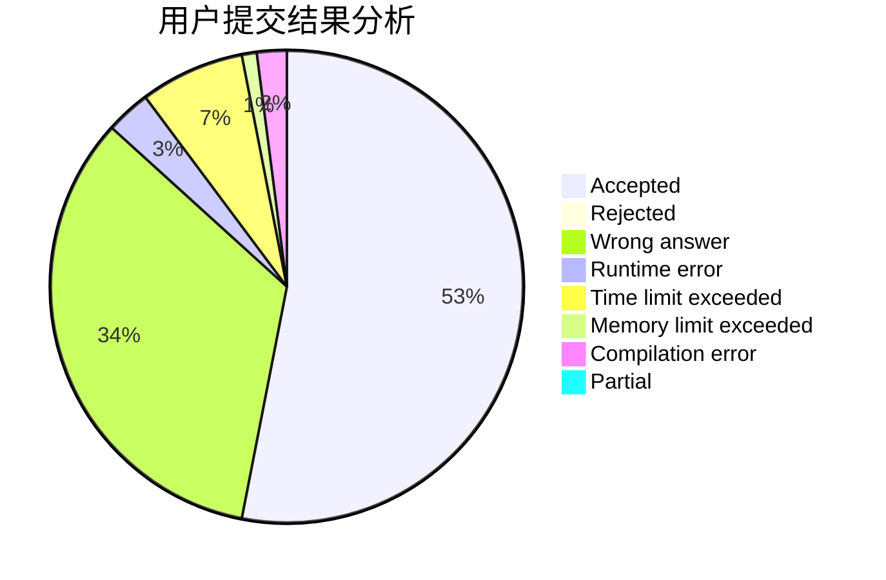
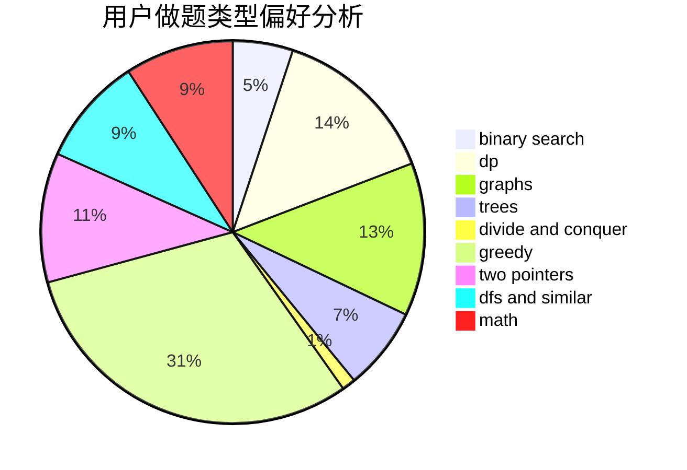

# Lxzy_Zby

<!-- tabs:start -->

#### **用户提交结果分析**

#### **用户做题类型偏好分析**

<!-- tabs:end -->
# 推荐题目
[464E](https://codeforces.com/contest/464/problem/E)
[571C](https://codeforces.com/contest/571/problem/C)
[1081F](https://codeforces.com/contest/1081/problem/F)
[12271](https://codeforces.com/contest/1227/problem/1)
[260D](https://codeforces.com/contest/260/problem/D)
[704E](https://codeforces.com/contest/704/problem/E)
[1053E](https://codeforces.com/contest/1053/problem/E)
[963B](https://codeforces.com/contest/963/problem/B)
[367E](https://codeforces.com/contest/367/problem/E)
[364C](https://codeforces.com/contest/364/problem/C)
