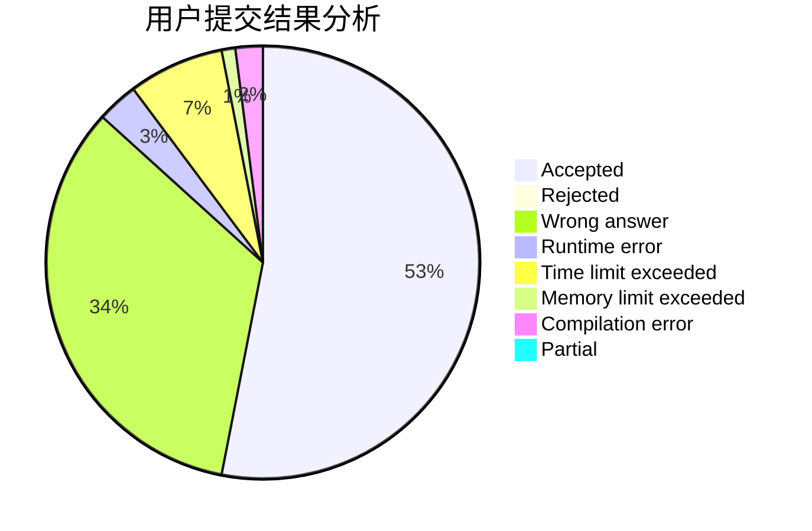
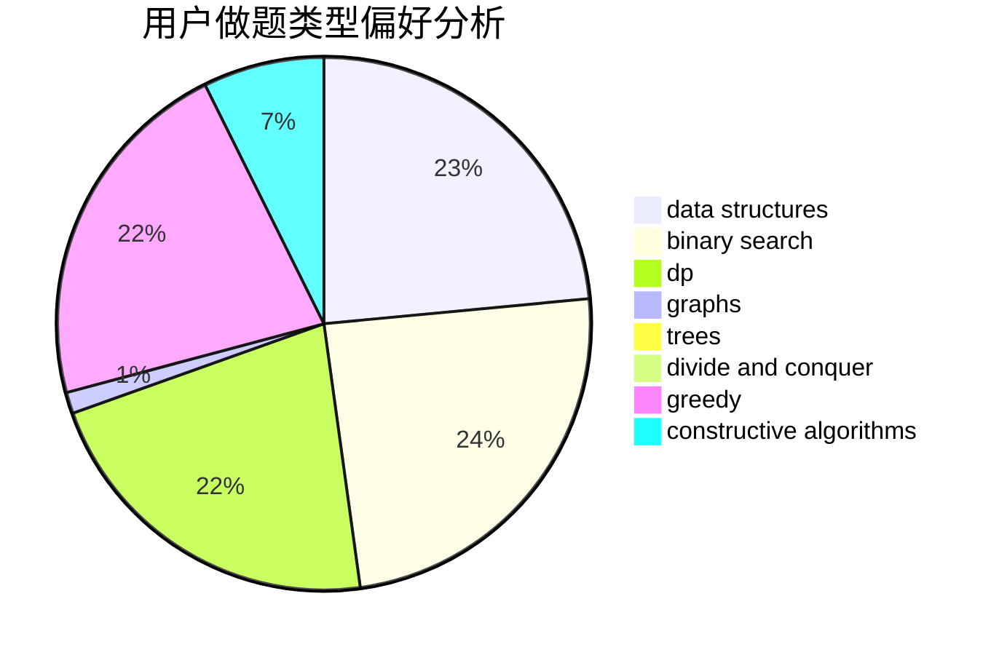
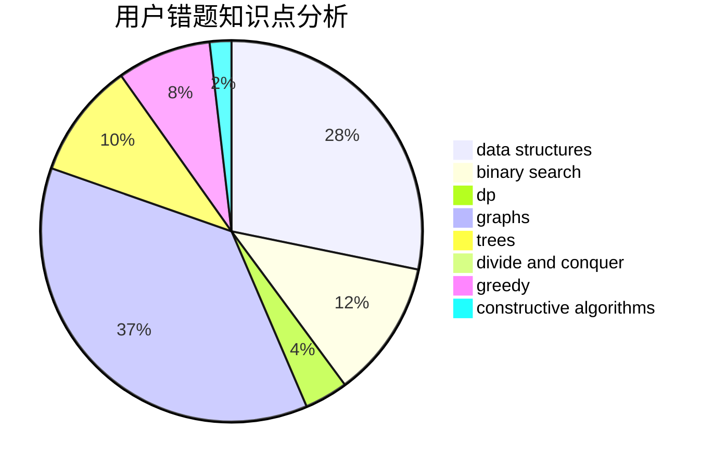

# Lxzy_Zby

<!-- tabs:start -->

#### **用户提交结果分析**

#### **用户做题类型偏好分析**

#### **用户错题知识点分析**

<!-- tabs:end -->
# 推荐题目
[445A](https://codeforces.com/contest/445/problem/A)		dfs and similar,
                        implementation		  
[547A](https://codeforces.com/contest/547/problem/A)		brute force,
                        greedy,
                        implementation,
                        math		  
[1081C](https://codeforces.com/contest/1081/problem/C)		combinatorics,
                        dp,
                        math		  
[1219B](https://codeforces.com/contest/1219/problem/B)		dsu,graphs,sortings,trees		  
[23B](https://codeforces.com/contest/23/problem/B)		constructive algorithms,
                        graphs,
                        math		  
[681A](https://codeforces.com/contest/681/problem/A)		implementation		  
[1053A](https://codeforces.com/contest/1053/problem/A)		dsu,graphs,sortings,trees		  
[946E](https://codeforces.com/contest/946/problem/E)		greedy,
                        implementation		  
[340E](https://codeforces.com/contest/340/problem/E)		combinatorics,
                        math		  
[338D](https://codeforces.com/contest/338/problem/D)		chinese remainder theorem,
                        math,
                        number theory		  
