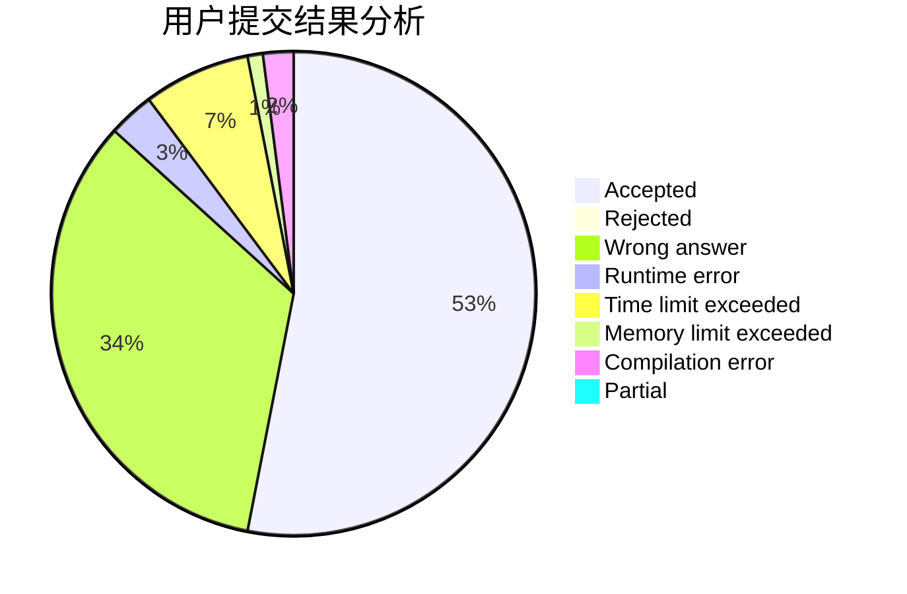
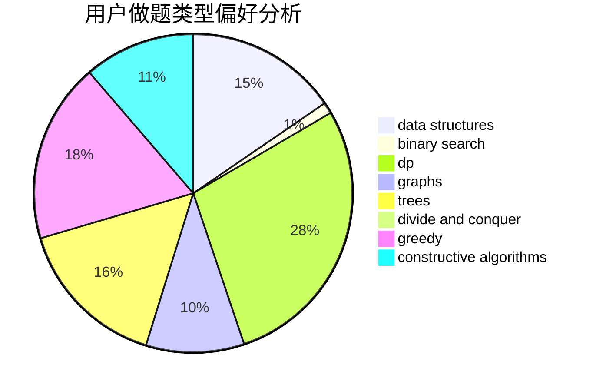
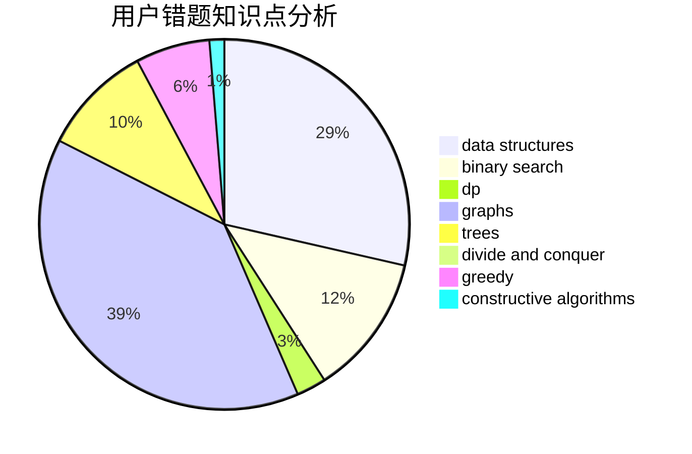

# Lxzy_Zby

<!-- tabs:start -->

#### **用户提交结果分析**

#### **用户做题类型偏好分析**

#### **用户错题知识点分析**

<!-- tabs:end -->
# 推荐题目
[464E](https://codeforces.com/contest/464/problem/E)		data structures,
                        graphs,
                        shortest paths		  
[571C](https://codeforces.com/contest/571/problem/C)		constructive algorithms,
                        dfs and similar,
                        graphs,
                        greedy		  
[1081F](https://codeforces.com/contest/1081/problem/F)		constructive algorithms,
                        implementation,
                        interactive		  
[12271](https://codeforces.com/contest/1227/problem/1)		dsu,graphs,sortings,trees		  
[260D](https://codeforces.com/contest/260/problem/D)		constructive algorithms,
                        dsu,
                        graphs,
                        greedy,
                        trees		  
[704E](https://codeforces.com/contest/704/problem/E)		data structures,
                        geometry,
                        trees		  
[1053E](https://codeforces.com/contest/1053/problem/E)		constructive algorithms,
                        trees		  
[963B](https://codeforces.com/contest/963/problem/B)		constructive algorithms,
                        dfs and similar,
                        dp,
                        greedy,
                        trees		  
[367E](https://codeforces.com/contest/367/problem/E)		combinatorics,
                        dp		  
[364C](https://codeforces.com/contest/364/problem/C)		brute force,
                        number theory		  
