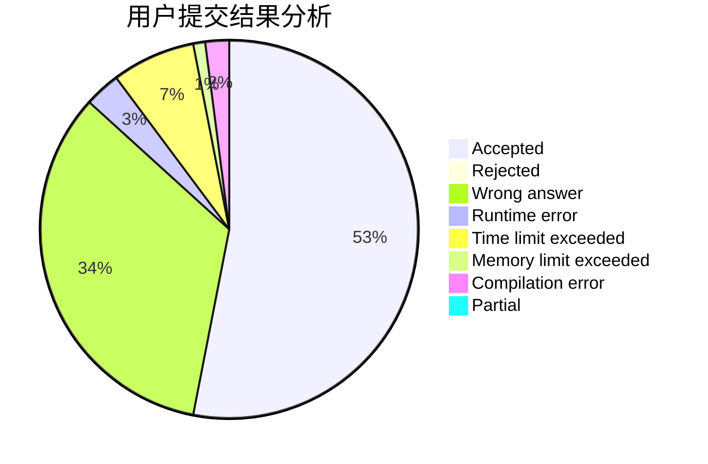
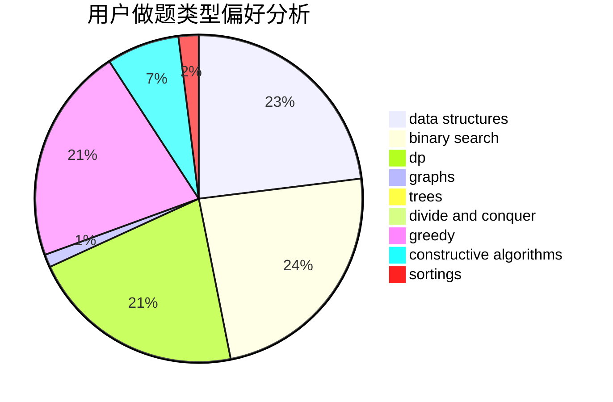
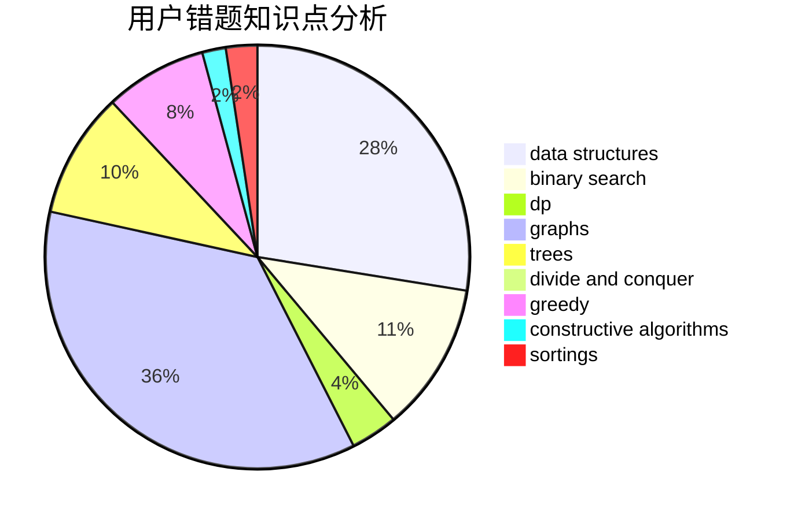

# Lxzy_Zby
<!-- tabs:start -->
#### **用户提交结果分析**

#### **用户做题类型偏好分析**

#### **用户错题知识点分析**

<!-- tabs:end -->
# 推荐题目
[445A](http://codeforces.com/problemset/problem/445/A)		dfs and similar,
                        implementation		  
[23B](http://codeforces.com/problemset/problem/23/B)		constructive algorithms,
                        graphs,
                        math		  
[14B](http://codeforces.com/problemset/problem/14/B)		implementation		  
[1053A](https://codeforces.com/contest/1053/problem/A)		geometry,
                        number theory		  
[138D](http://codeforces.com/problemset/problem/138/D)		dp,
                        games		  
[1219B](https://codeforces.com/contest/1219/problem/B)		divide and conquer,
                        fft,
                        graphs		  
[922E](http://codeforces.com/problemset/problem/922/E)		dp		  
[877B](http://codeforces.com/problemset/problem/877/B)		brute force,
                        dp		  
[681A](http://codeforces.com/problemset/problem/681/A)		implementation		  
[946E](http://codeforces.com/problemset/problem/946/E)		greedy,
                        implementation		  
<!-- tabs:start -->
#### **data structures**
[1389F](http://codeforces.com/problemset/problem/1389/F)		data structures,
                        dp,
                        graph matchings,
                        sortings		  
[1320C](http://codeforces.com/problemset/problem/1320/C)		brute force,
                        data structures,
                        sortings		  
[280E](http://codeforces.com/problemset/problem/280/E)		data structures,
                        dp,
                        implementation,
                        math		  
[364A](http://codeforces.com/problemset/problem/364/A)		combinatorics,
                        data structures,
                        implementation		  
[1435D](https://codeforces.com/contest/1435/problem/D)		data structures,
                        greedy,
                        implementation		  
[1163E](http://codeforces.com/problemset/problem/1163/E)		bitmasks,
                        brute force,
                        constructive algorithms,
                        data structures,
                        graphs,
                        math		  
[1446D1](http://codeforces.com/problemset/problem/1446/D1)		data structures,
                        greedy		  
[1284F](http://codeforces.com/problemset/problem/1284/F)		data structures,
                        graph matchings,
                        graphs,
                        math,
                        trees		  
[1492C](http://codeforces.com/problemset/problem/1492/C)		binary search,
                        data structures,
                        dp,
                        greedy,
                        two pointers		  
[1490G](http://codeforces.com/problemset/problem/1490/G)		binary search,
                        data structures,
                        math		  
#### **binary search**
[620D](http://codeforces.com/problemset/problem/620/D)		binary search,
                        two pointers		  
[1183C](http://codeforces.com/problemset/problem/1183/C)		binary search,
                        math		  
[301B](http://codeforces.com/problemset/problem/301/B)		binary search,
                        graphs,
                        shortest paths		  
[1509E](https://codeforces.com/contest/1509/problem/E)		binary search,
                        bitmasks,
                        combinatorics,
                        constructive algorithms,
                        implementation,
                        math		  
[1492C](http://codeforces.com/problemset/problem/1492/C)		binary search,
                        data structures,
                        dp,
                        greedy,
                        two pointers		  
[1463D](http://codeforces.com/problemset/problem/1463/D)		binary search,
                        constructive algorithms,
                        greedy,
                        two pointers		  
[1490G](http://codeforces.com/problemset/problem/1490/G)		binary search,
                        data structures,
                        math		  
[1479D](http://codeforces.com/problemset/problem/1479/D)		binary search,
                        bitmasks,
                        brute force,
                        data structures,
                        probabilities,
                        trees		  
[1436E](http://codeforces.com/problemset/problem/1436/E)		binary search,
                        data structures,
                        two pointers		  
[1461D](http://codeforces.com/problemset/problem/1461/D)		binary search,
                        brute force,
                        data structures,
                        divide and conquer,
                        implementation,
                        sortings		  
#### **dp**
[138D](http://codeforces.com/problemset/problem/138/D)		dp,
                        games		  
[922E](http://codeforces.com/problemset/problem/922/E)		dp		  
[877B](http://codeforces.com/problemset/problem/877/B)		brute force,
                        dp		  
[604C](https://codeforces.com/contest/604/problem/C)		dp,
                        greedy,
                        math		  
[814D](http://codeforces.com/problemset/problem/814/D)		dfs and similar,
                        dp,
                        geometry,
                        greedy,
                        trees		  
[1389F](http://codeforces.com/problemset/problem/1389/F)		data structures,
                        dp,
                        graph matchings,
                        sortings		  
[732B](http://codeforces.com/problemset/problem/732/B)		dp,
                        greedy		  
[1081C](http://codeforces.com/problemset/problem/1081/C)		combinatorics,
                        dp,
                        math		  
[115D](http://codeforces.com/problemset/problem/115/D)		dp,
                        expression parsing		  
[280E](http://codeforces.com/problemset/problem/280/E)		data structures,
                        dp,
                        implementation,
                        math		  
#### **graph**
[23B](http://codeforces.com/problemset/problem/23/B)		constructive algorithms,
                        graphs,
                        math		  
[1219B](https://codeforces.com/contest/1219/problem/B)		divide and conquer,
                        fft,
                        graphs		  
[1081D](http://codeforces.com/problemset/problem/1081/D)		dsu,
                        graphs,
                        shortest paths,
                        sortings		  
[1389F](http://codeforces.com/problemset/problem/1389/F)		data structures,
                        dp,
                        graph matchings,
                        sortings		  
[707B](http://codeforces.com/problemset/problem/707/B)		graphs		  
[118E](http://codeforces.com/problemset/problem/118/E)		dfs and similar,
                        graphs		  
[1163E](http://codeforces.com/problemset/problem/1163/E)		bitmasks,
                        brute force,
                        constructive algorithms,
                        data structures,
                        graphs,
                        math		  
[1284F](http://codeforces.com/problemset/problem/1284/F)		data structures,
                        graph matchings,
                        graphs,
                        math,
                        trees		  
[301B](http://codeforces.com/problemset/problem/301/B)		binary search,
                        graphs,
                        shortest paths		  
[1495C](http://codeforces.com/problemset/problem/1495/C)		constructive algorithms,
                        graphs		  
#### **trees**
[814D](http://codeforces.com/problemset/problem/814/D)		dfs and similar,
                        dp,
                        geometry,
                        greedy,
                        trees		  
[1284F](http://codeforces.com/problemset/problem/1284/F)		data structures,
                        graph matchings,
                        graphs,
                        math,
                        trees		  
[1322F](http://codeforces.com/problemset/problem/1322/F)		dp,
                        trees		  
[1060E](http://codeforces.com/problemset/problem/1060/E)		dfs and similar,
                        dp,
                        trees		  
[839C](http://codeforces.com/problemset/problem/839/C)		dfs and similar,
                        dp,
                        graphs,
                        probabilities,
                        trees		  
[1479D](http://codeforces.com/problemset/problem/1479/D)		binary search,
                        bitmasks,
                        brute force,
                        data structures,
                        probabilities,
                        trees		  
[1511C](http://codeforces.com/problemset/problem/1511/C)		brute force,
                        data structures,
                        implementation,
                        trees		  
[1499F](http://codeforces.com/problemset/problem/1499/F)		combinatorics,
                        dfs and similar,
                        dp,
                        trees		  
[1491E](http://codeforces.com/problemset/problem/1491/E)		brute force,
                        dfs and similar,
                        divide and conquer,
                        number theory,
                        trees		  
[1466D](http://codeforces.com/problemset/problem/1466/D)		data structures,
                        greedy,
                        sortings,
                        trees		  
#### **divide and conquer**
[1219B](https://codeforces.com/contest/1219/problem/B)		divide and conquer,
                        fft,
                        graphs		  
[1461D](http://codeforces.com/problemset/problem/1461/D)		binary search,
                        brute force,
                        data structures,
                        divide and conquer,
                        implementation,
                        sortings		  
[1466G](http://codeforces.com/problemset/problem/1466/G)		combinatorics,
                        divide and conquer,
                        hashing,
                        math,
                        string suffix structures,
                        strings		  
[1490D](http://codeforces.com/problemset/problem/1490/D)		dfs and similar,
                        divide and conquer,
                        implementation		  
[1483C](https://codeforces.com/contest/1483/problem/C)		data structures,
                        divide and conquer,
                        dp		  
[1491E](http://codeforces.com/problemset/problem/1491/E)		brute force,
                        dfs and similar,
                        divide and conquer,
                        number theory,
                        trees		  
[1303G](http://codeforces.com/problemset/problem/1303/G)		data structures,
                        divide and conquer,
                        geometry,
                        trees		  
[1494D](http://codeforces.com/problemset/problem/1494/D)		constructive algorithms,
                        data structures,
                        dfs and similar,
                        divide and conquer,
                        dsu,
                        greedy,
                        sortings,
                        trees		  
[1482E](http://codeforces.com/problemset/problem/1482/E)		data structures,
                        divide and conquer,
                        dp		  
[566C](http://codeforces.com/problemset/problem/566/C)		dfs and similar,
                        divide and conquer,
                        trees		  
#### **greedy**
[946E](http://codeforces.com/problemset/problem/946/E)		greedy,
                        implementation		  
[547A](http://codeforces.com/problemset/problem/547/A)		brute force,
                        greedy,
                        implementation,
                        math		  
[604C](https://codeforces.com/contest/604/problem/C)		dp,
                        greedy,
                        math		  
[814D](http://codeforces.com/problemset/problem/814/D)		dfs and similar,
                        dp,
                        geometry,
                        greedy,
                        trees		  
[1396A](http://codeforces.com/problemset/problem/1396/A)		constructive algorithms,
                        greedy,
                        number theory		  
[732B](http://codeforces.com/problemset/problem/732/B)		dp,
                        greedy		  
[1435D](https://codeforces.com/contest/1435/problem/D)		data structures,
                        greedy,
                        implementation		  
[1446D1](http://codeforces.com/problemset/problem/1446/D1)		data structures,
                        greedy		  
[1499B](http://codeforces.com/problemset/problem/1499/B)		brute force,
                        dp,
                        greedy,
                        implementation		  
[33C](http://codeforces.com/problemset/problem/33/C)		greedy		  
#### **constructive algorithms**
[23B](http://codeforces.com/problemset/problem/23/B)		constructive algorithms,
                        graphs,
                        math		  
[1396A](http://codeforces.com/problemset/problem/1396/A)		constructive algorithms,
                        greedy,
                        number theory		  
[868C](http://codeforces.com/problemset/problem/868/C)		bitmasks,
                        brute force,
                        constructive algorithms,
                        dp		  
[1163E](http://codeforces.com/problemset/problem/1163/E)		bitmasks,
                        brute force,
                        constructive algorithms,
                        data structures,
                        graphs,
                        math		  
[40A](http://codeforces.com/problemset/problem/40/A)		constructive algorithms,
                        geometry,
                        implementation,
                        math		  
[301C](http://codeforces.com/problemset/problem/301/C)		constructive algorithms		  
[1509E](https://codeforces.com/contest/1509/problem/E)		binary search,
                        bitmasks,
                        combinatorics,
                        constructive algorithms,
                        implementation,
                        math		  
[1495C](http://codeforces.com/problemset/problem/1495/C)		constructive algorithms,
                        graphs		  
[1493A](http://codeforces.com/problemset/problem/1493/A)		constructive algorithms,
                        greedy		  
[1463D](http://codeforces.com/problemset/problem/1463/D)		binary search,
                        constructive algorithms,
                        greedy,
                        two pointers		  
#### **sortings**
[1081D](http://codeforces.com/problemset/problem/1081/D)		dsu,
                        graphs,
                        shortest paths,
                        sortings		  
[1389F](http://codeforces.com/problemset/problem/1389/F)		data structures,
                        dp,
                        graph matchings,
                        sortings		  
[1320C](http://codeforces.com/problemset/problem/1320/C)		brute force,
                        data structures,
                        sortings		  
[811B](http://codeforces.com/problemset/problem/811/B)		implementation,
                        sortings		  
[1496C](https://codeforces.com/contest/1496/problem/C)		geometry,
                        greedy,
                        math,
                        sortings		  
[1495A](http://codeforces.com/problemset/problem/1495/A)		geometry,
                        greedy,
                        math,
                        sortings		  
[1497A](http://codeforces.com/problemset/problem/1497/A)		brute force,
                        data structures,
                        greedy,
                        sortings		  
[1427A](http://codeforces.com/problemset/problem/1427/A)		math,
                        sortings		  
[1461D](http://codeforces.com/problemset/problem/1461/D)		binary search,
                        brute force,
                        data structures,
                        divide and conquer,
                        implementation,
                        sortings		  
[1437C](http://codeforces.com/problemset/problem/1437/C)		dp,
                        flows,
                        graph matchings,
                        greedy,
                        math,
                        sortings		  
<!-- tabs:end -->
