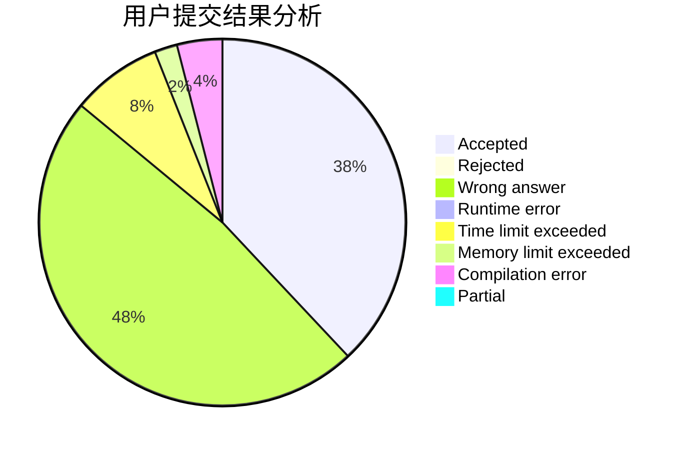
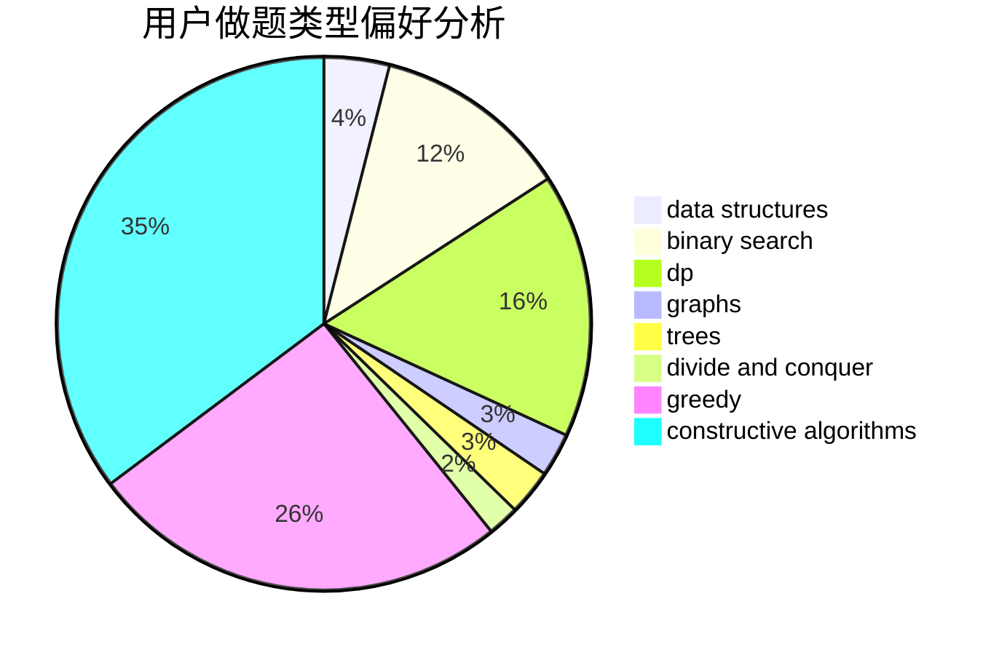

# LyFive

<!-- tabs:start -->

#### **用户提交结果分析**

#### **用户做题类型偏好分析**

#### **用户错题知识点分析**

<!-- tabs:end -->
# 推荐题目
[240F](https://codeforces.com/contest/240/problem/F)		data structures		  
[1368D](https://codeforces.com/contest/1368/problem/D)		bitmasks,
                        greedy,
                        math		  
[1030E](https://codeforces.com/contest/1030/problem/E)		bitmasks,
                        dp		  
[519B](https://codeforces.com/contest/519/problem/B)		data structures,
                        implementation,
                        sortings		  
[575A](https://codeforces.com/contest/575/problem/A)		data structures,
                        math,
                        matrices		  
[292A](https://codeforces.com/contest/292/problem/A)		implementation		  
[1271A](https://codeforces.com/contest/1271/problem/A)		brute force,
                        greedy,
                        math		  
[524F](https://codeforces.com/contest/524/problem/F)		data structures,
                        greedy,
                        hashing,
                        string suffix structures,
                        strings		  
[238C](https://codeforces.com/contest/238/problem/C)		dfs and similar,
                        dp,
                        greedy,
                        trees		  
[402B](https://codeforces.com/contest/402/problem/B)		brute force,
                        implementation		  
