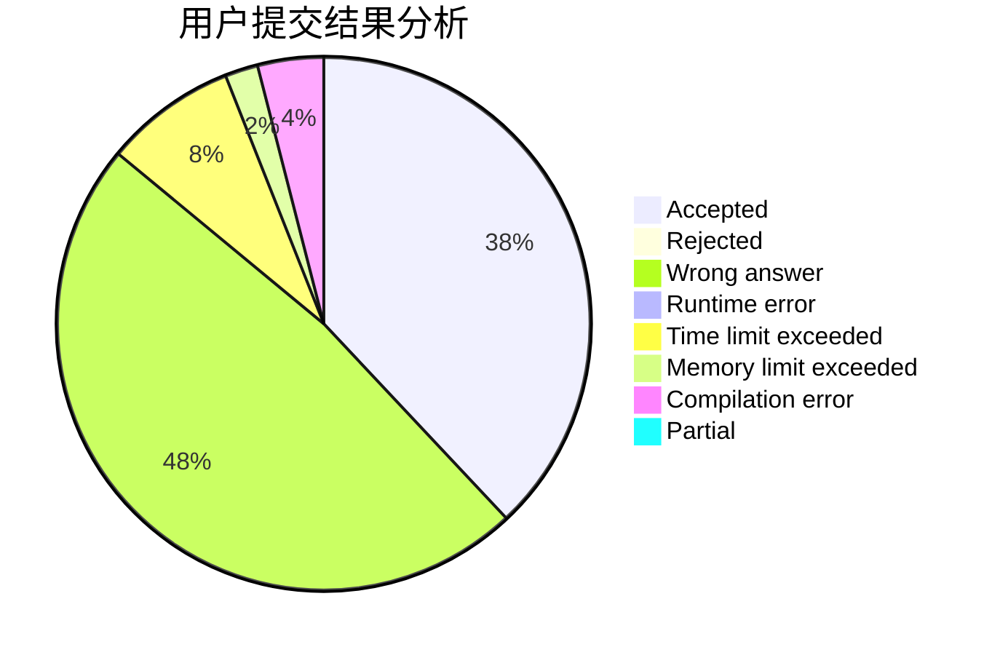
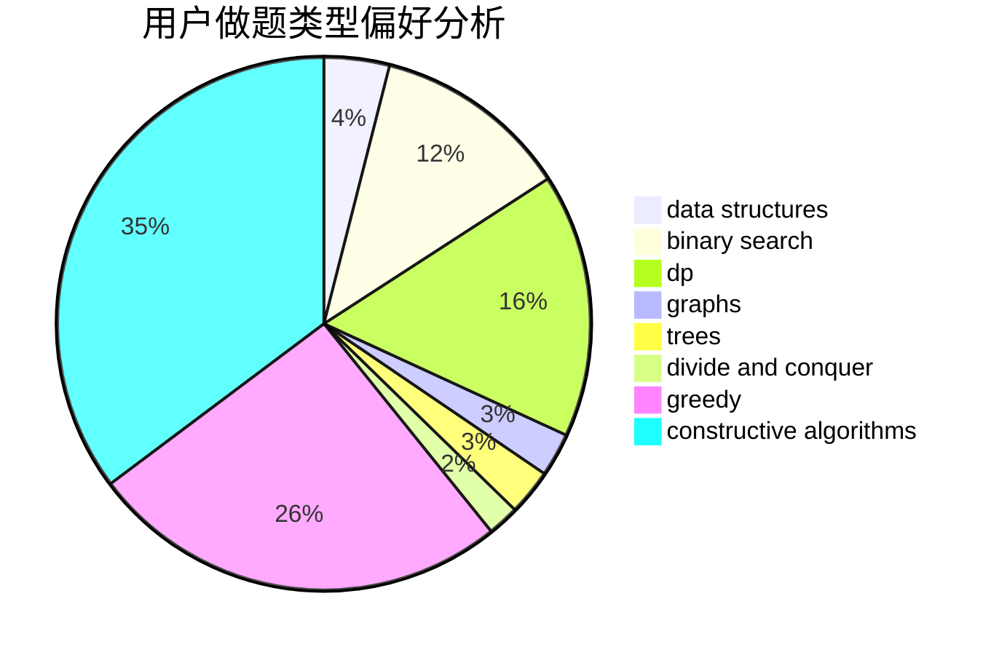

# LyFive
<!-- tabs:start -->
#### **用户提交结果分析**

#### **用户做题类型偏好分析**

#### **用户错题知识点分析**

<!-- tabs:end -->
# 推荐题目
[Orchestra](http://codeforces.com/problemset/problem/627/E)		two pointers		  
[A and B and Compilation Errors](http://codeforces.com/problemset/problem/519/B)		data structures,
                        implementation,
                        sortings		  
[TorCoder](http://codeforces.com/problemset/problem/240/F)		data structures		  
[Numbers](http://codeforces.com/problemset/problem/13/A)		implementation,
                        math		  
[World Eater Brothers](http://codeforces.com/problemset/problem/238/C)		dfs and similar,
                        dp,
                        greedy,
                        trees		  
[AND, OR and square sum](http://codeforces.com/problemset/problem/1368/D)		bitmasks,
                        greedy,
                        math		  
[Fibonotci](http://codeforces.com/problemset/problem/575/A)		data structures,
                        math,
                        matrices		  
[A Trivial Problem](http://codeforces.com/problemset/problem/633/B)		brute force,
                        constructive algorithms,
                        math,
                        number theory		  
[Wilbur and Swimming Pool](http://codeforces.com/problemset/problem/596/A)		geometry,
                        implementation		  
[Yet Another Partiton Problem](http://codeforces.com/problemset/problem/1175/G)		data structures,
                        divide and conquer,
                        dp,
                        geometry,
                        two pointers		  
<!-- tabs:start -->
#### **data structures**
[Orchestra](http://codeforces.com/problemset/problem/519/B)		data structures,
                        implementation,
                        sortings		  
[A and B and Compilation Errors](http://codeforces.com/problemset/problem/240/F)		data structures		  
[TorCoder](http://codeforces.com/problemset/problem/575/A)		data structures,
                        math,
                        matrices		  
[Numbers](http://codeforces.com/problemset/problem/1175/G)		data structures,
                        divide and conquer,
                        dp,
                        geometry,
                        two pointers		  
[World Eater Brothers](http://codeforces.com/problemset/problem/524/F)		data structures,
                        greedy,
                        hashing,
                        string suffix structures,
                        strings		  
[AND, OR and square sum](http://codeforces.com/problemset/problem/480/E)		data structures,
                        divide and conquer		  
[Fibonotci](http://codeforces.com/problemset/problem/1042/F)		data structures,
                        dfs and similar,
                        dsu,
                        graphs,
                        greedy,
                        sortings,
                        trees		  
[A Trivial Problem](http://codeforces.com/problemset/problem/600/E)		data structures,
                        dfs and similar,
                        dsu,
                        trees		  
[Wilbur and Swimming Pool](http://codeforces.com/problemset/problem/1508/C)		data structures,
                        dfs and similar,
                        dsu,
                        graphs,
                        greedy,
                        math		  
[Yet Another Partiton Problem](http://codeforces.com/problemset/problem/1348/B)		constructive algorithms,
                        data structures,
                        greedy,
                        sortings		  
#### **binary search**
[Orchestra](https://codeforces.com/contest/810/problem/D)		binary search,
                        interactive		  
[A and B and Compilation Errors](http://codeforces.com/problemset/problem/1492/C)		binary search,
                        data structures,
                        dp,
                        greedy,
                        two pointers		  
[TorCoder](http://codeforces.com/problemset/problem/1463/D)		binary search,
                        constructive algorithms,
                        greedy,
                        two pointers		  
[Numbers](http://codeforces.com/problemset/problem/1490/G)		binary search,
                        data structures,
                        math		  
[World Eater Brothers](http://codeforces.com/problemset/problem/1479/D)		binary search,
                        bitmasks,
                        brute force,
                        data structures,
                        probabilities,
                        trees		  
[AND, OR and square sum](http://codeforces.com/problemset/problem/1436/E)		binary search,
                        data structures,
                        two pointers		  
[Fibonotci](http://codeforces.com/problemset/problem/1461/D)		binary search,
                        brute force,
                        data structures,
                        divide and conquer,
                        implementation,
                        sortings		  
[A Trivial Problem](http://codeforces.com/problemset/problem/1493/C)		binary search,
                        brute force,
                        constructive algorithms,
                        greedy,
                        strings		  
[Wilbur and Swimming Pool](http://codeforces.com/problemset/problem/1487/D)		binary search,
                        brute force,
                        math,
                        number theory		  
[Yet Another Partiton Problem](http://codeforces.com/problemset/problem/1486/B)		binary search,
                        geometry,
                        shortest paths,
                        sortings		  
#### **dp**
[Orchestra](http://codeforces.com/problemset/problem/238/C)		dfs and similar,
                        dp,
                        greedy,
                        trees		  
[A and B and Compilation Errors](http://codeforces.com/problemset/problem/1175/G)		data structures,
                        divide and conquer,
                        dp,
                        geometry,
                        two pointers		  
[TorCoder](http://codeforces.com/problemset/problem/1030/E)		bitmasks,
                        dp		  
[Numbers](http://codeforces.com/problemset/problem/1272/D)		brute force,
                        dp		  
[World Eater Brothers](http://codeforces.com/problemset/problem/1188/C)		dp		  
[AND, OR and square sum](http://codeforces.com/problemset/problem/1103/D)		bitmasks,
                        dp		  
[Fibonotci](http://codeforces.com/problemset/problem/1492/C)		binary search,
                        data structures,
                        dp,
                        greedy,
                        two pointers		  
[A Trivial Problem](https://codeforces.com/contest/1457/problem/C)		brute force,
                        dp,
                        implementation		  
[Wilbur and Swimming Pool](http://codeforces.com/problemset/problem/1491/C)		brute force,
                        data structures,
                        dp,
                        greedy,
                        implementation		  
[Yet Another Partiton Problem](http://codeforces.com/problemset/problem/1437/C)		dp,
                        flows,
                        graph matchings,
                        greedy,
                        math,
                        sortings		  
#### **graph**
[Orchestra](http://codeforces.com/problemset/problem/1423/C)		divide and conquer,
                        graphs,
                        trees		  
[A and B and Compilation Errors](http://codeforces.com/problemset/problem/1042/F)		data structures,
                        dfs and similar,
                        dsu,
                        graphs,
                        greedy,
                        sortings,
                        trees		  
[TorCoder](http://codeforces.com/problemset/problem/1508/C)		data structures,
                        dfs and similar,
                        dsu,
                        graphs,
                        greedy,
                        math		  
[Numbers](http://codeforces.com/problemset/problem/1463/E)		constructive algorithms,
                        dfs and similar,
                        dsu,
                        graphs,
                        implementation,
                        sortings,
                        trees		  
[World Eater Brothers](http://codeforces.com/problemset/problem/1487/C)		brute force,
                        constructive algorithms,
                        dfs and similar,
                        graphs,
                        greedy,
                        implementation,
                        math		  
[AND, OR and square sum](http://codeforces.com/problemset/problem/1437/C)		dp,
                        flows,
                        graph matchings,
                        greedy,
                        math,
                        sortings		  
[Fibonotci](http://codeforces.com/problemset/problem/1470/D)		constructive algorithms,
                        dfs and similar,
                        graph matchings,
                        graphs,
                        greedy		  
[A Trivial Problem](http://codeforces.com/problemset/problem/1476/C)		dp,
                        graphs,
                        greedy		  
[Wilbur and Swimming Pool](http://codeforces.com/problemset/problem/1304/D)		constructive algorithms,
                        graphs,
                        greedy,
                        two pointers		  
[Yet Another Partiton Problem](http://codeforces.com/problemset/problem/1475/C)		combinatorics,
                        graphs,
                        math		  
#### **trees**
[Orchestra](http://codeforces.com/problemset/problem/238/C)		dfs and similar,
                        dp,
                        greedy,
                        trees		  
[A and B and Compilation Errors](http://codeforces.com/problemset/problem/1423/C)		divide and conquer,
                        graphs,
                        trees		  
[TorCoder](http://codeforces.com/problemset/problem/1042/F)		data structures,
                        dfs and similar,
                        dsu,
                        graphs,
                        greedy,
                        sortings,
                        trees		  
[Numbers](http://codeforces.com/problemset/problem/600/E)		data structures,
                        dfs and similar,
                        dsu,
                        trees		  
[World Eater Brothers](http://codeforces.com/problemset/problem/1463/E)		constructive algorithms,
                        dfs and similar,
                        dsu,
                        graphs,
                        implementation,
                        sortings,
                        trees		  
[AND, OR and square sum](http://codeforces.com/problemset/problem/1479/D)		binary search,
                        bitmasks,
                        brute force,
                        data structures,
                        probabilities,
                        trees		  
[Fibonotci](http://codeforces.com/problemset/problem/1511/C)		brute force,
                        data structures,
                        implementation,
                        trees		  
[A Trivial Problem](http://codeforces.com/problemset/problem/1499/F)		combinatorics,
                        dfs and similar,
                        dp,
                        trees		  
[Wilbur and Swimming Pool](http://codeforces.com/problemset/problem/1491/E)		brute force,
                        dfs and similar,
                        divide and conquer,
                        number theory,
                        trees		  
[Yet Another Partiton Problem](http://codeforces.com/problemset/problem/1466/D)		data structures,
                        greedy,
                        sortings,
                        trees		  
#### **divide and conquer**
[Orchestra](http://codeforces.com/problemset/problem/1175/G)		data structures,
                        divide and conquer,
                        dp,
                        geometry,
                        two pointers		  
[A and B and Compilation Errors](http://codeforces.com/problemset/problem/1423/C)		divide and conquer,
                        graphs,
                        trees		  
[TorCoder](http://codeforces.com/problemset/problem/480/E)		data structures,
                        divide and conquer		  
[Numbers](http://codeforces.com/problemset/problem/1461/D)		binary search,
                        brute force,
                        data structures,
                        divide and conquer,
                        implementation,
                        sortings		  
[World Eater Brothers](http://codeforces.com/problemset/problem/1466/G)		combinatorics,
                        divide and conquer,
                        hashing,
                        math,
                        string suffix structures,
                        strings		  
[AND, OR and square sum](http://codeforces.com/problemset/problem/1490/D)		dfs and similar,
                        divide and conquer,
                        implementation		  
[Fibonotci](https://codeforces.com/contest/1483/problem/C)		data structures,
                        divide and conquer,
                        dp		  
[A Trivial Problem](http://codeforces.com/problemset/problem/1491/E)		brute force,
                        dfs and similar,
                        divide and conquer,
                        number theory,
                        trees		  
[Wilbur and Swimming Pool](http://codeforces.com/problemset/problem/1303/G)		data structures,
                        divide and conquer,
                        geometry,
                        trees		  
[Yet Another Partiton Problem](http://codeforces.com/problemset/problem/1494/D)		constructive algorithms,
                        data structures,
                        dfs and similar,
                        divide and conquer,
                        dsu,
                        greedy,
                        sortings,
                        trees		  
#### **greedy**
[Orchestra](http://codeforces.com/problemset/problem/238/C)		dfs and similar,
                        dp,
                        greedy,
                        trees		  
[A and B and Compilation Errors](http://codeforces.com/problemset/problem/1368/D)		bitmasks,
                        greedy,
                        math		  
[TorCoder](http://codeforces.com/problemset/problem/524/F)		data structures,
                        greedy,
                        hashing,
                        string suffix structures,
                        strings		  
[Numbers](http://codeforces.com/problemset/problem/1271/A)		brute force,
                        greedy,
                        math		  
[World Eater Brothers](http://codeforces.com/problemset/problem/1042/F)		data structures,
                        dfs and similar,
                        dsu,
                        graphs,
                        greedy,
                        sortings,
                        trees		  
[AND, OR and square sum](http://codeforces.com/problemset/problem/1183/D)		greedy,
                        sortings		  
[Fibonotci](http://codeforces.com/problemset/problem/730/D)		greedy,
                        implementation,
                        math		  
[A Trivial Problem](http://codeforces.com/problemset/problem/1176/A)		brute force,
                        greedy,
                        implementation		  
[Wilbur and Swimming Pool](http://codeforces.com/problemset/problem/1508/C)		data structures,
                        dfs and similar,
                        dsu,
                        graphs,
                        greedy,
                        math		  
[Yet Another Partiton Problem](http://codeforces.com/problemset/problem/1197/A)		greedy,
                        math,
                        sortings		  
#### **constructive algorithms**
[Orchestra](http://codeforces.com/problemset/problem/633/B)		brute force,
                        constructive algorithms,
                        math,
                        number theory		  
[A and B and Compilation Errors](http://codeforces.com/problemset/problem/1463/E)		constructive algorithms,
                        dfs and similar,
                        dsu,
                        graphs,
                        implementation,
                        sortings,
                        trees		  
[TorCoder](http://codeforces.com/problemset/problem/804/A)		constructive algorithms,
                        greedy,
                        math		  
[Numbers](http://codeforces.com/problemset/problem/1348/B)		constructive algorithms,
                        data structures,
                        greedy,
                        sortings		  
[World Eater Brothers](http://codeforces.com/problemset/problem/1493/A)		constructive algorithms,
                        greedy		  
[AND, OR and square sum](http://codeforces.com/problemset/problem/1463/D)		binary search,
                        constructive algorithms,
                        greedy,
                        two pointers		  
[Fibonotci](https://codeforces.com/contest/1456/problem/B)		bitmasks,
                        brute force,
                        constructive algorithms		  
[A Trivial Problem](http://codeforces.com/problemset/problem/1492/D)		bitmasks,
                        constructive algorithms,
                        greedy,
                        math		  
[Wilbur and Swimming Pool](https://codeforces.com/contest/1504/problem/D)		constructive algorithms,
                        games,
                        interactive		  
[Yet Another Partiton Problem](https://codeforces.com/contest/1483/problem/A)		brute force,
                        constructive algorithms,
                        greedy,
                        implementation		  
#### **sortings**
[Orchestra](http://codeforces.com/problemset/problem/519/B)		data structures,
                        implementation,
                        sortings		  
[A and B and Compilation Errors](http://codeforces.com/problemset/problem/1042/F)		data structures,
                        dfs and similar,
                        dsu,
                        graphs,
                        greedy,
                        sortings,
                        trees		  
[TorCoder](http://codeforces.com/problemset/problem/1183/D)		greedy,
                        sortings		  
[Numbers](http://codeforces.com/problemset/problem/1463/E)		constructive algorithms,
                        dfs and similar,
                        dsu,
                        graphs,
                        implementation,
                        sortings,
                        trees		  
[World Eater Brothers](http://codeforces.com/problemset/problem/1197/A)		greedy,
                        math,
                        sortings		  
[AND, OR and square sum](http://codeforces.com/problemset/problem/1348/B)		constructive algorithms,
                        data structures,
                        greedy,
                        sortings		  
[Fibonotci](https://codeforces.com/contest/1496/problem/C)		geometry,
                        greedy,
                        math,
                        sortings		  
[A Trivial Problem](http://codeforces.com/problemset/problem/1495/A)		geometry,
                        greedy,
                        math,
                        sortings		  
[Wilbur and Swimming Pool](http://codeforces.com/problemset/problem/1497/A)		brute force,
                        data structures,
                        greedy,
                        sortings		  
[Yet Another Partiton Problem](http://codeforces.com/problemset/problem/1427/A)		math,
                        sortings		  
<!-- tabs:end -->
