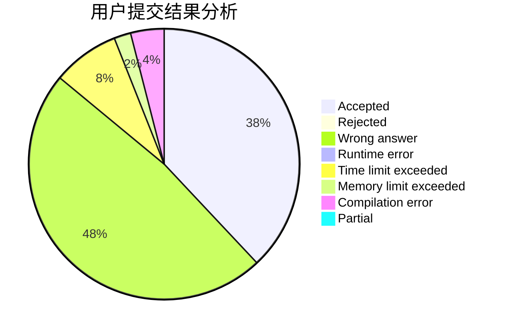
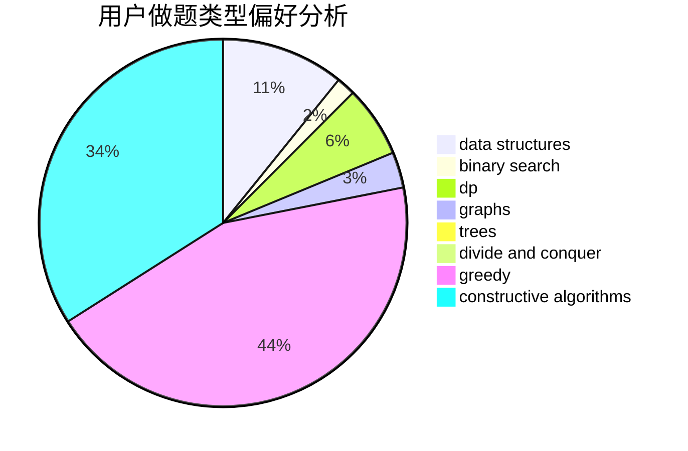

# LyFive

<!-- tabs:start -->

#### **用户提交结果分析**

#### **用户做题类型偏好分析**

#### **用户错题知识点分析**

<!-- tabs:end -->
# 推荐题目
[261D](https://codeforces.com/contest/261/problem/D)		dp		  
[1375C](https://codeforces.com/contest/1375/problem/C)		constructive algorithms,
                        data structures,
                        greedy		  
[1031B](https://codeforces.com/contest/1031/problem/B)		nan		  
[544D](https://codeforces.com/contest/544/problem/D)		dsu,graphs,sortings,trees		  
[596A](https://codeforces.com/contest/596/problem/A)		geometry,
                        implementation		  
[306D](https://codeforces.com/contest/306/problem/D)		constructive algorithms,
                        geometry		  
[1280C](https://codeforces.com/contest/1280/problem/C)		dfs and similar,
                        graphs,
                        greedy,
                        trees		  
[549C](https://codeforces.com/contest/549/problem/C)		games		  
[25E](https://codeforces.com/contest/25/problem/E)		hashing,
                        strings		  
[430B](https://codeforces.com/contest/430/problem/B)		brute force,
                        two pointers		  
