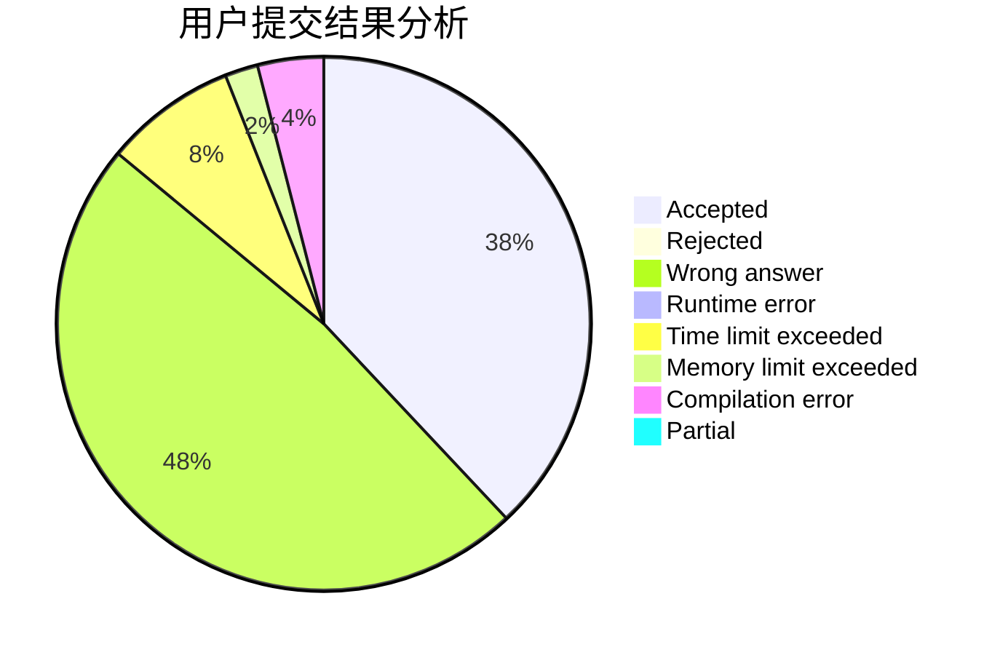
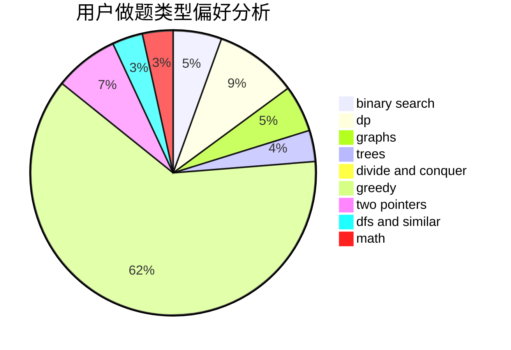

# LyFive

<!-- tabs:start -->

#### **用户提交结果分析**

#### **用户做题类型偏好分析**

<!-- tabs:end -->
# 推荐题目
[261D](https://codeforces.com/contest/261/problem/D)
[1375C](https://codeforces.com/contest/1375/problem/C)
[1031B](https://codeforces.com/contest/1031/problem/B)
[544D](https://codeforces.com/contest/544/problem/D)
[596A](https://codeforces.com/contest/596/problem/A)
[306D](https://codeforces.com/contest/306/problem/D)
[1280C](https://codeforces.com/contest/1280/problem/C)
[549C](https://codeforces.com/contest/549/problem/C)
[25E](https://codeforces.com/contest/25/problem/E)
[430B](https://codeforces.com/contest/430/problem/B)
