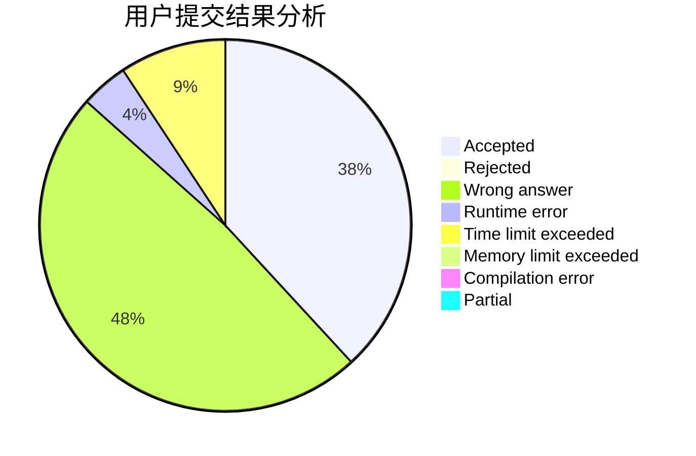
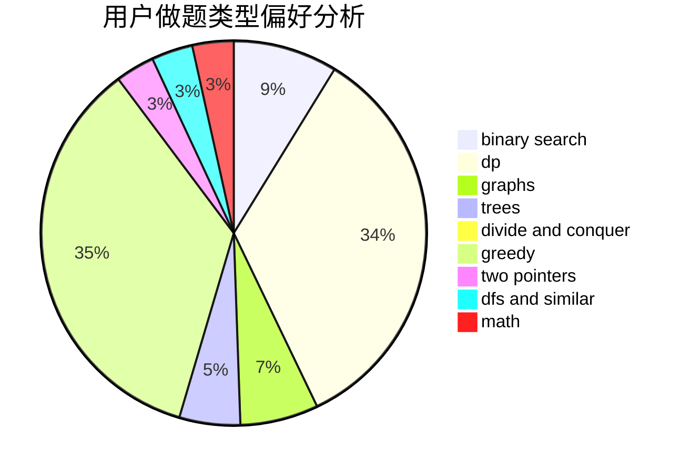

# Lycorisradiats

<!-- tabs:start -->

#### **用户提交结果分析**

#### **用户做题类型偏好分析**

<!-- tabs:end -->
# 推荐题目
[427D](https://codeforces.com/contest/427/problem/D)
[854B](https://codeforces.com/contest/854/problem/B)
[1413E](https://codeforces.com/contest/1413/problem/E)
[949E](https://codeforces.com/contest/949/problem/E)
[38C](https://codeforces.com/contest/38/problem/C)
[13577](https://codeforces.com/contest/1357/problem/7)
[713A](https://codeforces.com/contest/713/problem/A)
[358D](https://codeforces.com/contest/358/problem/D)
[708E](https://codeforces.com/contest/708/problem/E)
[11571](https://codeforces.com/contest/1157/problem/1)
