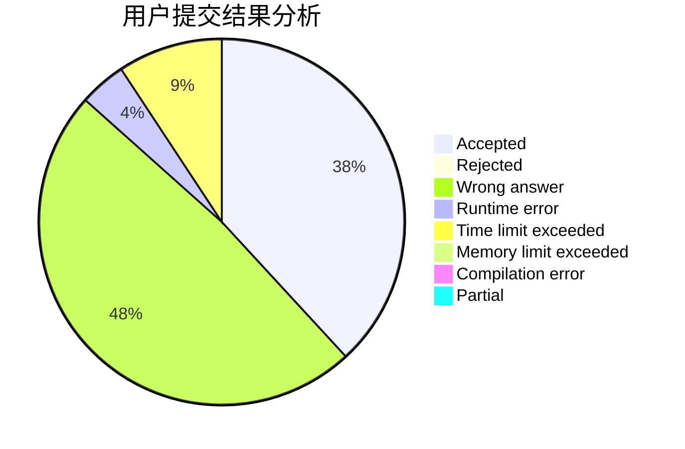
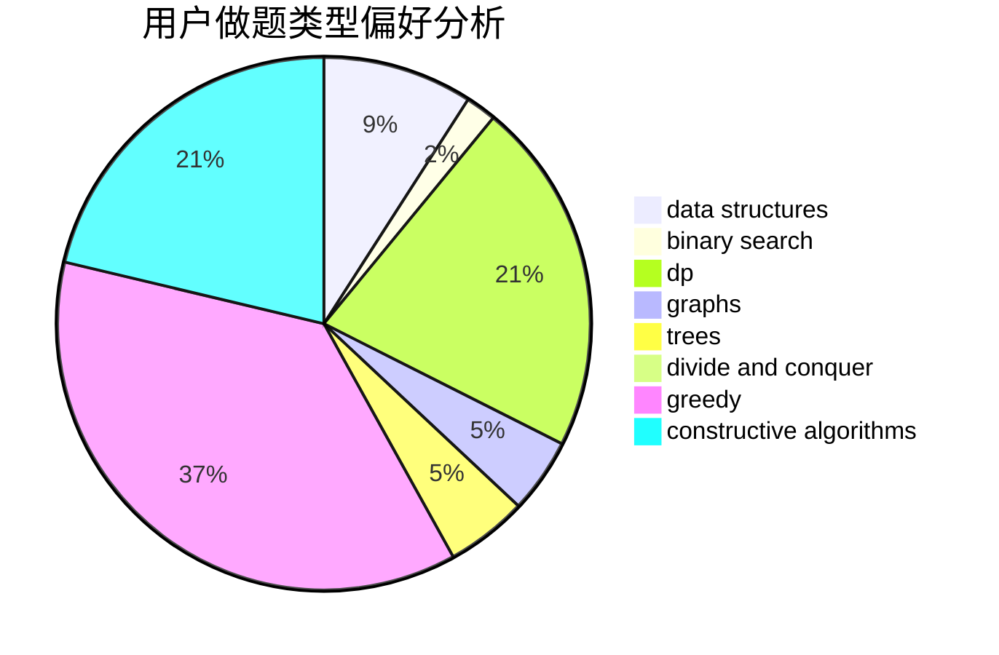
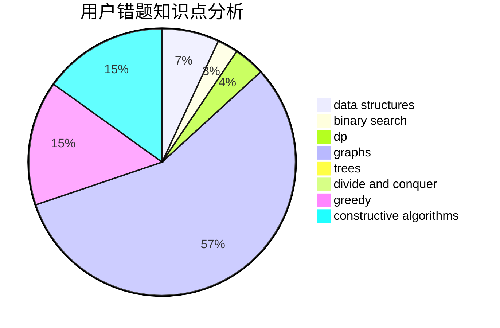

# Lycorisradiats

<!-- tabs:start -->

#### **用户提交结果分析**

#### **用户做题类型偏好分析**

#### **用户错题知识点分析**

<!-- tabs:end -->
# 推荐题目
[427D](https://codeforces.com/contest/427/problem/D)		dp,
                        string suffix structures,
                        strings		  
[854B](https://codeforces.com/contest/854/problem/B)		constructive algorithms,
                        math		  
[1413E](https://codeforces.com/contest/1413/problem/E)		greedy,
                        math,
                        ternary search		  
[949E](https://codeforces.com/contest/949/problem/E)		brute force		  
[38C](https://codeforces.com/contest/38/problem/C)		brute force		  
[13577](https://codeforces.com/contest/1357/problem/7)		dsu,graphs,sortings,trees		  
[713A](https://codeforces.com/contest/713/problem/A)		data structures,
                        implementation		  
[358D](https://codeforces.com/contest/358/problem/D)		dp,
                        greedy		  
[708E](https://codeforces.com/contest/708/problem/E)		dp,
                        math		  
[11571](https://codeforces.com/contest/1157/problem/1)		dsu,graphs,sortings,trees		  
