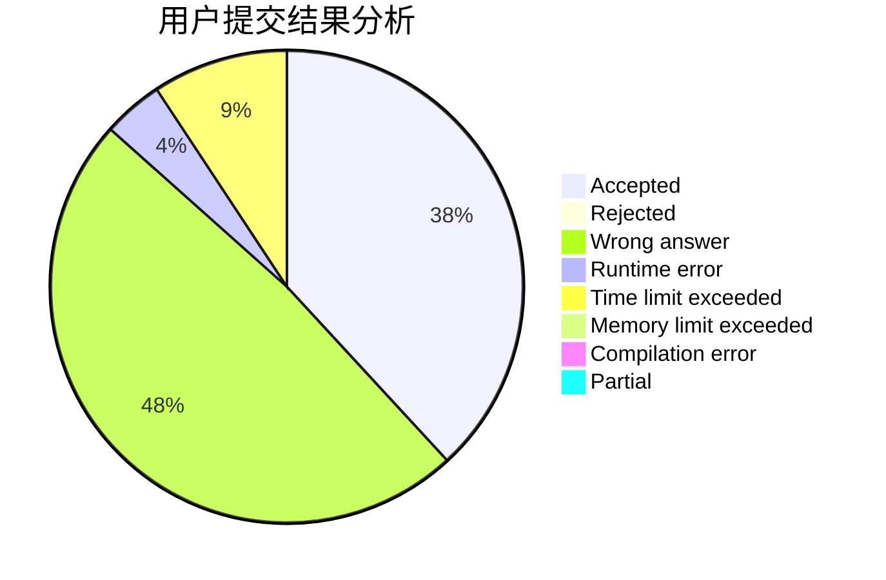
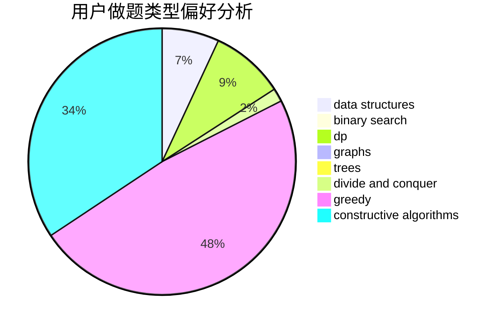
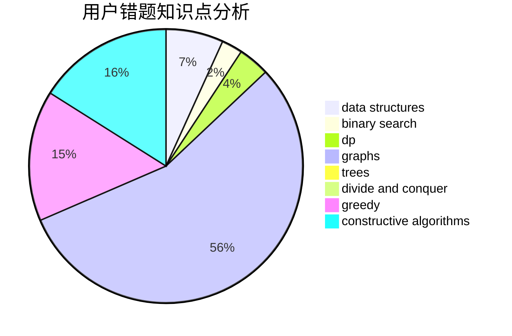

# Lycorisradiats

<!-- tabs:start -->

#### **用户提交结果分析**

#### **用户做题类型偏好分析**

#### **用户错题知识点分析**

<!-- tabs:end -->
# 推荐题目
[39H](https://codeforces.com/contest/39/problem/H)		implementation		  
[837B](https://codeforces.com/contest/837/problem/B)		brute force,
                        implementation		  
[1402C](https://codeforces.com/contest/1402/problem/C)		*special problem,
                        combinatorics,
                        dfs and similar,
                        dp,
                        games,
                        graphs,
                        matrices,
                        trees		  
[928B](https://codeforces.com/contest/928/problem/B)		*special problem,
                        dp		  
[363D](https://codeforces.com/contest/363/problem/D)		binary search,
                        greedy		  
[1350D](https://codeforces.com/contest/1350/problem/D)		dsu,graphs,sortings,trees		  
[696C](https://codeforces.com/contest/696/problem/C)		combinatorics,
                        dp,
                        implementation,
                        math,
                        matrices		  
[32B](https://codeforces.com/contest/32/problem/B)		expression parsing,
                        implementation		  
[687A](https://codeforces.com/contest/687/problem/A)		dfs and similar,
                        graphs		  
[1155A](https://codeforces.com/contest/1155/problem/A)		implementation,
                        sortings,
                        strings		  
