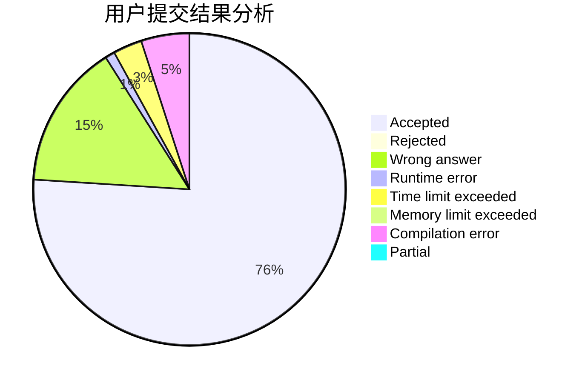
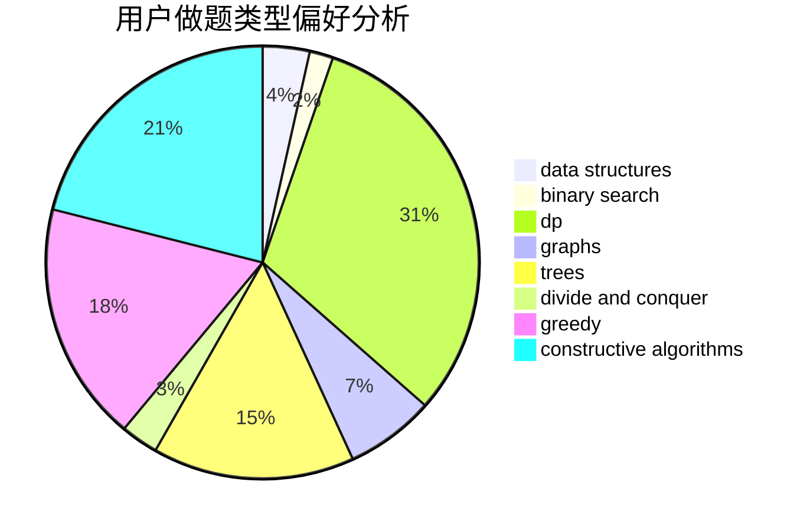
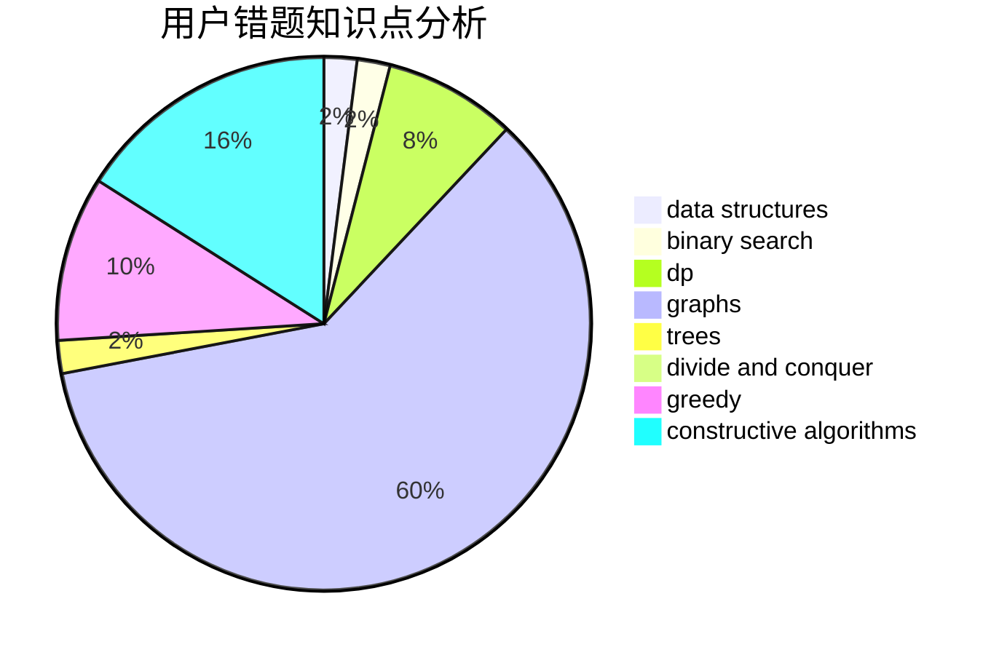

# M.w.

<!-- tabs:start -->

#### **用户提交结果分析**

#### **用户做题类型偏好分析**

#### **用户错题知识点分析**

<!-- tabs:end -->
# 推荐题目
[1457C](https://codeforces.com/contest/1457/problem/C)		dsu,graphs,sortings,trees		  
[1463E](https://codeforces.com/contest/1463/problem/E)		constructive algorithms,
                        dfs and similar,
                        dsu,
                        graphs,
                        implementation,
                        sortings,
                        trees		  
[578E](https://codeforces.com/contest/578/problem/E)		constructive algorithms,
                        greedy		  
[1043E](https://codeforces.com/contest/1043/problem/E)		constructive algorithms,
                        greedy,
                        math,
                        sortings		  
[1340A](https://codeforces.com/contest/1340/problem/A)		brute force,
                        data structures,
                        greedy,
                        implementation		  
[1323B](https://codeforces.com/contest/1323/problem/B)		binary search,
                        greedy,
                        implementation		  
[714A](https://codeforces.com/contest/714/problem/A)		implementation,
                        math		  
[962F](https://codeforces.com/contest/962/problem/F)		dfs and similar,
                        graphs,
                        trees		  
[893F](https://codeforces.com/contest/893/problem/F)		data structures,
                        trees		  
[938E](https://codeforces.com/contest/938/problem/E)		combinatorics,
                        math		  
