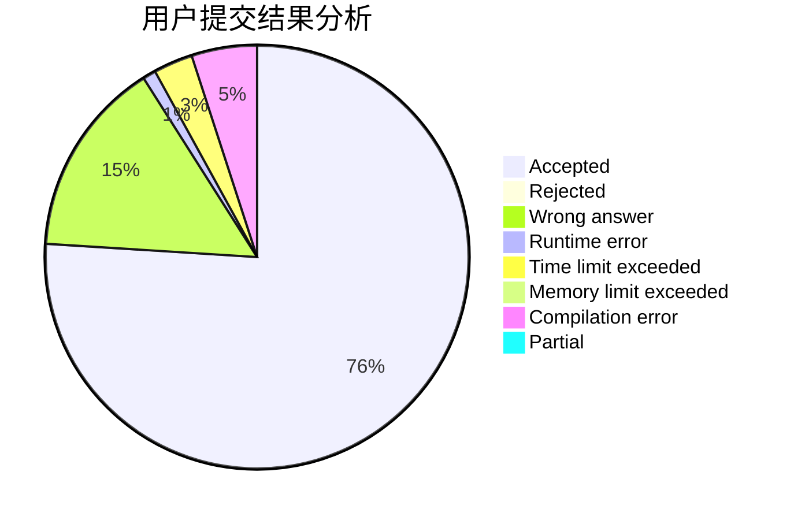
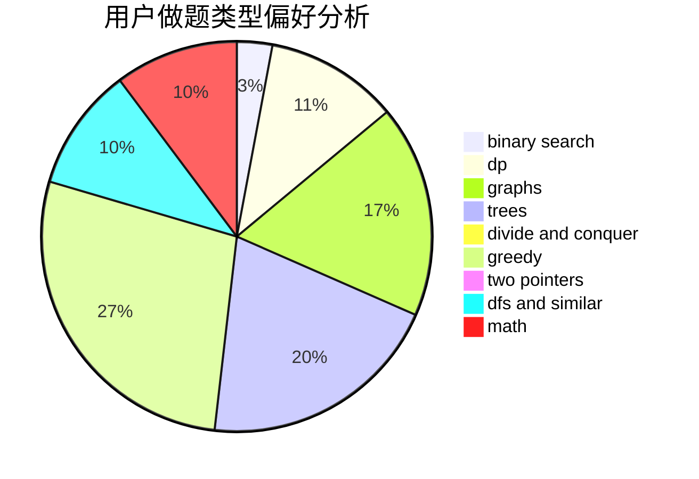

# M.w.

<!-- tabs:start -->

#### **用户提交结果分析**

#### **用户做题类型偏好分析**

<!-- tabs:end -->
# 推荐题目
[1457C](https://codeforces.com/contest/1457/problem/C)
[1463E](https://codeforces.com/contest/1463/problem/E)
[578E](https://codeforces.com/contest/578/problem/E)
[1043E](https://codeforces.com/contest/1043/problem/E)
[1340A](https://codeforces.com/contest/1340/problem/A)
[1323B](https://codeforces.com/contest/1323/problem/B)
[714A](https://codeforces.com/contest/714/problem/A)
[962F](https://codeforces.com/contest/962/problem/F)
[893F](https://codeforces.com/contest/893/problem/F)
[938E](https://codeforces.com/contest/938/problem/E)
