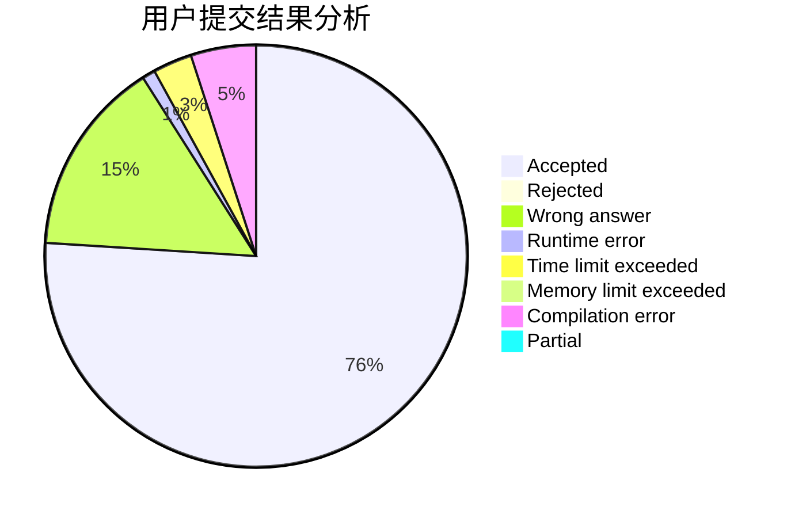
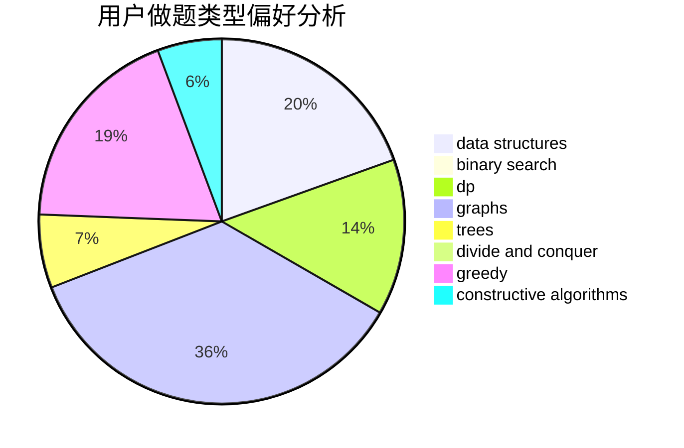
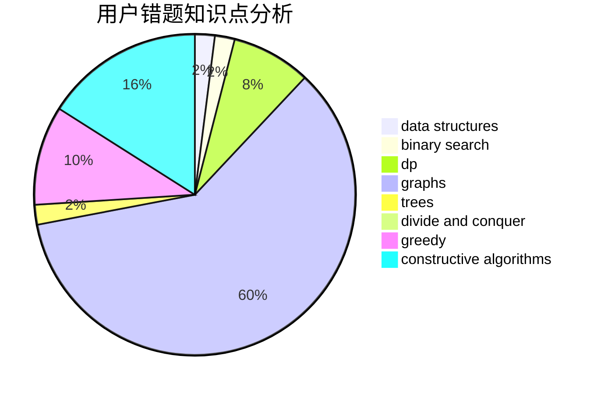

# M.w.

<!-- tabs:start -->

#### **用户提交结果分析**

#### **用户做题类型偏好分析**

#### **用户错题知识点分析**

<!-- tabs:end -->
# 推荐题目
[1447F1](https://codeforces.com/contest/1447F/problem/1)		dsu,graphs,sortings,trees		  
[1454B](https://codeforces.com/contest/1454/problem/B)		implementation		  
[553C](https://codeforces.com/contest/553/problem/C)		dfs and similar,
                        dsu,
                        graphs		  
[1043B](https://codeforces.com/contest/1043/problem/B)		implementation		  
[1333B](https://codeforces.com/contest/1333/problem/B)		greedy,
                        implementation		  
[1313D](https://codeforces.com/contest/1313/problem/D)		bitmasks,
                        dp,
                        implementation		  
[697C](https://codeforces.com/contest/697/problem/C)		dsu,graphs,sortings,trees		  
[946B](https://codeforces.com/contest/946/problem/B)		math,
                        number theory		  
[873A](https://codeforces.com/contest/873/problem/A)		implementation		  
[918B](https://codeforces.com/contest/918/problem/B)		implementation,
                        strings		  
