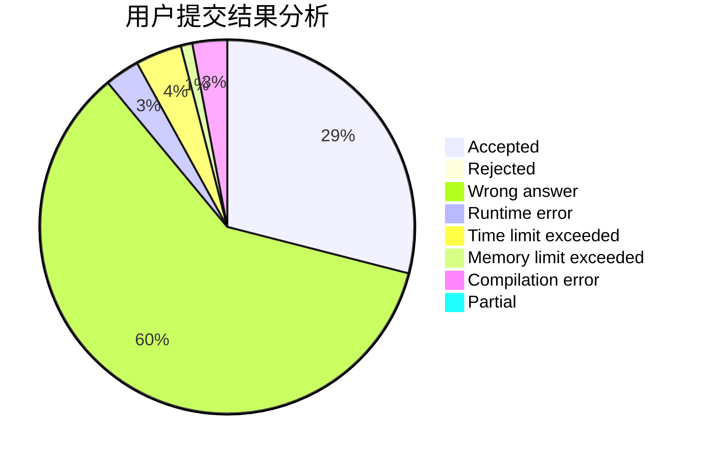
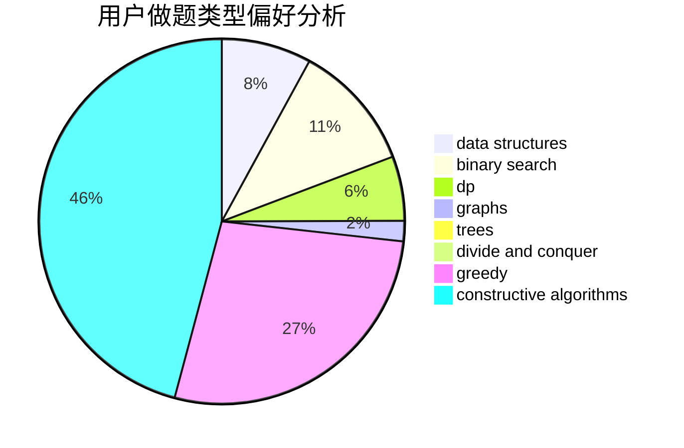

# MAOoo
<!-- tabs:start -->
#### **用户提交结果分析**

#### **用户做题类型偏好分析**

#### **用户错题知识点分析**

<!-- tabs:end -->
# 推荐题目
[Two Substrings](http://codeforces.com/problemset/problem/550/A)		brute force,
                        dp,
                        greedy,
                        implementation,
                        strings		  
[Riverside Curio](https://codeforces.com/contest/957/problem/D)		data structures,
                        dp,
                        greedy		  
[Tourism](https://codeforces.com/contest/1314/problem/D)		dp,
                        graphs,
                        probabilities		  
[Interactive LowerBound](http://codeforces.com/problemset/problem/843/B)		brute force,
                        interactive,
                        probabilities		  
[Table Tennis](http://codeforces.com/problemset/problem/879/B)		data structures,
                        implementation		  
[Dream Team](http://codeforces.com/problemset/problem/1297/C)		*special problem,
                        greedy		  
[Attack on Red Kingdom](http://codeforces.com/problemset/problem/1312/F)		games,
                        two pointers		  
[Chips](http://codeforces.com/problemset/problem/1244/F)		constructive algorithms,
                        implementation		  
[Good Matrix Elements](http://codeforces.com/problemset/problem/177/A2)		implementation		  
[Ratings and Reality Shows](http://codeforces.com/problemset/problem/887/D)		data structures,
                        two pointers		  
<!-- tabs:start -->
#### **data structures**
[Two Substrings](https://codeforces.com/contest/957/problem/D)		data structures,
                        dp,
                        greedy		  
[Riverside Curio](http://codeforces.com/problemset/problem/879/B)		data structures,
                        implementation		  
[Tourism](http://codeforces.com/problemset/problem/887/D)		data structures,
                        two pointers		  
[Interactive LowerBound](http://codeforces.com/problemset/problem/1209/G2)		data structures		  
[Table Tennis](http://codeforces.com/problemset/problem/377/B)		binary search,
                        data structures,
                        greedy,
                        sortings		  
[Dream Team](http://codeforces.com/problemset/problem/1041/E)		constructive algorithms,
                        data structures,
                        graphs,
                        greedy		  
[Attack on Red Kingdom](http://codeforces.com/problemset/problem/487/B)		binary search,
                        data structures,
                        dp,
                        two pointers		  
[Chips](http://codeforces.com/problemset/problem/1492/C)		binary search,
                        data structures,
                        dp,
                        greedy,
                        two pointers		  
[Good Matrix Elements](http://codeforces.com/problemset/problem/1490/G)		binary search,
                        data structures,
                        math		  
[Ratings and Reality Shows](http://codeforces.com/problemset/problem/1479/D)		binary search,
                        bitmasks,
                        brute force,
                        data structures,
                        probabilities,
                        trees		  
#### **binary search**
[Two Substrings](http://codeforces.com/problemset/problem/377/B)		binary search,
                        data structures,
                        greedy,
                        sortings		  
[Riverside Curio](http://codeforces.com/problemset/problem/487/B)		binary search,
                        data structures,
                        dp,
                        two pointers		  
[Tourism](https://codeforces.com/contest/233/problem/C)		binary search,
                        constructive algorithms,
                        graphs,
                        greedy		  
[Interactive LowerBound](http://codeforces.com/problemset/problem/1153/D)		binary search,
                        dfs and similar,
                        dp,
                        greedy,
                        trees		  
[Table Tennis](http://codeforces.com/problemset/problem/1462/E1)		binary search,
                        combinatorics,
                        math,
                        sortings,
                        two pointers		  
[Dream Team](http://codeforces.com/problemset/problem/1492/C)		binary search,
                        data structures,
                        dp,
                        greedy,
                        two pointers		  
[Attack on Red Kingdom](http://codeforces.com/problemset/problem/1463/D)		binary search,
                        constructive algorithms,
                        greedy,
                        two pointers		  
[Chips](http://codeforces.com/problemset/problem/1490/G)		binary search,
                        data structures,
                        math		  
[Good Matrix Elements](http://codeforces.com/problemset/problem/1479/D)		binary search,
                        bitmasks,
                        brute force,
                        data structures,
                        probabilities,
                        trees		  
[Ratings and Reality Shows](http://codeforces.com/problemset/problem/1436/E)		binary search,
                        data structures,
                        two pointers		  
#### **dp**
[Two Substrings](http://codeforces.com/problemset/problem/550/A)		brute force,
                        dp,
                        greedy,
                        implementation,
                        strings		  
[Riverside Curio](https://codeforces.com/contest/957/problem/D)		data structures,
                        dp,
                        greedy		  
[Tourism](https://codeforces.com/contest/1314/problem/D)		dp,
                        graphs,
                        probabilities		  
[Interactive LowerBound](https://codeforces.com/contest/1243/problem/E)		bitmasks,
                        dfs and similar,
                        dp,
                        graphs		  
[Table Tennis](http://codeforces.com/problemset/problem/487/B)		binary search,
                        data structures,
                        dp,
                        two pointers		  
[Dream Team](https://codeforces.com/contest/1447/problem/D)		dp,
                        strings		  
[Attack on Red Kingdom](http://codeforces.com/problemset/problem/1153/D)		binary search,
                        dfs and similar,
                        dp,
                        greedy,
                        trees		  
[Chips](http://codeforces.com/problemset/problem/1492/C)		binary search,
                        data structures,
                        dp,
                        greedy,
                        two pointers		  
[Good Matrix Elements](https://codeforces.com/contest/1457/problem/C)		brute force,
                        dp,
                        implementation		  
[Ratings and Reality Shows](http://codeforces.com/problemset/problem/1491/C)		brute force,
                        data structures,
                        dp,
                        greedy,
                        implementation		  
#### **graph**
[Two Substrings](https://codeforces.com/contest/1314/problem/D)		dp,
                        graphs,
                        probabilities		  
[Riverside Curio](http://codeforces.com/problemset/problem/254/D)		brute force,
                        dfs and similar,
                        graphs,
                        implementation,
                        shortest paths		  
[Tourism](http://codeforces.com/problemset/problem/1041/E)		constructive algorithms,
                        data structures,
                        graphs,
                        greedy		  
[Interactive LowerBound](https://codeforces.com/contest/1243/problem/E)		bitmasks,
                        dfs and similar,
                        dp,
                        graphs		  
[Table Tennis](https://codeforces.com/contest/233/problem/C)		binary search,
                        constructive algorithms,
                        graphs,
                        greedy		  
[Dream Team](http://codeforces.com/problemset/problem/1250/E)		graphs,
                        implementation		  
[Attack on Red Kingdom](http://codeforces.com/problemset/problem/1487/C)		brute force,
                        constructive algorithms,
                        dfs and similar,
                        graphs,
                        greedy,
                        implementation,
                        math		  
[Chips](http://codeforces.com/problemset/problem/1437/C)		dp,
                        flows,
                        graph matchings,
                        greedy,
                        math,
                        sortings		  
[Good Matrix Elements](http://codeforces.com/problemset/problem/1470/D)		constructive algorithms,
                        dfs and similar,
                        graph matchings,
                        graphs,
                        greedy		  
[Ratings and Reality Shows](http://codeforces.com/problemset/problem/1476/C)		dp,
                        graphs,
                        greedy		  
#### **trees**
[Two Substrings](http://codeforces.com/problemset/problem/1210/C)		math,
                        number theory,
                        trees		  
[Riverside Curio](http://codeforces.com/problemset/problem/1438/F)		interactive,
                        probabilities,
                        trees		  
[Tourism](http://codeforces.com/problemset/problem/1153/D)		binary search,
                        dfs and similar,
                        dp,
                        greedy,
                        trees		  
[Interactive LowerBound](http://codeforces.com/problemset/problem/1479/D)		binary search,
                        bitmasks,
                        brute force,
                        data structures,
                        probabilities,
                        trees		  
[Table Tennis](http://codeforces.com/problemset/problem/1511/C)		brute force,
                        data structures,
                        implementation,
                        trees		  
[Dream Team](http://codeforces.com/problemset/problem/1499/F)		combinatorics,
                        dfs and similar,
                        dp,
                        trees		  
[Attack on Red Kingdom](http://codeforces.com/problemset/problem/1491/E)		brute force,
                        dfs and similar,
                        divide and conquer,
                        number theory,
                        trees		  
[Chips](http://codeforces.com/problemset/problem/1466/D)		data structures,
                        greedy,
                        sortings,
                        trees		  
[Good Matrix Elements](http://codeforces.com/problemset/problem/1495/D)		combinatorics,
                        dfs and similar,
                        graphs,
                        math,
                        shortest paths,
                        trees		  
[Ratings and Reality Shows](http://codeforces.com/problemset/problem/1303/G)		data structures,
                        divide and conquer,
                        geometry,
                        trees		  
#### **divide and conquer**
[Two Substrings](http://codeforces.com/problemset/problem/1461/D)		binary search,
                        brute force,
                        data structures,
                        divide and conquer,
                        implementation,
                        sortings		  
[Riverside Curio](http://codeforces.com/problemset/problem/1466/G)		combinatorics,
                        divide and conquer,
                        hashing,
                        math,
                        string suffix structures,
                        strings		  
[Tourism](http://codeforces.com/problemset/problem/1490/D)		dfs and similar,
                        divide and conquer,
                        implementation		  
[Interactive LowerBound](https://codeforces.com/contest/1483/problem/C)		data structures,
                        divide and conquer,
                        dp		  
[Table Tennis](http://codeforces.com/problemset/problem/1491/E)		brute force,
                        dfs and similar,
                        divide and conquer,
                        number theory,
                        trees		  
[Dream Team](http://codeforces.com/problemset/problem/1303/G)		data structures,
                        divide and conquer,
                        geometry,
                        trees		  
[Attack on Red Kingdom](http://codeforces.com/problemset/problem/1494/D)		constructive algorithms,
                        data structures,
                        dfs and similar,
                        divide and conquer,
                        dsu,
                        greedy,
                        sortings,
                        trees		  
[Chips](http://codeforces.com/problemset/problem/1482/E)		data structures,
                        divide and conquer,
                        dp		  
[Good Matrix Elements](http://codeforces.com/problemset/problem/566/C)		dfs and similar,
                        divide and conquer,
                        trees		  
[Ratings and Reality Shows](http://codeforces.com/problemset/problem/1428/F)		binary search,
                        data structures,
                        divide and conquer,
                        dp,
                        two pointers		  
#### **greedy**
[Two Substrings](http://codeforces.com/problemset/problem/550/A)		brute force,
                        dp,
                        greedy,
                        implementation,
                        strings		  
[Riverside Curio](https://codeforces.com/contest/957/problem/D)		data structures,
                        dp,
                        greedy		  
[Tourism](http://codeforces.com/problemset/problem/1297/C)		*special problem,
                        greedy		  
[Interactive LowerBound](http://codeforces.com/problemset/problem/377/B)		binary search,
                        data structures,
                        greedy,
                        sortings		  
[Table Tennis](http://codeforces.com/problemset/problem/1251/C)		greedy,
                        two pointers		  
[Dream Team](http://codeforces.com/problemset/problem/1041/E)		constructive algorithms,
                        data structures,
                        graphs,
                        greedy		  
[Attack on Red Kingdom](https://codeforces.com/contest/233/problem/C)		binary search,
                        constructive algorithms,
                        graphs,
                        greedy		  
[Chips](http://codeforces.com/problemset/problem/1305/B)		constructive algorithms,
                        greedy,
                        strings,
                        two pointers		  
[Good Matrix Elements](http://codeforces.com/problemset/problem/1153/D)		binary search,
                        dfs and similar,
                        dp,
                        greedy,
                        trees		  
[Ratings and Reality Shows](http://codeforces.com/problemset/problem/1463/B)		bitmasks,
                        constructive algorithms,
                        greedy		  
#### **constructive algorithms**
[Two Substrings](http://codeforces.com/problemset/problem/1244/F)		constructive algorithms,
                        implementation		  
[Riverside Curio](http://codeforces.com/problemset/problem/1041/E)		constructive algorithms,
                        data structures,
                        graphs,
                        greedy		  
[Tourism](https://codeforces.com/contest/233/problem/C)		binary search,
                        constructive algorithms,
                        graphs,
                        greedy		  
[Interactive LowerBound](http://codeforces.com/problemset/problem/1025/C)		constructive algorithms,
                        implementation		  
[Table Tennis](http://codeforces.com/problemset/problem/1305/B)		constructive algorithms,
                        greedy,
                        strings,
                        two pointers		  
[Dream Team](http://codeforces.com/problemset/problem/1463/B)		bitmasks,
                        constructive algorithms,
                        greedy		  
[Attack on Red Kingdom](http://codeforces.com/problemset/problem/1493/A)		constructive algorithms,
                        greedy		  
[Chips](http://codeforces.com/problemset/problem/1463/D)		binary search,
                        constructive algorithms,
                        greedy,
                        two pointers		  
[Good Matrix Elements](https://codeforces.com/contest/1456/problem/B)		bitmasks,
                        brute force,
                        constructive algorithms		  
[Ratings and Reality Shows](http://codeforces.com/problemset/problem/1492/D)		bitmasks,
                        constructive algorithms,
                        greedy,
                        math		  
#### **sortings**
[Two Substrings](http://codeforces.com/problemset/problem/377/B)		binary search,
                        data structures,
                        greedy,
                        sortings		  
[Riverside Curio](http://codeforces.com/problemset/problem/1462/E1)		binary search,
                        combinatorics,
                        math,
                        sortings,
                        two pointers		  
[Tourism](https://codeforces.com/contest/1496/problem/C)		geometry,
                        greedy,
                        math,
                        sortings		  
[Interactive LowerBound](http://codeforces.com/problemset/problem/1495/A)		geometry,
                        greedy,
                        math,
                        sortings		  
[Table Tennis](http://codeforces.com/problemset/problem/1497/A)		brute force,
                        data structures,
                        greedy,
                        sortings		  
[Dream Team](http://codeforces.com/problemset/problem/1427/A)		math,
                        sortings		  
[Attack on Red Kingdom](http://codeforces.com/problemset/problem/1461/D)		binary search,
                        brute force,
                        data structures,
                        divide and conquer,
                        implementation,
                        sortings		  
[Chips](http://codeforces.com/problemset/problem/1437/C)		dp,
                        flows,
                        graph matchings,
                        greedy,
                        math,
                        sortings		  
[Good Matrix Elements](http://codeforces.com/problemset/problem/1473/A)		greedy,
                        implementation,
                        math,
                        sortings		  
[Ratings and Reality Shows](http://codeforces.com/problemset/problem/1486/B)		binary search,
                        geometry,
                        shortest paths,
                        sortings		  
<!-- tabs:end -->
