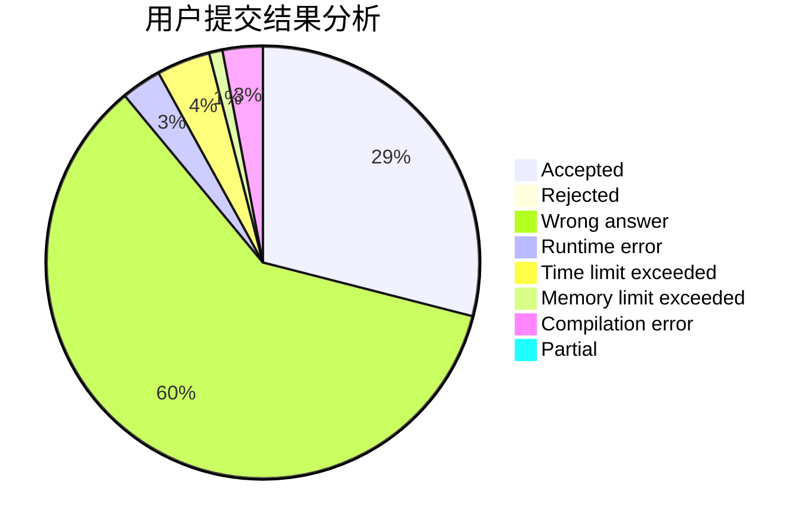
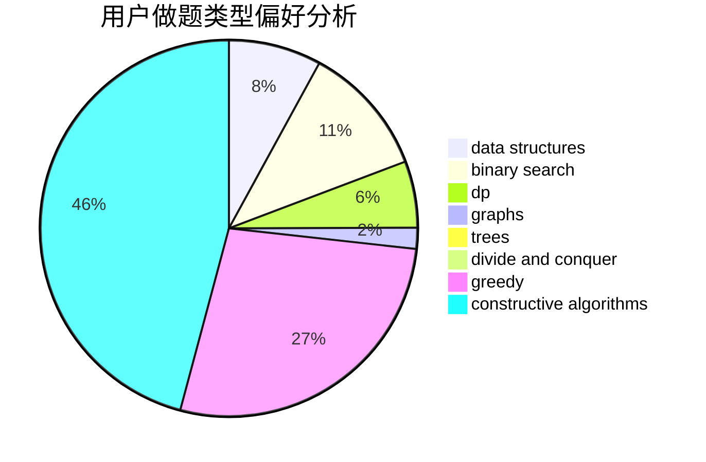

# MAOoo

<!-- tabs:start -->

#### **用户提交结果分析**

#### **用户做题类型偏好分析**

#### **用户错题知识点分析**

<!-- tabs:end -->
# 推荐题目
[550A](https://codeforces.com/contest/550/problem/A)		brute force,
                        dp,
                        greedy,
                        implementation,
                        strings		  
[1246F](https://codeforces.com/contest/1246/problem/F)		nan		  
[254D](https://codeforces.com/contest/254/problem/D)		brute force,
                        dfs and similar,
                        graphs,
                        implementation,
                        shortest paths		  
[957D](https://codeforces.com/contest/957/problem/D)		dsu,graphs,sortings,trees		  
[843B](https://codeforces.com/contest/843/problem/B)		brute force,
                        interactive,
                        probabilities		  
[1244F](https://codeforces.com/contest/1244/problem/F)		constructive algorithms,
                        implementation		  
[1462E1](https://codeforces.com/contest/1462E/problem/1)		binary search,
                        combinatorics,
                        math,
                        sortings,
                        two pointers		  
[177A2](https://codeforces.com/contest/177A/problem/2)		implementation		  
[1244A](https://codeforces.com/contest/1244/problem/A)		math		  
[879B](https://codeforces.com/contest/879/problem/B)		data structures,
                        implementation		  
