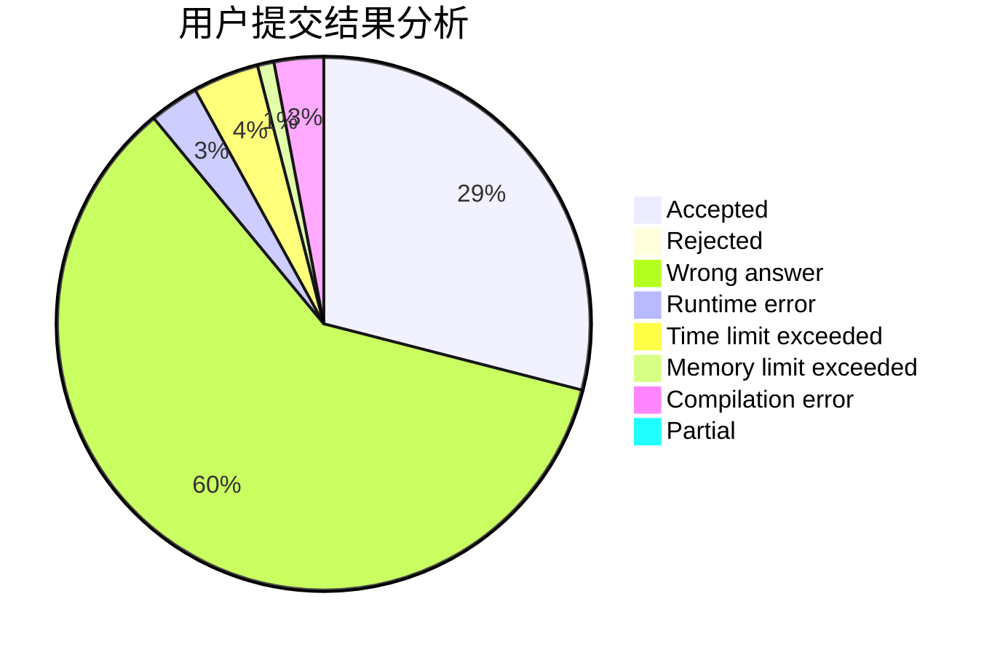
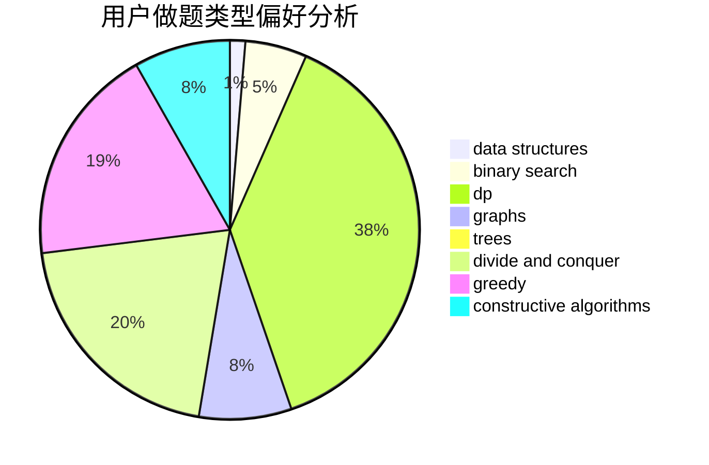

# MAOoo

<!-- tabs:start -->

#### **用户提交结果分析**

#### **用户做题类型偏好分析**

#### **用户错题知识点分析**

<!-- tabs:end -->
# 推荐题目
[575C](https://codeforces.com/contest/575/problem/C)		bitmasks,
                        brute force,
                        graph matchings		  
[1250N](https://codeforces.com/contest/1250/problem/N)		dfs and similar,
                        graphs,
                        greedy		  
[273D](https://codeforces.com/contest/273/problem/D)		dp		  
[978G](https://codeforces.com/contest/978/problem/G)		greedy,
                        implementation,
                        sortings		  
[862D](https://codeforces.com/contest/862/problem/D)		binary search,
                        divide and conquer,
                        interactive		  
[1250A](https://codeforces.com/contest/1250/problem/A)		implementation		  
[146B](https://codeforces.com/contest/146/problem/B)		brute force,
                        implementation		  
[203B](https://codeforces.com/contest/203/problem/B)		brute force,
                        implementation		  
[12492](https://codeforces.com/contest/1249/problem/2)		dsu,graphs,sortings,trees		  
[899F](https://codeforces.com/contest/899/problem/F)		data structures,
                        strings		  
