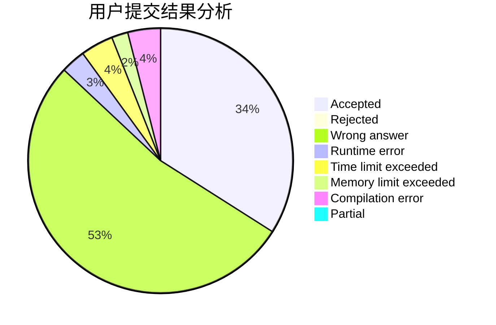
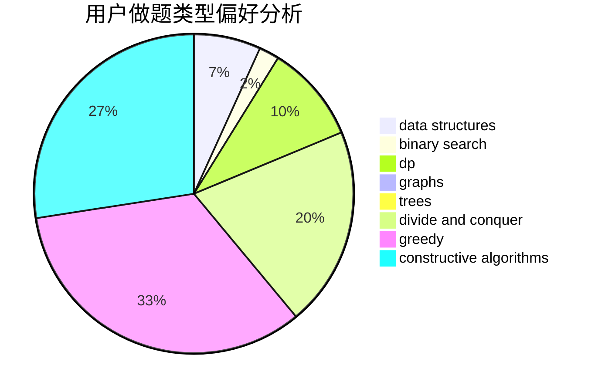

# 0o_o0

<!-- tabs:start -->

#### **用户提交结果分析**

#### **用户做题类型偏好分析**

#### **用户错题知识点分析**

<!-- tabs:end -->
# 推荐题目
[1062C](https://codeforces.com/contest/1062/problem/C)		greedy,
                        implementation,
                        math		  
[1062E](https://codeforces.com/contest/1062/problem/E)		binary search,
                        data structures,
                        dfs and similar,
                        greedy,
                        trees		  
[1059B](https://codeforces.com/contest/1059/problem/B)		implementation		  
[1059E](https://codeforces.com/contest/1059/problem/E)		binary search,
                        data structures,
                        dp,
                        greedy,
                        trees		  
[1059A](https://codeforces.com/contest/1059/problem/A)		implementation		  
[1062A](https://codeforces.com/contest/1062/problem/A)		greedy,
                        implementation		  
[1063F](https://codeforces.com/contest/1063/problem/F)		data structures,
                        dp,
                        string suffix structures		  
[1060D](https://codeforces.com/contest/1060/problem/D)		greedy,
                        math		  
[1063B](https://codeforces.com/contest/1063/problem/B)		graphs,
                        shortest paths		  
[1062D](https://codeforces.com/contest/1062/problem/D)		dfs and similar,
                        graphs,
                        implementation,
                        math		  
