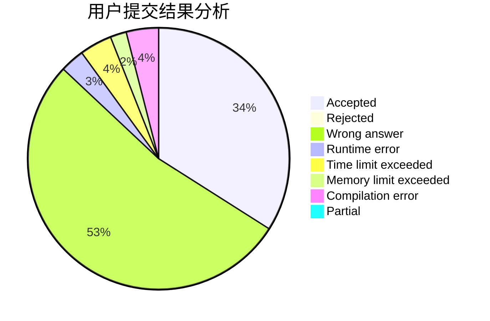
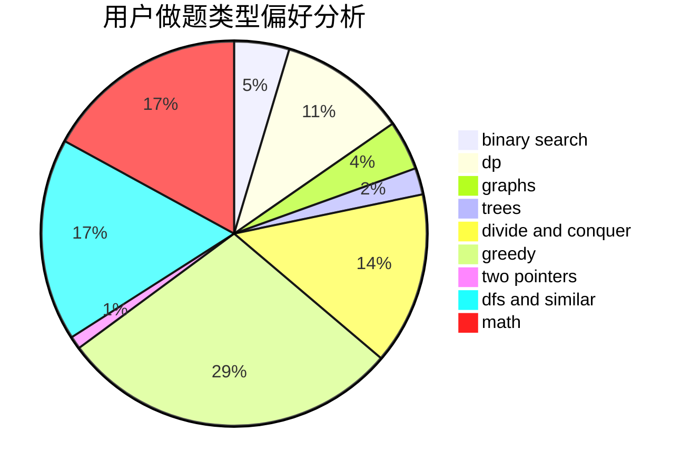

# 0o_o0

<!-- tabs:start -->

#### **用户提交结果分析**

#### **用户做题类型偏好分析**

<!-- tabs:end -->
# 推荐题目
[1062C](https://codeforces.com/contest/1062/problem/C)
[1062E](https://codeforces.com/contest/1062/problem/E)
[1059B](https://codeforces.com/contest/1059/problem/B)
[1059E](https://codeforces.com/contest/1059/problem/E)
[1059A](https://codeforces.com/contest/1059/problem/A)
[1062A](https://codeforces.com/contest/1062/problem/A)
[1063F](https://codeforces.com/contest/1063/problem/F)
[1060D](https://codeforces.com/contest/1060/problem/D)
[1063B](https://codeforces.com/contest/1063/problem/B)
[1062D](https://codeforces.com/contest/1062/problem/D)
