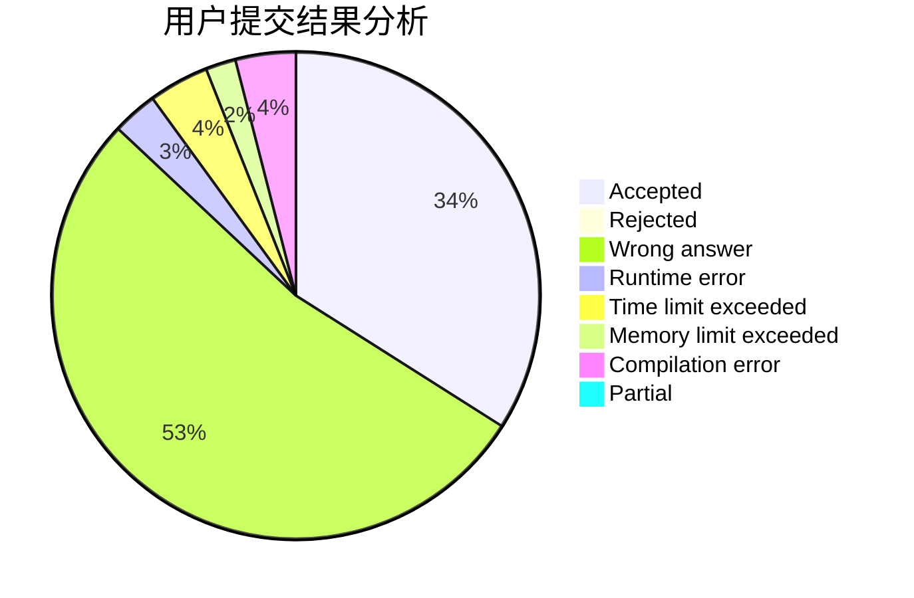
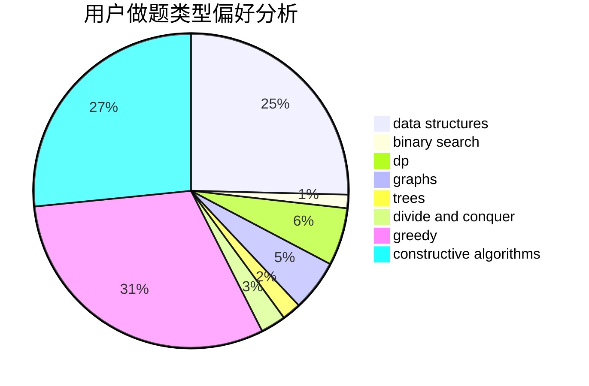

# 0o_o0

<!-- tabs:start -->

#### **用户提交结果分析**

#### **用户做题类型偏好分析**

#### **用户错题知识点分析**

<!-- tabs:end -->
# 推荐题目
[1061F](https://codeforces.com/contest/1061/problem/F)		interactive,
                        probabilities		  
[1062B](https://codeforces.com/contest/1062/problem/B)		greedy,
                        math,
                        number theory		  
[1058D](https://codeforces.com/contest/1058/problem/D)		dsu,graphs,sortings,trees		  
[1059B](https://codeforces.com/contest/1059/problem/B)		implementation		  
[1058C](https://codeforces.com/contest/1058/problem/C)		dsu,graphs,sortings,trees		  
[1061C](https://codeforces.com/contest/1061/problem/C)		data structures,
                        dp,
                        implementation,
                        math,
                        number theory		  
[1063C](https://codeforces.com/contest/1063/problem/C)		binary search,
                        constructive algorithms,
                        geometry,
                        interactive		  
[1060A](https://codeforces.com/contest/1060/problem/A)		brute force		  
[1062E](https://codeforces.com/contest/1062/problem/E)		binary search,
                        data structures,
                        dfs and similar,
                        greedy,
                        trees		  
[1062A](https://codeforces.com/contest/1062/problem/A)		greedy,
                        implementation		  
